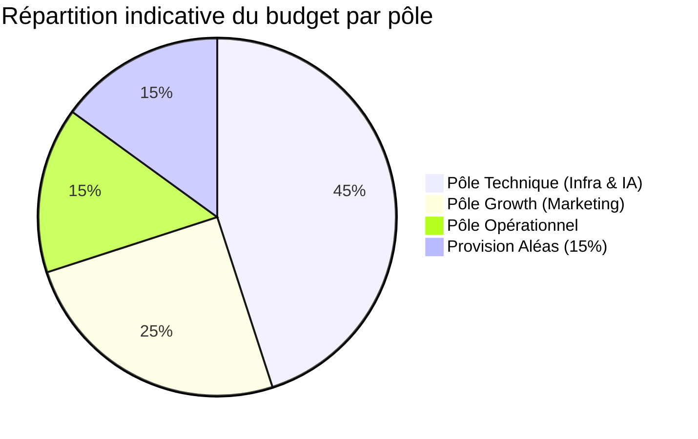
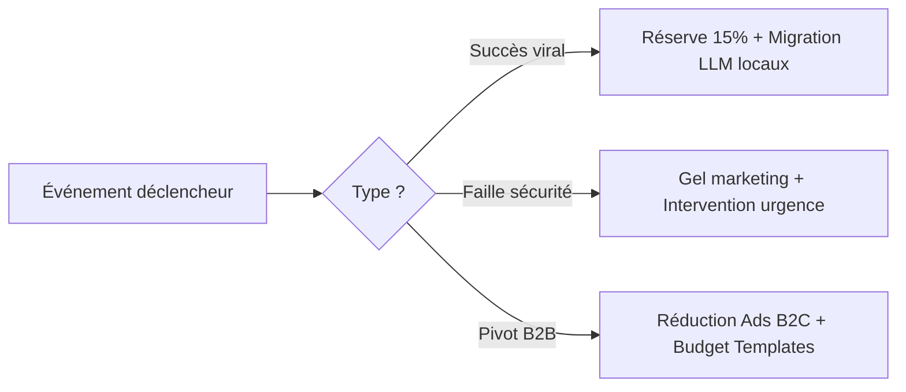

# Esquisse du Budget Prévisionnel : DopaLearn

Ce document sert de **cadre de pilotage financier**. Il identifie les leviers de coûts pour passer du MVP (Phase 1) à la croissance Agile (Phase 2).

---

## 1. Pôle Technique : Infrastructure & IA Core

*Ce pôle garantit la "Zéro Friction" et le fonctionnement des serveurs.*

| **Poste de dépense** | **Nature** | **Justification Stratégique** | **Priorité** | **Est. (€)** |
| --- | --- | --- | --- | --- |
| **APIs LLM (Mistral/OpenAI)** | Variable | Génération dynamique des cours/jeux. | 🔴 Haute | *À chiffrer* |
| **APIs Voice & Audio** | Variable | Synthèse vocale pour mode "Main libre". | 🔴 Haute | *À chiffrer* |
| **Hébergement & Cloud** | Fixe | Serveur MCP et stockage base connaissances. | 🔴 Haute | *À chiffrer* |
| **Audit Cybersécurité** | Ponctuel | Validation de la DOD avant mise en production. | 🔴 Haute | *À chiffrer* |
| **Outils Dev (GitHub/CI-CD)** | Fixe | Traçabilité et automatisation des tests. | 🔴 Haute | *À chiffrer* |

---

## 2. Pôle Growth : Acquisition & Marketing

*Basé sur les axes de Daniel pour détourner la dopamine des concurrents.*

| **Poste de dépense** | **Nature** | **Justification Stratégique** | **Priorité** | **Est. (€)** |
| --- | --- | --- | --- | --- |
| **Ads (TikTok/Meta/Shorts)** | Variable | Campagnes choc "Hack de dopamine". | 🟡 Moyenne | *À chiffrer* |
| **Récompenses Challenge** | Ponctuel | Incitation au switch des réseaux sociaux. | 🟢 Basse | *À chiffrer* |
| **Influenceurs Edu-Tech** | Forfait | Démos du système "Bonus/Malus". | 🟡 Moyenne | *À chiffrer* |
| **Production Vidéo** | Forfait | Montage de contenus ironiques et démos. | 🟡 Moyenne | *À chiffrer* |
| **Marketing B2B** | Forfait | Plaquettes et prospection pour les écoles. | 🟢 Basse | *À chiffrer* |

---

## 3. Pôle Opérationnel & Événementiel (La Structure)

*Assure la pérennité et la visibilité physique du projet.*

| **Poste de dépense** | **Nature** | **Justification Stratégique** | **Priorité** | **Est. (€)** |
| --- | --- | --- | --- | --- |
| **Outils Pilotage (Notion)** | Fixe | Support documentaire et interne. | 🔴 Haute | *À chiffrer* |
| **Logistique Salons** | Ponctuel | Démonstrations physiques et tests. | 🟢 Basse | *À chiffrer* |
| **Frais de Représentation** | Variable | Déplacements partenariats B2B. | 🟢 Basse | *À chiffrer* |
| **Provision Aléas (15%)** | Provision | Sécurisation face aux imprévus. | 🔴 Haute | *Auto* |

---

## 4. Gestion des Prestataires & Expertises Externes

| **Prestataire Type** | **Mission Spécifique** | **Critère de Sélection** | **Impact Budget** |
| --- | --- | --- | --- |
| **Expert Cybersécurité** | Pentest (tests d'intrusion) et audit de l'infrastructure MCP. | Certification ANSSI ou expérience IA reconnue. | Ponctuel (Élevé) |
| **Agence Creative / Vidéo** | Montage des formats courts "ironiques" et publicités Axe 1. | Maîtrise des codes TikTok/Reels et humour "DopaLearn". | Forfait / Récurrent |
| **Consultant Cloud/DevOps** | Optimisation du déploiement des LLM en local (Architecture A.R.M). | Expertise en hardware mobile et performance IA. | Ponctuel (Moyen) |
| **Freelance Content Manager** | Gestion du "DopaChallenge" et animation de la communauté Discord. | Capacité d'engagement et modération "Dopamine Seeker". | Mensuel (Modéré) |

---

## 5. Répartition budgétaire par pôle

---

## 6. Situations Spécifiques & Plans de Contingence

*Anticipation des variations budgétaires liées aux risques du projet.*

### Situation A : Succès Viral Immédiat (Scaling)

- **Risque :** Explosion des coûts d'API LLM suite à un afflux massif d'utilisateurs.
- **Action Budgétaire :** Activation immédiate de la réserve pour imprévus (15%) et passage prioritaire sur des modèles Open Source locaux pour réduire la dépendance aux APIs payantes.

### Situation B : Faille de Sécurité Majeure

- **Risque :** Détection d'une vulnérabilité critique lors de l'audit ou après MEP.
- **Action Budgétaire :** Gel du budget marketing (Growth) pour réallouer les fonds vers une intervention technique d'urgence et une refonte de l'architecture de données.

### Situation C : Pivot B2B Prioritaire

- **Risque :** Une opportunité majeure avec un grand organisme de formation demande des fonctionnalités spécifiques.
- **Action Budgétaire :** Réduction des dépenses Ads B2C (Ads TikTok) pour financer le développement de "Templates" personnalisés et la présence sur des salons professionnels spécialisés.

---

### Flux de contingence

---

## 7. Stratégies d'Arbitrage (Scénarios)

*Utilisez ces scénarios selon les fonds disponibles au lancement.*

- **Scénario "Bootstrap" (Low Cost) :** Priorité aux APIs Open Source et à la communication organique (0€ Ads).
- **Scénario "MVP Sécurisé" (Recommandé) :** Inclusion de l'audit Cyber et budget Ads modéré pour tester la rétention (DAU/MAU).
- **Scénario "Accélération" (Premium) :** Influenceurs majeurs, présence salons et R&D sur modèles IA locaux (A.R.M).

---

## 8. Règles d'Or du Pilotage

- **Validation DOD :** Aucune dépense marketing n'est engagée pour une fonctionnalité qui n'est pas "Done" techniquement.
- **Contrôle Mensuel :** Le Comité de Pilotage réévalue les coûts API chaque mois pour éviter les dérives.
- **ROI B2B :** Chaque investissement prospection vise la signature d'un premier prototype de parcours en entreprise.

---

## 9. Matrice de Priorisation Financière (Arbitrage)

Utilise ce tableau pour décider où couper si le budget est restreint :

- **Priorité 🔴 (Vital) :** APIs IA, Hébergement, Audit Cyber (Sans cela, le produit n'existe pas ou est dangereux).
- **Priorité 🟡 (Crucial) :** Ads TikTok, Influenceurs (Sans cela, personne n'utilise l'application).
- **Priorité 🟢 (Confort) :** Salons physiques, Récompenses physiques du challenge (Peuvent être digitalisées pour économiser).

| **Catégorie** | **Poste de dépense** | **Nature** | **Estimation (€)** | **Priorité** |
| --- | --- | --- | --- | --- |
| **TECH** | APIs LLM & Voice (Mistral/OpenAI) | Variable |  | 🔴 Haute |
| **TECH** | Hébergement Cloud & Serveur MCP | Fixe |  | 🔴 Haute |
| **TECH** | Audit Cybersécurité Externe | Ponctuel |  | 🔴 Haute |
| **MARKETING** | Social Ads (TikTok/Meta) | Variable |  | 🟡 Moyenne |
| **MARKETING** | Récompenses DopaChallenge | Ponctuel |  | 🟢 Basse |
| **MARKETING** | Partenariats Influenceurs | Forfait |  | 🟡 Moyenne |
| **OPS** | Abonnements Notion/GitHub Pro | Fixe |  | 🔴 Haute |
| **B2B** | Salons & Événements | Ponctuel |  | 🟢 Basse |
