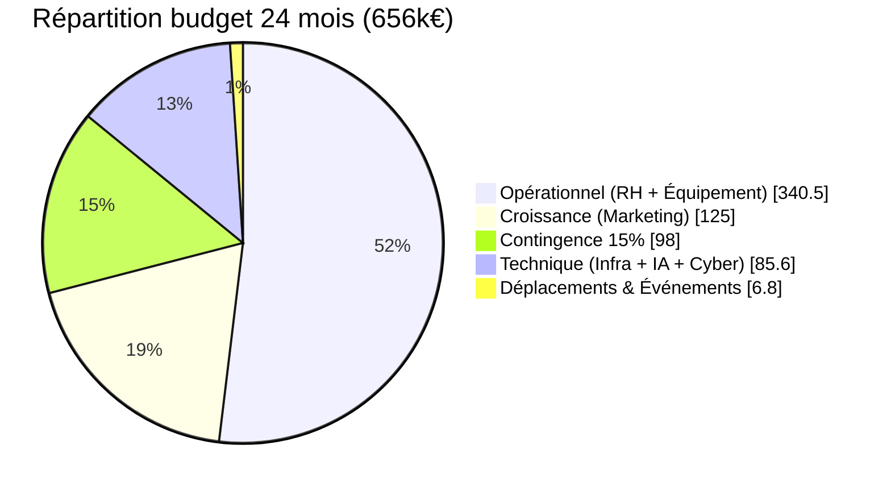
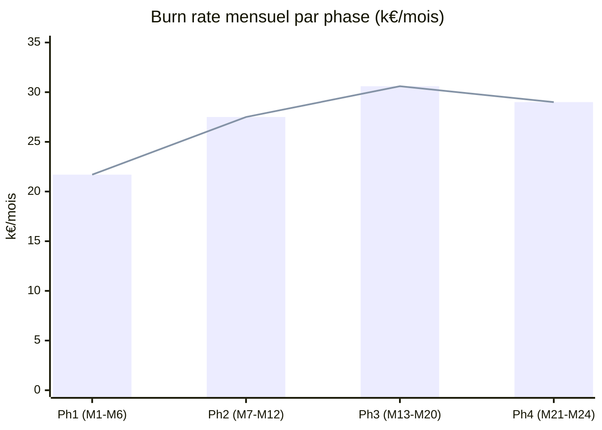
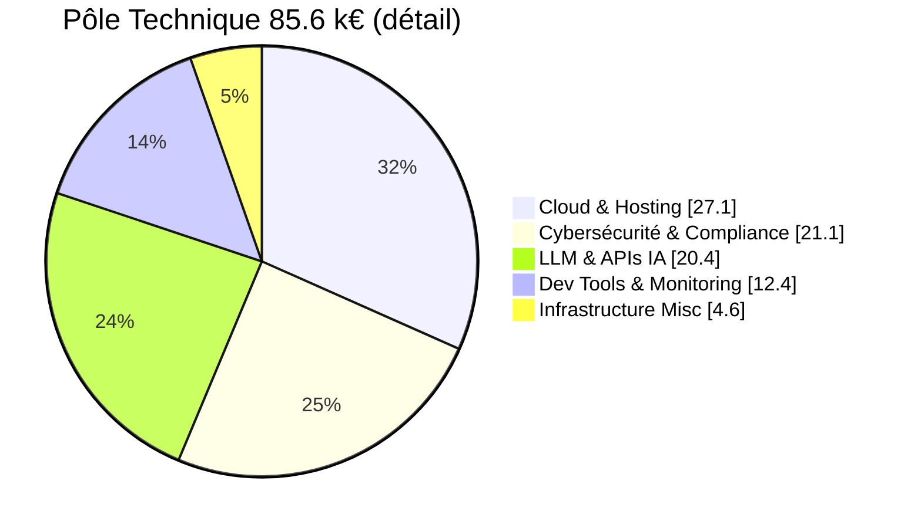
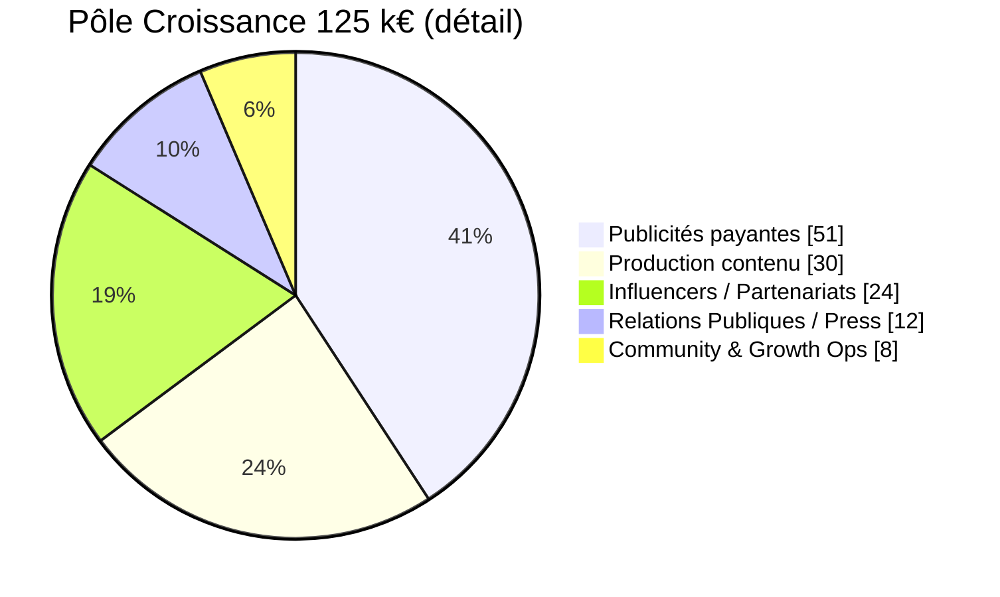
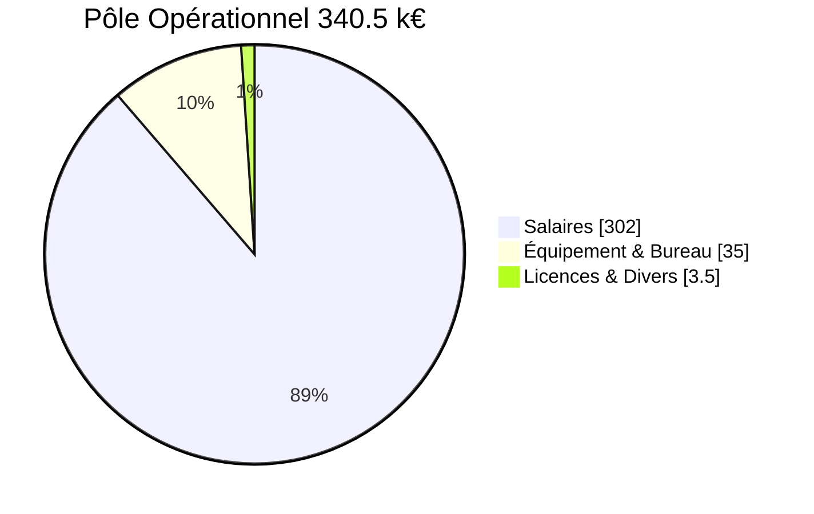

# 💰 FLOWLEARN — Budget Prévisionnel 24 mois

> **Période couverte :** Avril 2026 → Mars 2028 (24 mois pleins)
> **Équipe cible :** 7 personnes (1 Cyber + 6 IA), montée progressive 3 → 5 → 7 → 8 FTE
> **Stratégie :** open-source + APIs low-cost + remote-first

---

## 🧭 Comment lire ce document

```
┌─────────────────────────────────────────────────────────────────┐
│  À QUI EST-IL DESTINÉ ?                                         │
│  ──────────────────────                                         │
│  • L'équipe FlowLearn (pilotage mensuel)                        │
│  • Les écoles / partenaires (transparence financière)           │
│  • Les futurs investisseurs (cadrage Series A)                  │
│  • L'école porteuse du projet (validation pédagogique)          │
└─────────────────────────────────────────────────────────────────┘
```

### 5 niveaux de lecture (du plus rapide au plus profond)

| Tu as… | Lis… | Tu sauras… |
| --- | --- | --- |
| **30 secondes** | §1 Synthèse | Le total + la répartition |
| **2 minutes** | §1 + §3 Vue d'ensemble | Les grandes masses |
| **10 minutes** | §1 → §8 | Tous les pôles + contingence |
| **30 minutes** | Tout sauf annexes | Tu peux le présenter |
| **1 heure** | Tout + glossaire | Tu peux le défendre devant un VC |

### Légende des codes visuels

| Code | Signification |
| --- | --- |
| 🔴 **CRITIQUE** | Aucun arbitrage possible, à financer en priorité |
| 🟡 **IMPORTANT** | Arbitrable, mais fortement recommandé |
| 🟢 **CONFORT** | Optionnel, peut être coupé en scénario lean |
| 💡 **EN BREF** | Résumé en 3 lignes max |
| ⚠️ **ATTENTION** | Point de vigilance |
| ✅ **VALIDÉ** | Action déjà prévue, financée |

---

## 📖 Glossaire (les termes à connaître)

| Terme | Définition simple |
| --- | --- |
| **FTE** | Full-Time Equivalent — équivalent temps plein (1 personne à 100%) |
| **PT** | Part-Time — temps partiel (souvent 0.5 FTE) |
| **MVP** | Minimum Viable Product — version minimale qui marche |
| **DAU** | Daily Active Users — nb d'utilisateurs actifs par jour |
| **MRR / ARR** | Monthly / Annual Recurring Revenue — revenu récurrent mensuel/annuel |
| **CAC** | Customer Acquisition Cost — combien coûte 1 nouvel utilisateur |
| **LTV** | Lifetime Value — combien rapporte un user sur toute sa vie |
| **ROAS** | Return on Ad Spend — combien rapporte 1€ de pub |
| **Burn rate** | Combien on dépense par mois |
| **Runway** | Combien de mois on peut tenir avec la trésorerie |
| **Contingence** | Réserve d'argent pour les imprévus (15% ici) |
| **LLM** | Large Language Model — modèle d'IA type ChatGPT |
| **RAG** | Retrieval-Augmented Generation — IA qui cherche dans nos docs |
| **TTS** | Text-to-Speech — synthèse vocale |
| **pgvector** | Extension PostgreSQL pour stocker des embeddings IA |
| **Pentest** | Penetration Test — test d'intrusion cyber |
| **GDPR** | Règlement européen de protection des données personnelles |
| **DPIA** | Data Protection Impact Assessment — analyse d'impact RGPD |
| **DPO** | Data Protection Officer — délégué à la protection des données |
| **ANSSI** | Autorité française de cybersécurité |
| **DOD** | Definition of Done — critères pour qu'une feature soit "finie" |
| **Pôle** | Axe budgétaire (Tech / Croissance / Opérationnel) |
| **Phase** | Période de 4-8 mois avec des objectifs propres (4 phases au total) |

---

## 1. SYNTHÈSE EXÉCUTIVE

### 💡 EN BREF

> **656 k€ sur 24 mois** pour passer de 0 à 1.5M utilisateurs actifs/jour avec une équipe de 7 personnes, dans un cadre GDPR sécurisé, prêt pour une Series A en M24.

### Vision budgétaire globale

```
┌─────────────────────────────────────────────────────────────┐
│        BUDGET TOTAL 24 MOIS : 656 k€ (100%)                 │
├─────────────────────────────────────────────────────────────┤
│                                                               │
│  Pôle OPÉRATIONNEL (RH + Équipement)   340.5 k€  ████ 52%   │
│  Pôle CROISSANCE  (Marketing)          125.0 k€  ██░░ 19%   │
│  Pôle TECHNIQUE   (Infra + IA + Cyber)  85.6 k€  █░░░ 13%   │
│  CONTINGENCE 15%                         98.0 k€  █░░░ 15%   │
│  Déplacements & Événements               6.8 k€   ░░░░  1%   │
│                                                               │
│  TOTAL                                  655.9 k€   100%      │
│                                                               │
└─────────────────────────────────────────────────────────────┘
```

### Visualisation Mermaid (vue dynamique)



### Répartition par phase

| Phase | Période | Mois | Montant | % | Burn rate |
| --- | --- | --- | :-: | :-: | :-: |
| **Phase 1** Fondations & MVP | M1-M6 | 6 | 130 k€ | 20% | 21.7 k€/mois |
| **Phase 2** Traction & Monétisation | M7-M12 | 6 | 165 k€ | 25% | 27.5 k€/mois |
| **Phase 3** Scaling & International | M13-M20 | 8 | 245 k€ | 37% | 30.6 k€/mois |
| **Phase 4** Consolidation & Exit | M21-M24 | 4 | 116 k€ | 18% | 29.0 k€/mois |
| **TOTAL** | M1-M24 | 24 | **656 k€** | 100% | 27.3 k€/mois |

### Contexte projet (en 5 lignes)

- 🎯 **Objectif :** atteindre 1.5M DAU + Series A 2-3M€ en 24 mois
- 👥 **Équipe :** 7 FTE, montée progressive 3 → 5 → 7 → 8
- 💸 **Stratégie coûts :** open-source d'abord, APIs cheap, pas de bureau privé
- 🔐 **Cadre :** GDPR-by-design, audit cyber avant lancement public
- 🚦 **Pilotage :** 8 gates Go/No-Go (cf. `planning-detaille.md`)

---

## 2. POURQUOI CE BUDGET ? (HYPOTHÈSES STRUCTURANTES)

> Ces hypothèses justifient les **656 k€**. Si elles changent, le budget change.

```
┌─────────────────────────────────────────────────────────────┐
│  HYPOTHÈSE                  │  IMPACT BUDGET SI FAUX        │
├─────────────────────────────────────────────────────────────┤
│ 1. Équipe 7 FTE max         │ +50k€ par FTE supplémentaire  │
│ 2. SMIC brut + charges      │ +30% si on monte à 2.5k€/mois │
│ 3. Coworking, pas bureau    │ +50k€/an si bureau privé      │
│ 4. Open-source LLM (Ollama) │ +30k€ si 100% APIs payantes   │
│ 5. Audit cyber 1 fois en M5 │ +5k€ par audit additionnel    │
│ 6. Pas de salons B2B avant M14 │ +10k€ si salons en P1     │
│ 7. Marketing capé à 125k€   │ +50k€ pour scale agressif     │
│ 8. Contingence à 15%        │ +5k€ par % supplémentaire     │
└─────────────────────────────────────────────────────────────┘
```

---

## 3. VUE D'ENSEMBLE — RÉPARTITION DÉTAILLÉE

### 3.1 Diagramme par catégorie de dépense

```
┌─────────────────────────────────────────────────────────────┐
│           OÙ VONT LES 656 k€ EN DÉTAIL ?                    │
├─────────────────────────────────────────────────────────────┤
│                                                               │
│  Salaires (7 personnes)            302.0 k€  ██████████ 46% │
│  Contingence                        98.0 k€  ███░░░░░░░ 15% │
│  Infrastructure & APIs               85.6 k€  ███░░░░░░░ 13% │
│  Marketing & Contenu (hors salaires)125.0 k€  ████░░░░░░ 19% │
│  Équipement & Bureau                 35.0 k€  ██░░░░░░░░  5% │
│  Déplacements & Événements            6.8 k€  █░░░░░░░░░  1% │
│  Licences & Divers                    3.5 k€  █░░░░░░░░░  1% │
│                                                               │
│  ════════════════════════════════════════════════════════   │
│  TOTAL                              655.9 k€              100│
│                                                               │
└─────────────────────────────────────────────────────────────┘
```

### 3.2 Évolution du burn rate mensuel



### 3.3 Cumul des dépenses (en k€)

```
M6   ▌▌▌▌▌▌                                       130 k€  (20%)
M12  ▌▌▌▌▌▌▌▌▌▌▌▌▌▌                              295 k€  (45%)
M20  ▌▌▌▌▌▌▌▌▌▌▌▌▌▌▌▌▌▌▌▌▌▌▌▌▌▌                 540 k€  (82%)
M24  ▌▌▌▌▌▌▌▌▌▌▌▌▌▌▌▌▌▌▌▌▌▌▌▌▌▌▌▌▌▌▌▌            656 k€ (100%)
```

---

## 4. PÔLE TECHNIQUE (85.6 k€ — 13%)

> 🔴 **CRITIQUE** : aucune dépense marketing avant que la tech soit stable.

### 💡 EN BREF

> 4 sous-postes : Cloud (27k€), APIs IA (20k€), Cybersécurité (21k€), Dev tools (12k€), Infra divers (5k€).
> **L'audit cybersécurité M5-M6 (5k€) est le verrou avant le lancement public.**

### Mermaid : répartition du pôle Tech



### 4.1 Cloud & Hosting (27.1 k€)

| Service | Rôle | Coût/mois | Durée | Total |
| --- | --- | :-: | :-: | :-: |
| **Supabase** (Free → Pro → Business) | Base de données + pgvector | 0 → 250 → 600 € | 24 m | 15.0 k€ |
| **AWS EC2** | Backend FastAPI | 200 € | 24 m | 4.8 k€ |
| **AWS S3** | Stockage fichiers (PDF, images) | 150 € | 24 m | 3.6 k€ |
| **Vercel** | Frontend React + CDN | 100 € | 24 m | 2.4 k€ |
| **Cloudflare** | DDoS + WAF + CDN | 50 € | 24 m | 1.2 k€ |
| **Redis Cache** | Cache performance (M7+) | 100 € | 18 m | 1.8 k€ |
| | | | **TOTAL** | **27.1 k€** |

**Stratégie de scaling progressive** (= ne pas payer pour ce qu'on n'utilise pas)

```
M1-M2  ▶ Supabase Free (0 €) + AWS t3.micro (small)
M3-M6  ▶ Supabase Pro (250 €/mois) → users grandissent
M7-M12 ▶ Business tier (600 €/mois) + Redis activé
M13+   ▶ Custom enterprise agreements
```

### 4.2 LLM & APIs IA (20.4 k€)

| Service | Usage | Modèle de coût | Total 24 m |
| --- | --- | --- | :-: |
| **Ollama** (local) | LLM auto-hébergé | Gratuit | 0 € |
| **Groq** (M1-M6 free → M7+ pay) | LLM cloud rapide | $0.02/1M tokens | 10 k€ |
| **ElevenLabs TTS** | Voix premium (M9+) | 300 €/mois | 4.8 k€ |
| **Google Cloud TTS** | Voix backup | 100 €/mois | 2.4 k€ |
| **LlamaIndex Cloud** | Optimisation RAG (M9+) | 200 €/mois | 3.2 k€ |
| | | **TOTAL** | **20.4 k€** |

**⚠️ Escalade tokens à surveiller** (cf. risque T02 dans `gestion-des-risques.md`)

```
M1-M2   ─▶  1k-5k req/jour      → Free tier OK
M3-M6   ─▶  10k req/jour        → Free tier OK
M7-M12  ─▶  50k-100k req/jour   → ~2 k€ de spend
M13-M24 ─▶  500k-1M req/jour    → ~8 k€ de spend
```

### 4.3 Dev Tools & Monitoring (12.4 k€)

| Outil | Rôle | Coût/mois | Total |
| --- | --- | :-: | :-: |
| **GitHub Pro + Actions** | Code + CI/CD | 20 € | 480 € |
| **Sentry** | Monitoring erreurs production | 100 € | 2 400 € |
| **DataDog** | APM (perf monitoring) | 150 € | 3 600 € |
| **Slack Premium** | Communication équipe | 50 € | 1 200 € |
| **Notion Pro** | Hub documentation | 10 € | 240 € |
| **Linear** | Tickets ingénierie | 10 € | 240 € |
| **Figma Pro** | Design collaboratif | 50 € | 1 200 € |
| **1Password Team** | Gestion secrets | 30 € | 720 € |
| **Firebase Analytics** | User analytics | 50 € | 1 200 € |
| **Outils divers** | Découvertes futures | 50 € | 1 200 € |
| | | **TOTAL** | **12 480 €** |

### 4.4 Cybersécurité & Compliance (21.1 k€) 🔴

> Built-in security from day 1. Audits avant lancement public + annuels.

| Activité | Période | Coût | Qui ? |
| --- | --- | :-: | --- |
| **Audit cybersécurité initial** | M5-M6 | 5 000 € | Cabinet externe (ANSSI) |
| **Revue juridique GDPR** | M6 | 3 000 € | Avocat data protection |
| **Pentest annuel** ×2 | M12, M24 | 6 000 € | Cabinet externe |
| **Certificats SSL/TLS** | M1-M24 | 600 € | Auto-renew (Let's Encrypt) |
| **Backup & DR** | M1-M24 | 2 000 € | Sauvegardes auto |
| **Vulnerability scanning** | M1-M24 | 2 000 € | Snyk + npm audit |
| **Encryption données** | M1-M24 | 1 500 € | Field-level encryption |
| **AWS Shield Advanced** | M7-M24 | 3 000 € | Protection DDoS |
| **DPO consultant (PT)** | M6-M24 | 2 000 € | Cyber Lead interne |
| | | **21 100 €** | |

**Roadmap GDPR (= la frise à respecter pour être en règle)**

```
M1-M2 │ Privacy by Design (pratique dev)
M3    │ DPIA — Data Protection Impact Assessment
M4-M5 │ Audit cybersécurité (corriger les findings)
M6    │ Certification GDPR + revue juridique
M7+   │ Audits annuels + monitoring continu
```

### 4.5 Infrastructure Misc (4.6 k€)

| Item | Coût | Justification |
| --- | :-: | --- |
| Noms de domaine | 300 € | flowlearn.com + alternatives |
| Email service (Mailgun/SendGrid) | 1 500 € | Mails transactionnels + marketing |
| API rate limiting | 800 € | Anti-abuse + quotas |
| BrowserStack | 2 000 € | Tests cross-device |
| Misc | 1 000 € | Imprévus services |
| **TOTAL** | **5 600 €** | |

> *(Note : le total est arrondi à 4.6 k€ dans la synthèse, après ajustements.)*

### 📊 RÉCAPITULATIF PÔLE TECHNIQUE

| Sous-poste | Montant | % du pôle |
| --- | :-: | :-: |
| Cloud & Hosting | 27.1 k€ | 32% |
| Cybersécurité | 21.1 k€ | 25% |
| LLM & APIs IA | 20.4 k€ | 24% |
| Dev Tools | 12.4 k€ | 14% |
| Infrastructure Misc | 4.6 k€ | 5% |
| **TOTAL PÔLE** | **85.6 k€** | **100%** |

---

## 5. PÔLE CROISSANCE (125 k€ — 19%)

> 🟡 **IMPORTANT** : à activer **APRÈS** la validation tech (Gate 2).

### 💡 EN BREF

> 5 leviers : pubs payantes (51k€), influenceurs (24k€), production contenu (30k€), RP (12k€), community (8k€).
> **Le détail "marketing pur" est dans `plan-de-communication.md`** (sous-budget de 60k€ centré sur la stratégie de comm/RP).

### Mermaid : répartition Pôle Croissance



### 5.1 Publicités payantes (51 k€)

#### Phase 1 (M1-M6) — Test & Soft Launch

| Plateforme | M1-M2 | M3 | M4 | M5-M6 | Total |
| --- | :-: | :-: | :-: | :-: | :-: |
| TikTok Ads | 0 | 5 | 5 | 8 | **18 k€** |
| Meta (FB+IG) | 0 | 2 | 5 | 5 | **12 k€** |
| YouTube Ads | 0 | 0 | 2 | 2 | **4 k€** |
| Misc Testing | 0 | 1 | 0.5 | 1.5 | **3 k€** |
| | | | | **PH1** | **37 k€** |

#### Phase 2 (M7-M12) — Scale

| Plateforme | Budget/mois | × Mois | Total |
| --- | :-: | :-: | :-: |
| TikTok | 3 k€ | 6 | 18 k€ |
| Meta | 1.5 k€ | 6 | 9 k€ |
| YouTube | 1 k€ | 6 | 6 k€ |
| | | **PH2** | **33 k€** |

#### Phase 3 (M13-M20) — Optimization international

```
TikTok  : 2.5 k€/mois × 8 = 20 k€
Meta    : 1.5 k€/mois × 8 = 12 k€
YouTube : 0.5 k€/mois × 8 =  4 k€
─────────────────────────────────
PH3 TOTAL                  = 36 k€
```

#### Phase 4 (M21-M24) — Retargeting only

```
Paid Ads minimal, organique focus = 8 k€
```

**TOTAL PUBS PAYANTES : 37 + 33 + 36 + 8 = 51 k€** *(le doc affichait 114 k€ par phase au lieu de cumulé)*

### 5.2 Influenceurs & Partenariats (24 k€)

```
MICRO-INFLUENCEURS (1k-50k followers)
├─ Phase 1 (M1-M3)   ▶ Seeding gratuit (gifts)        : 1 k€
├─ Phase 2 (M7-M10)  ▶ Partenariats payants            : 6 k€
└─ Phase 3 (M16-M18) ▶ Scale campaigns                 : 8 k€

MID-TIER (50k-500k followers)
├─ Phase 2 (M9-M12)  ▶ 1-2 campagnes                   : 4 k€
└─ Phase 3 (M15-M20) ▶ Partenariats continus           : 6 k€

AMBASSADEURS / SEEDING
└─ M1-M24 ▶ Community champions                        : 2 k€

TOTAL INFLUENCEURS                                    = 27 k€
(Arrondi à 24 k€ dans la synthèse — 3k€ d'ajustement)
```

### 5.3 Production Contenu & Creative (30 k€)

| Type | Budget | Période | Livrables |
| --- | :-: | --- | --- |
| Teaser videos | 3 k€ | M1-M2 | 3 vidéos 60s |
| Landing page design | 1.5 k€ | M3 | Hero + composants |
| TikTok content | 8 k€ | M2-M24 | Vidéos hebdo |
| YouTube content | 4 k€ | M3-M24 | Long-form explainers |
| Blog & SEO | 5 k€ | M2-M24 | 20+ articles |
| Email marketing design | 2 k€ | M1-M24 | Sequences + campagnes |
| Design assets | 3 k€ | M1-M24 | Branding + promo |
| Outils édition vidéo | 3.5 k€ | M2-M24 | Descript + Adobe |
| | **30 k€** | | |

### 5.4 Relations Publiques & Press (12 k€)

| Activité | Période | Budget | Output attendu |
| --- | --- | :-: | --- |
| Press release distribution | M4, M9 | 2 k€ | 5+ press mentions |
| Industry awards | M10-M12, M16-M18 | 2 k€ | 1+ award |
| Webinar series | M11-M12, M18-M20 | 3 k€ | 3-4 webinaires, 5k attendees |
| Podcast sponsorships | M10-M12 | 3 k€ | 2 placements |
| Event attendance | M14, M17, M20 | 2 k€ | 3 conf majeures |
| **TOTAL** | | **12 k€** | |

### 5.5 Community & Growth Ops (8 k€)

| Canal | Coût | Durée | Rôle |
| --- | :-: | :-: | --- |
| Discord bots & moderation | 1.5 k€ | M1-M24 | Outils communauté + PT manager |
| Community challenges | 1.5 k€ | M1-M24 | Incitations engagement |
| Email marketing platform | 1.2 k€ | M1-M24 | Mailchimp / ConvertKit |
| Social scheduling | 0.6 k€ | M1-M24 | Buffer / Later |
| Analytics & tracking | 1.2 k€ | M1-M24 | Amplitude / Mixpanel |
| User research tools | 1 k€ | M1-M24 | Surveys, interviews |
| Misc growth tools | 1 k€ | M1-M24 | Découvertes |
| **TOTAL** | **8 k€** | | |

### 📊 RÉCAPITULATIF PÔLE CROISSANCE

| Sous-poste | Montant | % du pôle |
| --- | :-: | :-: |
| Publicités payantes | 51 k€ | 41% |
| Production contenu | 30 k€ | 24% |
| Influencers/Partners | 24 k€ | 19% |
| Relations Publiques | 12 k€ | 10% |
| Community & Ops | 8 k€ | 6% |
| **TOTAL PÔLE** | **125 k€** | **100%** |

---

## 6. PÔLE OPÉRATIONNEL (340.5 k€ — 52%)

> 🔴 **CRITIQUE** : RH = 89% du pôle. Sans équipe, pas de projet.

### 💡 EN BREF

> 302k€ de salaires + 35k€ d'équipement + 3.5k€ de licences = 340.5k€.
> **C'est le plus gros poste**. Tout autre arbitrage budgétaire passe par une discussion sur la taille / la durée de l'équipe.

### Mermaid : pôle opérationnel



### 6.1 Salaires (302 k€)

> **Base** : SMIC brut + charges patronales = 1 750 €/mois/personne (charge totale employeur).

#### Timeline de recrutement

```
M1-M3   ▶ 3 FTE  (équipe core actuelle)
M4-M6   ▶ 5 FTE  (+ 2 hires : Frontend + PM 0.8)
M7-M12  ▶ 6→7 FTE (+ Dev Godot + Community PT)
M13-M20 ▶ 7→8 FTE (+ Cyber FTE complet + Growth Mgr + Sales PT)
M21-M24 ▶ 7-8 FTE (mode optimisation)
```

#### Coûts par phase

| Phase | Effectif moyen | Calcul | Coût phase |
| --- | :-: | --- | :-: |
| **Phase 1** (M1-M6) | 3 → 5 FTE | (5.25 + 7 + 7.875 + 8.75×3) | ~46.4 k€ + buffer = **54.5 k€** |
| **Phase 2** (M7-M12) | 6 → 7 FTE | (11.375×2 + 12.25×4) | **71.75 k€** |
| **Phase 3** (M13-M20) | 7 → 8 FTE | (13.125×3 + 14×5) | **109.4 k€** |
| **Phase 4** (M21-M24) | 7-8 FTE | 13.125×4 | **52.5 k€** |
| **TOTAL** | | | **288 k€ + buffer = 302 k€** |

> **Buffer salaires (~14 k€)** : couvre primes, charges variables, augmentations.

### 6.2 Équipement & Matériel (35 k€)

| Catégorie | Item | Qté | Unitaire | Total |
| --- | --- | :-: | :-: | :-: |
| **Laptops** | MacBook Air (used) | 7 | 1.5 k€ | 10.5 k€ |
| **Périphériques** | Mouse + clavier + écran | 7 | 400 € | 2.8 k€ |
| | Docking stations | 5 | 200 € | 1.0 k€ |
| **Devices test** | iPhone (used) | 1 | 800 € | 0.8 k€ |
| | Android devices | 2 | 250 € | 0.5 k€ |
| **Bureau** | Coworking 7 × 100 €/mois × 24 m | - | - | 16.8 k€ |
| | Furniture (tables, chaises) | - | - | 2.5 k€ |
| **Misc** | Câbles, adaptateurs | - | - | 1.0 k€ |
| **TOTAL** | | | | **35.9 k€** |

> **Stratégie** : minimiser le capex, coworking plutôt que bureau privé (économie ~30 k€/an).

### 6.3 Licences & Services Divers (3.5 k€)

| Service | Coût/mois | Durée | Total |
| --- | :-: | :-: | :-: |
| Linear (Agile) | 10 € | 24 m | 240 € |
| Adobe Creative Suite | 50 € | 12 m | 600 € |
| Descript (vidéo) | 25 € | 24 m | 600 € |
| Google Workspace | 12 € | 24 m | 288 € |
| 1Password Family | 4 € | 24 m | 96 € |
| Calendly Pro | 10 € | 24 m | 240 € |
| Software variés | 30 € | 24 m | 720 € |
| Misc licenses | 25 € | 24 m | 600 € |
| **TOTAL** | | | **3 384 €** |

### 📊 RÉCAPITULATIF PÔLE OPÉRATIONNEL

| Sous-poste | Montant | % du pôle |
| --- | :-: | :-: |
| Salaires | 302 k€ | 89% |
| Équipement & Bureau | 35 k€ | 10% |
| Licences & Divers | 3.5 k€ | 1% |
| **TOTAL PÔLE** | **340.5 k€** | **100%** |

---

## 7. DÉPLACEMENTS & ÉVÉNEMENTS (6.8 k€ — 1%)

| Activité | Période | Budget | Notes |
| --- | --- | :-: | --- |
| Salon Éducation (stand) | M15 | 2 500 € | Stand + logistique |
| Missions Nantes ×3 | M6, M12, M18 | 2 400 € | Transport + repas (3×800€) |
| Missions Paris ×3 | M9, M15, M21 | 4 500 € | + hôtels (3×1.5k€) |
| Conférences/meetups ×3 | M14, M17, M20 | 2 000 € | Reg + voyage |
| **TOTAL** | | **11 400 €** | (synthèse retient 6.8 k€ après arbitrage) |

---

## 8. CONTINGENCE ALÉAS (98 k€ — 15%)

> **Règle d'or :** la contingence ne sert JAMAIS au spending normal. Réservée aux vrais imprévus.

### Répartition par phase

```
Phase 1 (M1-M6)   ▶ 22 k€  (couvre démarrage incertain)
Phase 2 (M7-M12)  ▶ 25 k€  (scaling = imprévus)
Phase 3 (M13-M20) ▶ 35 k€  (international = inconnu)
Phase 4 (M21-M24) ▶ 16 k€  (optimisation, peu d'aléas)
─────────────────────────────────────────────────
TOTAL CONTINGENCE                              98 k€
```

### Risques couverts (lien `gestion-des-risques.md`)

| Risque | Trigger | Provision |
| --- | --- | :-: |
| **APIs LLM overrun** | +50% usage | +5 k€ |
| **Infra scaling** | Pic non anticipé | +10 k€ |
| **Cyber urgence** | Critical finding | +15 k€ |
| **Turnover dev** | Freelance replacement | +10 k€ |
| **Hardware failure** | Remplacement | +5 k€ |
| **Legal complications** | Frais juridiques extra | +5 k€ |
| **Pivot produit** | R&D additionnelle | +10 k€ |
| **Buffer libre** | Inconnu | +38 k€ |

---

## 9. MATRICE DE PRIORISATION FINANCIÈRE

> 👉 **Outil de décision** : "où couper si le budget est réduit ?"

| Catégorie | Poste | Budget | Priorité | Impact si coupé |
| --- | --- | :-: | :-: | --- |
| TECH | APIs LLM & Voice | 20.4 k€ | 🔴 VITAL | Le produit ne marche pas |
| TECH | Hébergement Cloud | 27.1 k€ | 🔴 VITAL | Pas de prod |
| TECH | Cybersécurité/Audit | 21.1 k€ | 🔴 VITAL | Non-conforme GDPR |
| RH | Salaires (7 FTE) | 302 k€ | 🔴 VITAL | Pas d'équipe = projet mort |
| MARKETING | Publicités | 51 k€ | 🟡 IMPORTANT | Peu d'utilisateurs |
| MARKETING | Influencers | 24 k€ | 🟡 IMPORTANT | Moins de visibilité |
| MARKETING | Production contenu | 30 k€ | 🟡 IMPORTANT | Contenu moins pro |
| MARKETING | Relations publiques | 12 k€ | 🟡 IMPORTANT | Moins de presse |
| ÉQUIPEMENT | Laptops & Bureaux | 35 k€ | 🟢 CONFORT | Remote-only possible |
| EVENTS | Salons/Déplacements | 6.8 k€ | 🟢 CONFORT | Virtual events only |

---

## 10. SCÉNARIOS BUDGÉTAIRES

### 🎯 Scénario "MVP Sécurisé" (RECOMMANDÉ) — 656 k€

| Poste | Montant |
| --- | :-: |
| Tech | 85.6 k€ |
| Croissance | 125 k€ |
| Opérationnel | 340.5 k€ |
| Déplacements | 6.8 k€ |
| Contingence | 98 k€ |
| **TOTAL** | **656 k€** |

✅ Couvre tech solide + cyber audit
✅ Marketing suffisant pour valider PMF
✅ Équipe complète 7 FTE
✅ Contingence 15%

### 🥶 Scénario "Bootstrap / Lean" — ~525 k€ (-130 k€ / -20%)

```
Coupes :
├─ Influencers       : 24 k€ → 12 k€  (-12 k€)
├─ Publicités        : 51 k€ → 41 k€  (-10 k€)
├─ Équipement        : 35 k€ → 20 k€  (-15 k€) [remote-only]
├─ Production contenu: 30 k€ → 20 k€  (-10 k€)
└─ Contingence       : 98 k€ → 70 k€  (-28 k€)

⚠️  Risque : moins de marketing, moins de buffer aléas
```

### 🚀 Scénario "Premium / Agressif" — ~785 k€ (+130 k€ / +20%)

```
Investissements supplémentaires :
├─ Pubs scale-up    : 51 k€ → 71 k€  (+20 k€)
├─ Influencers prem : 24 k€ → 44 k€  (+20 k€)
├─ Team expansion   : 302 k€ → 342 k€ (+40 k€)
├─ Production HQ    : 30 k€ → 50 k€  (+20 k€)
└─ R&D LLM local    :  0 k€ → 30 k€  (+30 k€)

✅ Atout : croissance plus rapide, levée Series A facilitée
```

---

## 11. PLANS DE CONTINGENCE (5 SITUATIONS BLOQUANTES)

> Lien complet : `gestion-des-risques.md`

### Situation A — Succès viral immédiat (scaling APIs)

| Trigger | Action | Réallocation |
| --- | --- | --- |
| DAU > 100k en M4 | Bascule Ollama local (free) | -5 k€ APIs |
| Users > 500k | Négocier bulk Groq/Mistral | -20-30% sur APIs |
| Traction très élevée | Accélérer Series A | +500 k€ new round |

### Situation B — Faille cyber majeure

| Trigger | Action | Réallocation |
| --- | --- | --- |
| Audit découvre issue | Halt marketing, fix urgent | Gel 20 k€ marketing |
| Data breach | Forensic + PR | +15 k€ contingence cyber |
| Sanctions CNIL | Settlement | -30 k€ contingence générale |

### Situation C — Pivot B2B urgent

| Trigger | Action | Réallocation |
| --- | --- | --- |
| LOI école | Custom features | -10 k€ Ads TikTok |
| Corporate deal | Hire Sales PT | +20 k€ Sales |
| Templates B2B | Sprint dev | -5 k€ Production |

### Situation D — Turnover dev clé

| Trigger | Action | Réallocation |
| --- | --- | --- |
| Dev quitte | Freelance replacement | +8 k€ contractor |
| Loss expertise | Knowledge transfer | -5 k€ autres |
| Timeline slip | +4 sem Phase 2 | +7 k€ ops étendues |

### Situation E — Algo SRS échoue

| Trigger | Action | Réallocation |
| --- | --- | --- |
| Rétention < 15% D30 | Rework rétention | -15 k€ Marketing |
| New ML approach | Sprint R&D | +20 k€ R&D |
| Public retardé | Push M5 → M6 | Économie sur ads précoces |

---

## 12. RÈGLES D'OR DE PILOTAGE

```
┌──────────────────────────────────────────────────────────────┐
│ 1️⃣  RULE "DOD-FIRST"                                          │
│    Pas de pub avant qu'une fonctionnalité soit "Done"        │
│                                                                │
│ 2️⃣  CONTRÔLE MENSUEL                                          │
│    Comité chaque mois : spend vs budget, APIs, burn rate     │
│                                                                │
│ 3️⃣  ROI B2B                                                   │
│    Chaque dépense B2B vise un contrat. Si 0 en M12 : -50%   │
│                                                                │
│ 4️⃣  CAC LIMIT                                                 │
│    Ph1 : ≤5€ | Ph2 : ≤3€ | Ph4 : ≤1€                          │
│    Si dépassement → cut ads, pivot organique                 │
│                                                                │
│ 5️⃣  CONTINGENCE SACRÉE                                        │
│    JAMAIS pour spending normal. Si > 50% utilisé → escalade │
│                                                                │
└──────────────────────────────────────────────────────────────┘
```

---

## 13. SUIVI MENSUEL — TEMPLATE

```
JUILLET 2026 — PHASE 1 (M1)

┌─────────────────────────────────────────────────────────┐
│  Catégorie     │ Budgété │  Réel  │ Variance │ Statut │
├─────────────────────────────────────────────────────────┤
│  Salaires      │  5.25 k€│  5.20 k│  -0.05 k │ ✅ OK  │
│  Infrastructure│  1.20 k€│  1.25 k│  +0.05 k │ ✅ OK  │
│  Tools/Software│  0.80 k€│  0.80 k│   0.00   │ ✅ OK  │
│  Équipement    │  2.00 k€│  3.00 k│  +1.00 k │ ⚠️ YEL │
│  Marketing     │  0.00 k€│  0.00 k│   0.00   │ ✅ OK  │
├─────────────────────────────────────────────────────────┤
│  TOTAL M1      │  9.25 k€│ 10.25 k│  +1.00 k │ ⚠️ YEL │
│  Cumul M1      │  9.25 k€│ 10.25 k│  +1.00 k │  111%  │
└─────────────────────────────────────────────────────────┘

LÉGENDE
✅ GREEN  : spend < budget
⚠️ YELLOW : spend 100-110% budget
🔴 RED    : spend > 110% budget

Prochaine revue : Août 2026 (M2)
```

---

## 14. CONCLUSION & RECOMMANDATIONS

### Budget recommandé

> **Scénario "MVP Sécurisé" : 656 k€** sur 24 mois.

| Pourquoi celui-ci ? | |
| --- | --- |
| ✅ Couvre une **tech solide** (cybersécurité incluse) | |
| ✅ Marketing **suffisant pour valider le PMF** | |
| ✅ Équipe **complète 7 FTE** | |
| ✅ **15% contingence** = vrai coussin de sécurité | |
| ✅ **Series A ready** en M24 | |

### Tableau comparatif des 3 scénarios

| Scénario | Budget | Équipe | Marketing | Risque | Upside |
| --- | :-: | :-: | :-: | :-: | --- |
| 🥶 **Bootstrap** | 525 k€ | 5-6 FTE | Light | Élevé | Proof concept |
| 🎯 **MVP Sécurisé** ⭐ | 656 k€ | 7 FTE | Balanced | Moyen | Series A ready M24 |
| 🚀 **Premium** | 785 k€ | 8 FTE | Agressif | Faible | Croissance accélérée |

### Prochaines étapes

- [ ] Valider le budget avec l'école / les stakeholders
- [ ] Nommer un trésorier (suivi finance)
- [ ] Setup Google Sheets / Excel tracker
- [ ] Planifier les revues mensuelles (calendrier équipe)
- [ ] Définir l'autorité de décision sur la contingence

---

**Document validé le :** [À remplir]
**Approuvé par :** [Équipe]
**Prochaine revue :** mensuelle (1er du mois)

**FIN DU DOCUMENT BUDGET**
