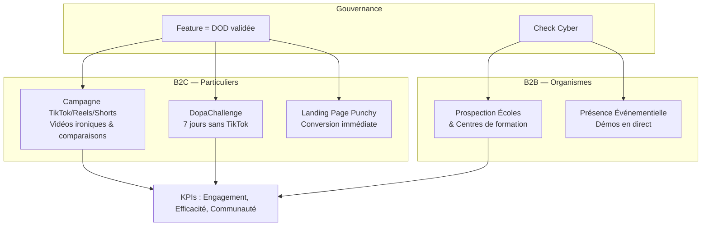

# Plan de Communication : Projet DopaLearn

## 1. Fondations et Vision

L'objectif central est de transformer une addiction subie (le scroll "vide") en une opportunité d'apprentissage sans friction.

- **Notoriété :** Imposer DopaLearn comme l'alternative éthique aux réseaux sociaux.
- **Engagement :** Prouver que l'apprentissage peut être aussi addictif qu'un jeu vidéo.
- **Zéro Friction :** Communiquer sur la simplicité radicale (pas de saisie, pas de PDF).
- **Promesse de marque :** Proposer une alternative éthique aux algorithmes toxiques en remplaçant les flux passifs par du contenu ludique et interactif.
- **Différenciation Majeure :** Zéro effort de préparation ; l'IA construit le cours de manière organique et conversationnelle.
- **Technologie au service de l'usage :** Utilisation de l'IA vocale et du mode "mains libres" pour s'intégrer dans les micro-pauses du quotidien.

---

## 2. Axes de Communication (Marketing Daniel)

Ces axes définissent le ton et le contenu de chaque campagne pour maximiser l'impact sur la cible (étudiants, professionnels, hyperactifs).

| **Axe** | **Message Clé** | **Concept de Contenu** | **Objectif Psychologique** |
| --- | --- | --- | --- |
| **Le Choc Dopamine** | *"On a hacké la dopamine pour apprendre"*. | Comparaison : 10 min de TikTok (0 souvenir) vs 10 min de DopaLearn (3 notions). | Créer la surprise en détournant le vocabulaire des réseaux sociaux. |
| **Le Scroll Utile** | *"Tu ne perds pas ton temps, tu choisis ta dopamine"*. | Contenu déculpabilisant : Le feed qui fait progresser ton cerveau même quand tu es fatigué. | Déculpabiliser l'utilisateur : le scroll est un réflexe neutre que l'on redirige. |
| **Zéro Effort** | *"Pas de PDF. Pas de fiches. Pas de préparation"*. | Démo de l'IA : L'utilisateur parle et le jeu se génère instantanément. | Lever le frein psychologique de la charge mentale liée aux révisions classiques. |
| **Gameplay Pur** | *"Si tu sais, tu gagnes. Si tu oublies, tu perds"*. | Visualisation du savoir comme un "stuff" de RPG (Ton cerveau = Ton perso). | Transformer la connaissance en "équipement" (stuff) pour progresser dans le jeu. |
| **Anti-Algo Toxique** | *"L'algorithme à ton service, pas l'inverse"*. | Discours engagé : DopaLearn investit ton attention au lieu de la monétiser. | Se positionner comme une solution de souveraineté de l'attention face aux GAFAM. |

---

## 3. Stratégie de Mise en Œuvre (Actions Clés)

### Campagnes B2C (Particuliers)

- **Campagne TikTok/Reels/Shorts :** Utiliser les codes de nos concurrents directs pour proposer des vidéos ironiques et des comparaisons "Avant (Scroll inutile) / Après (DopaLearn)".
- **Le DopaChallenge :** Organisation d'un défi communautaire pour inciter les gens à désinstaller TikTok au profit de DopaLearn pendant 7 jours, avec un système de récompenses ludiques.
- **Landing Page Punchy :** Un site web minimaliste axé sur la conversion immédiate via les messages clés de l'IA.

### Stratégie B2B & Événementiel

- **Prospection Organismes :** Démarchage des écoles et centres de formation pour intégrer DopaLearn dans leurs parcours de montée en compétences.
- **Présence Événementielle :** Intégration de l'application dans des événements physiques pour des démos en direct.

---

## 4. Gouvernance et Communication Interne

Pour garantir la cohérence entre le développement technique (MVP) et la promesse marketing.

### Alignement Technique

Toute communication sur une fonctionnalité (ex: Voice IA) doit respecter la **Definition of Done (DOD)** technique avant publication.

### Rituels de Communication

- **Hebdomadaire :** Réunion d'équipe avec démo des fonctionnalités pour alimenter le contenu marketing.
- **Mensuel :** Comité de pilotage pour ajuster les messages en fonction de l'avancement du WBS.

### Outils de Référence

| Outil | Usage |
| --- | --- |
| **Discord** | Communication quotidienne et flux opérationnel. |
| **Réunion Hebdomadaire** | Démo des fonctionnalités et résolution des blocages (Enregistrée). |
| **Comité de Pilotage (Mensuel)** | Contrôle des deadlines et du budget. |
| **Phase Review** | Bilan en fin de MVP pour valider la transition vers le mode Agile. |

### Traçabilité et Validation

- **Notion :** Espace de travail pour le brouillon et la collaboration.
- **GitHub Wiki :** Référentiel officiel pour les versions validées ("Single Source of Truth").
- **Validation Cyber :** Toute communication technique ou feature doit passer le "Check Cyber" avant d'être rendue publique.

---

## 5. Indicateurs de Succès (KPIs)

| KPI | Description |
| --- | --- |
| **Engagement** | Capacité à approcher les taux de rétention des réseaux sociaux classiques. |
| **Efficacité** | Taux de complétion des cours générés par l'IA. |
| **Communauté** | Nombre de contributeurs et de plugins sur la brique Open Source. |
