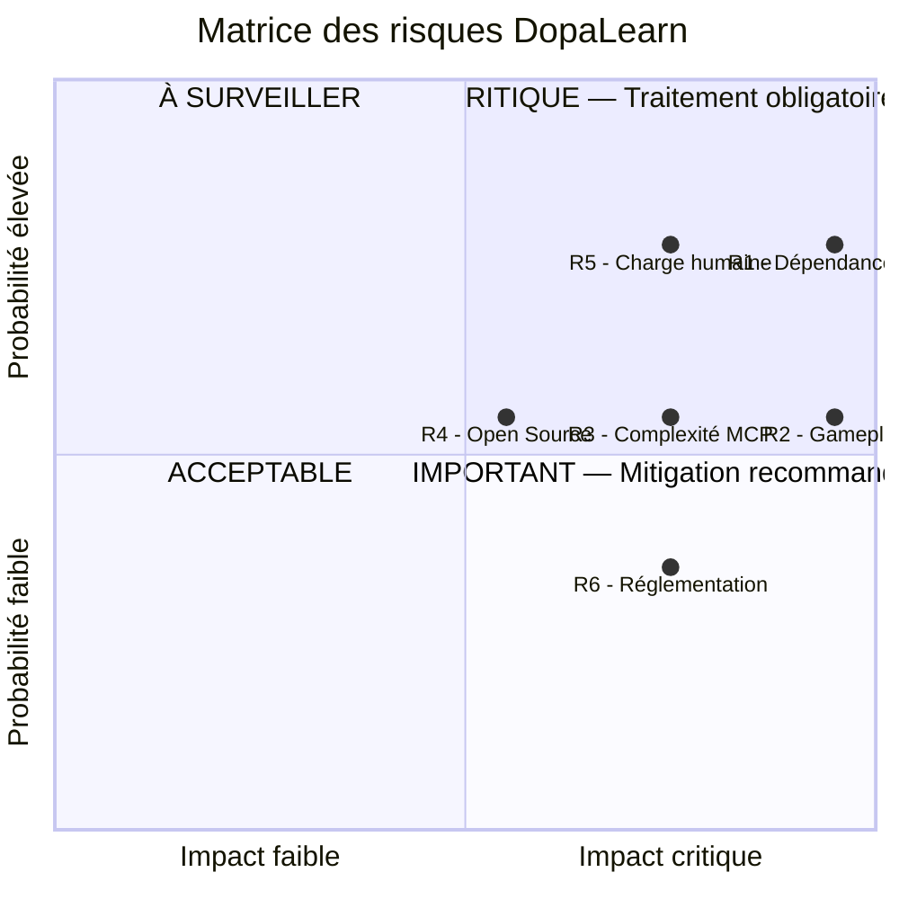
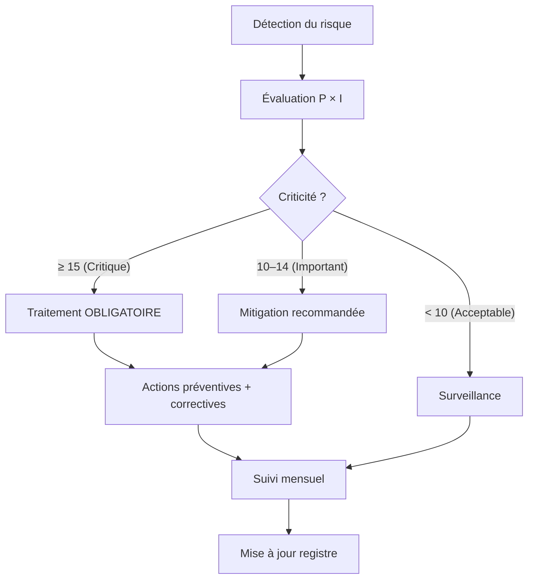

# Gestion des risques

## 1. Objectif du document

### Rôle de la gestion des risques dans le projet

La gestion des risques vise à anticiper les événements susceptibles de compromettre la réussite du projet DopaLearn. Elle permet de :

- Sécuriser la livraison du MVP v0.1
- Garantir la qualité de l'expérience utilisateur
- Maintenir le respect des contraintes de planning et de budget
- Préserver la viabilité produit et business

### Lien avec les objectifs, le planning et le budget

| Élément projet | Lien avec les risques |
| --- | --- |
| Objectifs produit | Les risques peuvent empêcher la validation de la proposition de valeur (ex : gameplay non engageant). |
| Planning | Les risques techniques ou humains peuvent provoquer des retards. |
| Budget | Les risques liés aux LLM ou à la complexité technique peuvent générer des surcoûts importants. |

### Niveau d'anticipation attendu

Le projet adopte une approche **pragmatique** :

- Acceptation d'un risque d'innovation élevé (car projet exploratoire)
- Refus des risques de rupture critique (retards majeurs, explosion des coûts, impossibilité de livrer)

---

## 2. Méthodologie de gestion des risques

### 2.1 Méthode d'identification

| Source | Description |
| --- | --- |
| Analyse des hypothèses | Identification des points critiques du MVP (IA, gameplay, Open Source). |
| Brainstorming | Sessions Produit / Technique / Business. |
| Retour d'expérience | Benchmark SaaS, IA, Open Source. |

### 2.2 Méthode d'analyse

- **Analyse qualitative** : jugement expert basé sur expérience et hypothèses projet.
- Évaluation croisée **Probabilité × Impact**.

### 2.3 Échelles utilisées

**Probabilité (P)**

| Valeur | Signification |
| --- | --- |
| 1 | Très faible |
| 2 | Faible |
| 3 | Moyenne |
| 4 | Élevée |
| 5 | Très élevée |

**Impact (I)**

| Valeur | Signification |
| --- | --- |
| 1 | Mineur |
| 2 | Faible |
| 3 | Modéré |
| 4 | Majeur |
| 5 | Critique |

**Formule de criticité :**

> Criticité = Probabilité × Impact

---

## 3. Typologie des risques

| Type de risque | Description |
| --- | --- |
| Techniques | Architecture, performance, dépendances IA. |
| Organisationnels | Open Source, gouvernance, coordination. |
| Humains | Charge, fatigue, dépendance aux ressources clés. |
| Planning | Retards, sous-estimation des tâches. |
| Budgétaires | Surcoûts API, infra, développement. |
| Externes | Réglementation, perception éthique, marché. |

---

## 4. Identification des risques (Registre)

| ID | Description | Catégorie | Cause racine | Conséquences potentielles |
| --- | --- | --- | --- | --- |
| R1 | Dépendance excessive aux LLM externes | Technique / Budgétaire | Usage intensif d'APIs IA | Explosion des coûts, latence, UX dégradée |
| R2 | Gameplay insuffisamment engageant | Produit / Business | Difficulté à créer des boucles dopaminergiques | Faible rétention, échec validation produit |
| R3 | Complexité excessive du noyau MCP | Technique / Planning | Sur-ingénierie | Retards, dette technique |
| R4 | Échec adoption Open Source | Organisationnel / Externe | Manque de visibilité/documentation | Peu de contributions, charge interne |
| R5 | Sous-estimation de la charge humaine | Humain / Planning | Polyvalence excessive | Burnout, glissement planning |
| R6 | Risques réglementaires / éthiques | Externe | Assimilation à un produit addictif | Image dégradée, freins B2B |

---

## 5. Analyse des risques

| ID | Probabilité (P) | Impact (I) | Criticité | Justification |
| --- | --- | --- | --- | --- |
| R1 | 4 | 5 | 20 | Forte dépendance aux APIs IA coûteuses et instables. |
| R2 | 3 | 5 | 15 | Gameplay est clé mais difficile à designer. |
| R3 | 3 | 4 | 12 | Tentation d'over-engineering forte en projet tech. |
| R4 | 3 | 3 | 9 | Open Source incertain sans stratégie community. |
| R5 | 4 | 4 | 16 | Équipe réduite, forte polyvalence. |
| R6 | 2 | 4 | 8 | Risque réel mais encore peu probable à court terme. |

---

## 6. Hiérarchisation des risques

### Matrice Probabilité × Impact

### Classement par criticité

1. R1 – Dépendance LLM (20)
2. R5 – Charge humaine (16)
3. R2 – Gameplay (15)
4. R3 – Complexité MCP (12)
5. R4 – Open Source (9)
6. R6 – Réglementation / éthique (8)

### Seuils de tolérance

| Niveau | Criticité | Traitement |
| --- | --- | --- |
| Critique | ≥ 15 | Traitement obligatoire |
| Important | 10–14 | Mitigation recommandée |
| Acceptable | < 10 | Surveillance |

---

## 7. Stratégies de traitement

| ID | Stratégie | Actions préventives | Actions correctives |
| --- | --- | --- | --- |
| R1 | Réduction | Cache, limitation appels, LLM agnostique | Migration vers modèles locaux |
| R2 | Réduction / Acceptation | Prototypage rapide, tests UX | Pivot gameplay |
| R3 | Réduction | Scope MVP strict | Refactoring / simplification |
| R5 | Réduction | Priorisation, gel features | Recrutement / sous-traitance |

---

## 8. Plans de mitigation (exemple R1)

| Élément | Description |
| --- | --- |
| Déclencheur | Coût API > seuil mensuel |
| Actions | Réduction appels, fallback local |
| Responsable | Tech Lead |
| Délai | 2 semaines |

---

## 9. Responsabilités

| Rôle | Responsabilité |
| --- | --- |
| Product Owner | Priorisation et arbitrage |
| Tech Lead | Risques techniques |
| Project Manager | Planning et budget |
| Governance Board | Décisions majeures |

---

## 10. Processus de traitement d'un risque

---

## 11. Suivi et mise à jour

| Indicateur | Fréquence |
| --- | --- |
| Coût IA | Mensuel |
| Avancement planning | Hebdomadaire |
| Burn rate humain | Mensuel |
| Engagement utilisateur | Après chaque release |

Processus : mise à jour du registre à chaque jalon et revue mensuelle.

---

## 11. Lien avec les autres livrables

| Livrable | Intégration |
| --- | --- |
| Planning | Buffers de risques |
| Budget | Provisions pour risques |
| Plan de communication | Alertes et escalade |
| Organisation | Processus décisionnel |

---

## 12. Validation et gouvernance

| Élément | Description |
| --- | --- |
| Responsable validation | Product Owner + Tech Lead |
| Moment | Fin de conception MVP |
| Révision | À chaque changement majeur de périmètre |

---

## Annexe : Alignement avec la Vision DopaLearn

La gestion des risques soutient directement :

- La réduction de friction cognitive
- La viabilité économique (maîtrise coûts IA)
- L'ambition Open Source
- La protection contre les risques éthiques liés à la dopamine
