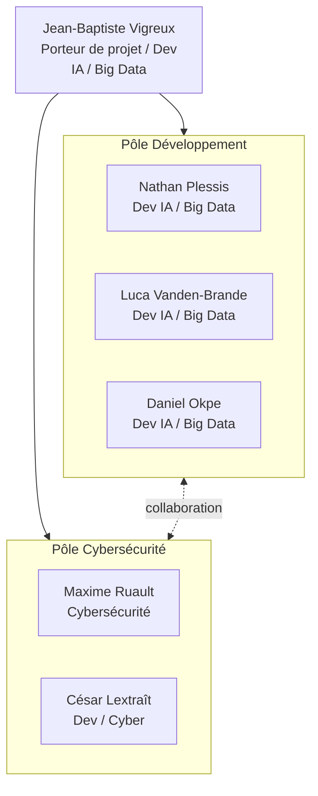
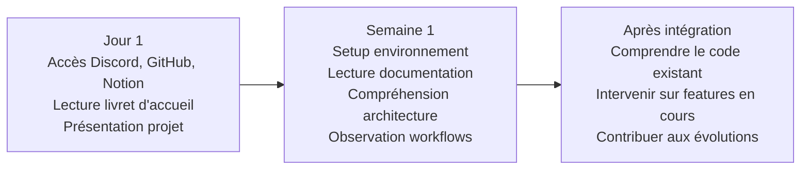
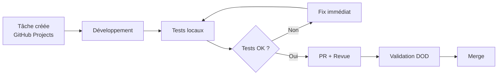

# Livret d'accueil – Projet DopaLearn

---

## 1. Rôle du livret d'accueil

**Finalité**

Ce livret a pour objectif de permettre à toute personne rejoignant le projet DopaLearn de comprendre rapidement :

- ce qu'est le projet,
- comment l'équipe fonctionne,
- ce qui est attendu concrètement,
- comment être autonome sans friction.

**Public cible**

Toute personne intégrant le groupe projet : développeur, cybersécurité, contributeur technique.

**Moment d'utilisation**

À l'arrivée dans l'équipe, et comme document de référence ponctuel.

**Portée normative**

- **Obligatoire** : organisation, outils, qualité, DOD, règles de validation.
- **Souple** : méthodes de travail, communication, onboarding.

---

## 2. Présentation du projet

**Nom**

DopaLearn

**Contexte général**

DopaLearn est un projet expérimental visant à détourner les mécanismes de dopamine (scroll, jeu, interaction) pour réduire la friction liée à l'apprentissage et à la révision.

Le projet est aussi un terrain d'exploration technique : IA, Big Data, cybersécurité, architecture logicielle, bonnes pratiques industrielles.

**Objectifs synthétiques**

- Apprendre en s'amusant, sans pression inutile
- Explorer des sujets techniques variés, parfois hors spécialité
- Construire un produit fonctionnel et cohérent
- Monter collectivement en compétences

**Périmètre fonctionnel (MVP)**

- Noyau applicatif central
- Construction de connaissances via interaction IA
- Modes ludiques d'apprentissage
- Architecture évolutive

**Contraintes majeures**

- Exigence forte sur la qualité et la sécurité
- MVP structuré avant passage en Agile
- Projet vivant, en évolution continue

---

## 3. Présentation de l'équipe

### Équipe actuelle

| Nom | Rôle | Spécialité | GitHub |
| --- | --- | --- | --- |
| Jean-Baptiste Vigreux | Porteur de projet / Dev | IA / Big Data | vigreux8 |
| Nathan Plessis | Dev | IA / Big Data | Epi-XeraCube |
| Luca Vanden-Brande | Dev | IA / Big Data | scawward |
| Daniel Okpe | Dev | IA / Big Data | danielOkpe |
| Maxime Ruault | Cybersécurité | Sécurité | SkyHonnor |
| César Lextraît | Dev / Cyber | Sécurité | cez0uille |

**Organisation**

- Structure plate
- Pas de hiérarchie lourde
- Jean-Baptiste porte la vision et tranche en cas de besoin
- Le reste de l'équipe fonctionne de manière collaborative

---

## 4. Culture de travail

La culture du projet repose sur les principes suivants :

- **Pas de prise de tête inutile**
- **Droit à l'exploration** : apprendre des sujets hors spécialité est encouragé
- **Responsabilité individuelle** : autonomie attendue
- **Qualité avant vitesse**
- **Discussion avant conflit**
- **Problèmes traités immédiatement, pas contournés**

Le projet est un espace pour :

- s'amuser techniquement,
- expérimenter,
- progresser collectivement.

---

## 5. Fonctionnement global du projet

**Méthodologie**

- Phase 1 : MVP en approche prédictive (PBS / WBS)
- Phase 2 : Évolutions en Agile (Backlog, User Stories)

**Décisions**

- Discussion collective privilégiée
- Arbitrage final assuré par le porteur de projet si nécessaire

**Priorisation**

- Basée sur le MVP, la faisabilité et la valeur technique ou produit

---

## 6. Onboarding (intégration)

Même s'il n'existe pas de processus formel rigide, une **timeline de référence** est définie.

### Timeline d'intégration indicative

**Jour 1**

- Accès Discord, GitHub, Notion
- Lecture du livret d'accueil
- Présentation rapide du projet

**Première semaine**

- Setup environnement local
- Lecture de la documentation existante
- Compréhension de l'architecture
- Observation des workflows

**Après intégration**

- Capacité à :
    - comprendre les fonctionnalités existantes,
    - intervenir sur des fonctionnalités en cours,
    - contribuer aux futures évolutions.

**Objectif final**

Être **autonome sur le projet**, ses fonctionnalités actuelles et celles à venir.

---

## 7. Outils et environnements

| Catégorie | Outil | Usage |
| --- | --- | --- |
| **Communication** | Discord | Canal principal, échanges quotidiens |
| **Gestion de projet** | GitHub Projects | Suivi WBS / Backlog |
| **Documentation (brouillon)** | Notion | Travail collaboratif |
| **Documentation (validée)** | GitHub Wiki | Single Source of Truth |
| **Code** | GitHub | Dépôt principal |
| **CI/CD** | GitHub Actions | Tests automatisés |
| **Environnement** | Local | Développement individuel |

---

## 8. Standards et conventions

À ce stade du projet :

- Aucune convention de nommage stricte imposée
- Aucune convention de commits formalisée
- Ces règles pourront évoluer si le projet grandit

**Règle implicite** : lisibilité, clarté, cohérence.

---

## 9. Processus clés

### Création d'une tâche

- Via GitHub Projects (WBS ou Backlog)

### Validation d'un livrable

- Application stricte de la DOD

### Blocage technique

- Discussion immédiate avec l'équipe
- Point technique si nécessaire

### Tests en échec

- Le problème doit être traité avant toute autre avancée
- Échange avec la personne ayant mis en place les tests si besoin

---

## 10. Qualité et exigences

La **Definition of Done (DOD)** est contractuelle.

Aucun travail n'est considéré terminé sans :

- Revue de code
- Documentation mise à jour
- Tests validés
- Validation cybersécurité si applicable

---

## 11. Ressources et références

| Document | Description |
| --- | --- |
| Genèse et objectifs | Vision, UVP, KPIs du projet |
| Organisation générale | Méthodologie, gouvernance, rituels |
| Definition of Done | Critères de validation globaux et par phase |
| OBS | Structure organisationnelle et responsabilités |
| PBS / WBS | Décomposition produit et travail |
| GitHub | Code source et wiki |
| Notion | Documentation collaborative |

---

## 12. Mise à jour du livret

| Élément | Description |
| --- | --- |
| **Responsable** | Jean-Baptiste Vigreux |
| **Fréquence** | À chaque changement majeur d'organisation ou de méthodologie |
| **Validation** | Équipe + mise à jour GitHub Wiki |
