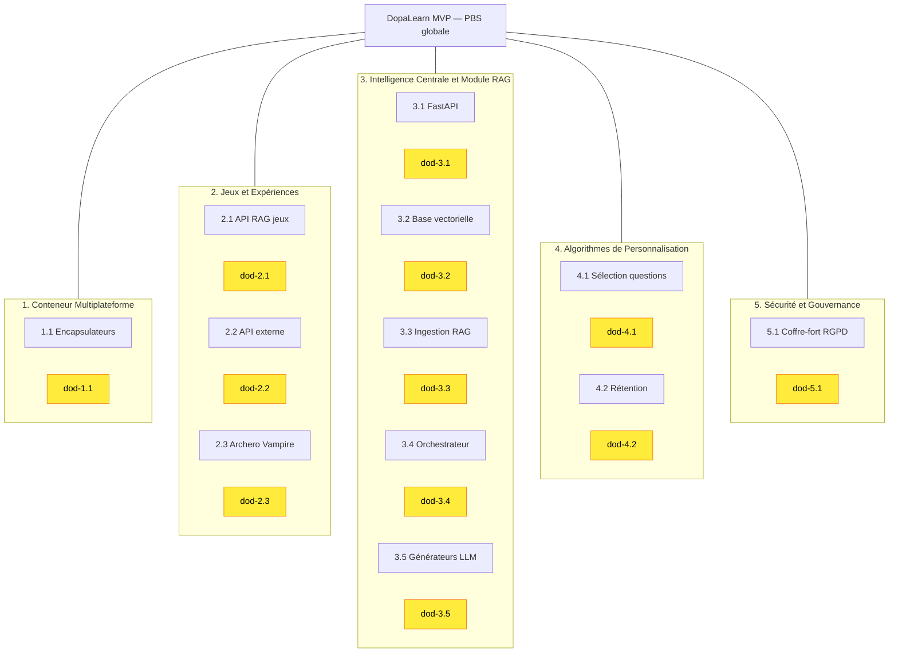

# Schéma global PBS + DOD — DopaLearn MVP

Grand schéma : **PBS** en tête, puis une zone par section avec des **petits carrés jaunes** (livrables / DOD).

**Légende :** les carrés jaunes correspondent aux fichiers DOD de chaque livrable (voir dossiers `dod/` par section).
