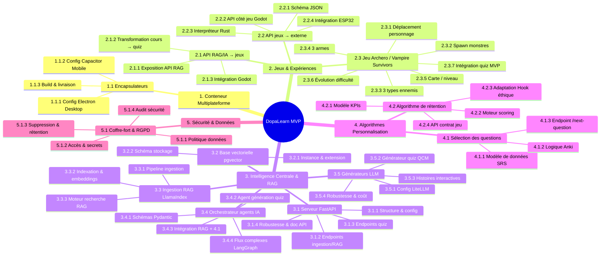
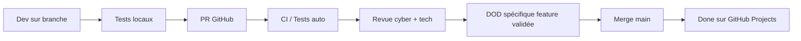
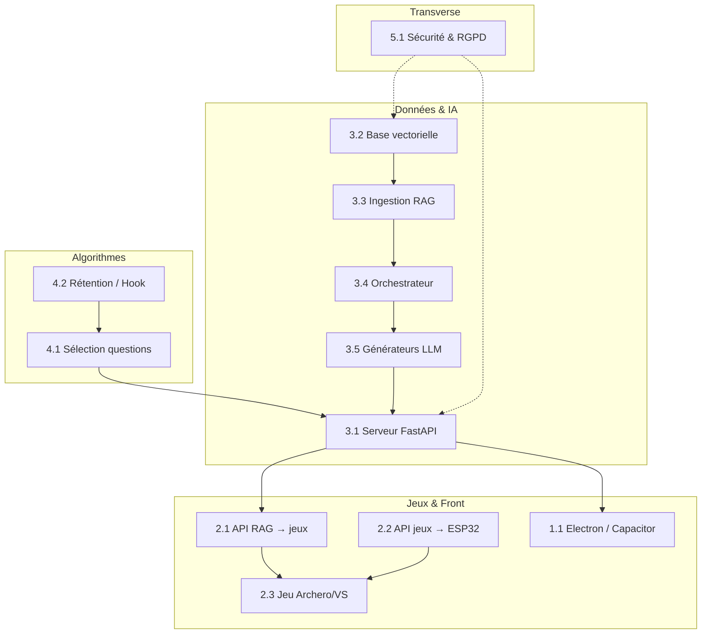

# Schéma WBS Global — DopaLearn MVP (v0.1)

---

## Vue d'ensemble (Mermaid)

---

## Vue tabulaire (PBS → WBS → fichiers)

| PBS | Feature | Sous-features (WBS) | Fichier WBS | Fichier DOD |
|-----|---------|---------------------|-------------|-------------|
| **1. Conteneur** | 1.1 Encapsulateurs | 1.1.1 Electron, 1.1.2 Capacitor, 1.1.3 Build | `wbs/conteneur-multiplateforme/wbs-1.1-encapsulateurs.md` | `dod/conteneur-multiplateforme/dod-1.1-encapsulateurs.md` |
| **2. Jeux** | 2.1 API RAG → jeux | 2.1.1 Expo API, 2.1.2 Transformation, 2.1.3 Godot | `wbs/jeux-et-experience/wbs-2.1-api-rag-ia-jeux.md` | `dod/jeux-et-experience/dod-2.1-api-rag-ia-jeux.md` |
| | 2.2 API jeux → externe | 2.2.1 JSON, 2.2.2 Godot, 2.2.3 Rust, 2.2.4 ESP32 | `wbs/jeux-et-experience/wbs-2.2-api-jeux-externe.md` | `dod/jeux-et-experience/dod-2.2-api-jeux-externe.md` |
| | 2.3 Archero / VS | 2.3.1→2.3.7 (7 features) | `wbs/jeux-et-experience/wbs-2.3-archero-vampire-survivors.md` | `dod/jeux-et-experience/dod-2.3-archero-vampire-survivors.md` |
| **3. Backend IA** | 3.1 Serveur FastAPI | 3.1.1→3.1.4 | `wbs/backend-ia/wbs-3.1-serveur-fastapi.md` | `dod/backend-ia/dod-3.1-serveur-fastapi.md` |
| | 3.2 Base vectorielle | 3.2.1 Instance, 3.2.2 Schéma | `wbs/backend-ia/wbs-3.2-base-vectorielle.md` | `dod/backend-ia/dod-3.2-base-vectorielle.md` |
| | 3.3 Ingestion RAG | 3.3.1 Pipeline, 3.3.2 Indexation, 3.3.3 Retrieval | `wbs/backend-ia/wbs-3.3-ingestion-rag.md` | `dod/backend-ia/dod-3.3-ingestion-rag.md` |
| | 3.4 Orchestrateur IA | 3.4.1→3.4.4 | `wbs/backend-ia/wbs-3.4-orchestrateur-agents.md` | `dod/backend-ia/dod-3.4-orchestrateur-agents.md` |
| | 3.5 Générateurs LLM | 3.5.1→3.5.4 | `wbs/backend-ia/wbs-3.5-generateurs-llm.md` | `dod/backend-ia/dod-3.5-generateurs-llm.md` |
| **4. Algos** | 4.1 Sélection questions | 4.1.1 Data SRS, 4.1.2 Anki, 4.1.3 Endpoint | `wbs/algorithmes-personnalisation/wbs-4.1-selection-questions.md` | `dod/algorithmes-personnalisation/dod-4.1-selection-questions.md` |
| | 4.2 Rétention (Hook) | 4.2.1 KPIs, 4.2.2 Scoring, 4.2.3 Hook, 4.2.4 API | `wbs/algorithmes-personnalisation/wbs-4.2-algorithme-retention.md` | `dod/algorithmes-personnalisation/dod-4.2-algorithme-retention.md` |
| **5. Sécu** | 5.1 RGPD & Coffre | 5.1.1→5.1.4 | `wbs/securite/wbs-5.1-securite-rgpd.md` | `dod/securite/dod-5.1-securite-rgpd.md` |

---

## Flux de validation (DOD global)

---

## Dépendances entre blocs

