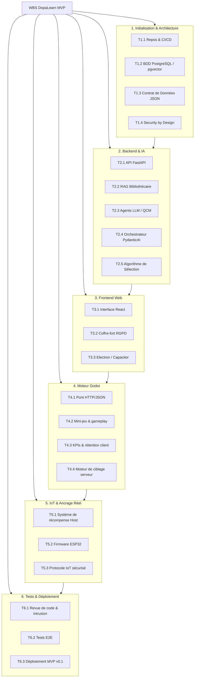

# Work Breakdown Structure (WBS) — DopaLearn MVP

---

## Introduction

Ce document décompose le projet en *lots de travaux* (Work Packages) et en tâches actionnables. Il est directement calqué sur le PBS (Product Breakdown Structure) v0.1 et tient compte de la stack technologique (React, FastAPI, Godot, LlamaIndex, PydanticAI, ESP32).

---

## 1. Phase d'Initialisation & Architecture (Fondations)

**Objectif :** Mettre en place l'environnement de travail et définir les règles de communication entre les briques.

| Tâche  | Description                                                                                          | Responsable                        |
|--------|------------------------------------------------------------------------------------------------------|------------------------------------|
| T1.1   | **Initialiser les dépôts et l'environnement CI/CD** Configurer les repos Git (Backend, Frontend, Godot, IoT) et les pipelines de déploiement.                             | Équipe de Développement            |
| T1.2   | **Déployer l'infrastructure de base de données** Configurer PostgreSQL / Supabase et activer l'extension pgvector pour le stockage vectoriel.                            | Équipe de Développement            |
| T1.3   | **Définir le Contrat de Données (Standardisation JSON)** Rédiger et valider les schémas stricts (via Pydantic) qui serviront de norme de communication absolue entre l'IA, le Backend et Godot. *(Lien PBS 2.3)* | Porteur de Projet & Équipe de Développement |
| T1.4   | **Définir les règles de sécurité (Security by Design)** Établir les protocoles de chiffrement, d'authentification et de gestion des tokens.                             | Pôle Cybersécurité                 |

---

## 2. Phase Backend & Intelligence Artificielle (Cerveau)

**Objectif :** Développer le moteur logique, le RAG et les API de service.

| Tâche  | Description                                                                                          | Responsable                        |
|--------|------------------------------------------------------------------------------------------------------|------------------------------------|
| T2.1   | **Développer l'API Asynchrone (FastAPI)** Créer les routes (endpoints) principales pour l'authentification, l'ingestion de données et la communication avec le jeu. *(Lien PBS 3.1)* | Équipe de Développement            |
| T2.2   | **Implémenter le module RAG "Bibliothécaire"** Intégrer LlamaIndex pour parser les documents (PDF/Texte), générer les embeddings et les stocker dans Supabase/pgvector. *(Lien PBS 3.3)* | Équipe de Développement            |
| T2.3   | **Développer les agents de génération (LLM)** Configurer LiteLLM et développer les prompts système pour générer des QCM. *(Lien PBS 3.5)* | Équipe de Développement            |
| T2.4   | **Coder l'Orchestrateur PydanticAI** Créer le flux de validation garantissant que la sortie de LiteLLM correspond exactement au standard JSON défini en T1.3. *(Lien PBS 3.4)* | Équipe de Développement            |
| T2.5   | **Développer l'Algorithme de Sélection** Coder la logique de répétition espacée (type Anki) pour interroger la base vectorielle. *(Lien PBS 4.1)* | Équipe de Développement            |

---

## 3. Phase Frontend Web & Encapsulation Multiplateforme

**Objectif :** Créer l'interface permettant à l'utilisateur de gérer son profil et ses cours.

| Tâche  | Description                                                                                          | Responsable                        |
|--------|------------------------------------------------------------------------------------------------------|------------------------------------|
| T3.1   | **Développer l'Interface Principale (React)** Maquetter et coder les écrans de connexion, le tableau de bord de progression, et l'interface d'import de documents.       | Équipe de Développement            |
| T3.2   | **Intégrer le Coffre-fort RGPD** Implémenter la vue et la logique de gestion des données personnelles (export des données, bouton de suppression définitive du compte). *(Lien PBS 5.1)* | Équipe de Développement & Pôle Cybersécurité |
| T3.3   | **Configurer les Encapsulateurs Natifs** Paramétrer Electron pour générer l'application Bureau (Mac/Win) et Capacitor pour l'application Mobile (iOS/Android). *(Lien PBS 1.1)* | Équipe de Développement            |

---

## 4. Phase Expériences Ludiques & Rétention (Moteur Godot)

**Objectif :** Développer le jeu qui va consommer les QCM générés par l'IA.

| Tâche  | Description                                                                                          | Responsable                        |
|--------|------------------------------------------------------------------------------------------------------|------------------------------------|
| T4.1   | **Intégrer le Pont de Communication HTTP/JSON** Développer en GDScript/C# le client HTTP côté Godot pour récupérer les QCM du Backend FastAPI selon le standard JSON.     | Équipe de Développement            |
| T4.2   | **Développer l'Expérience de Jeu 1 (Mini-jeu)** Concevoir la boucle de gameplay où les actions sont bloquées/débloquées par les questions du RAG. *(Lien PBS 2.5)*    | Équipe de Développement            |
| T4.3   | **Implémenter l'Algorithme de Rétention (Côté Client)** Coder la logique de collecte des KPIs d'engagement (temps de réponse, taux de réussite) en jeu et les renvoyer au Backend. *(Lien PBS 2.1)* | Équipe de Développement            |
| T4.4   | **Concevoir le Moteur de Ciblage (Côté Serveur)** Traiter les KPIs reçus de Godot pour ajuster la difficulté de manière dynamique. *(Lien PBS 4.2)*                    | Porteur de Projet (Définition) & Équipe de Développement (Code) |

---

## 5. Phase IoT et Mécaniques d'Ancrage Réel

**Objectif :** Lier les récompenses in-game à des actions dans le monde physique.

| Tâche  | Description                                                                                          | Responsable                        |
|--------|------------------------------------------------------------------------------------------------------|------------------------------------|
| T5.1   | **Développer le Système de Récompense (Host/Serveur)** Créer la logique côté serveur (séparée de l'IoT) qui valide si une récompense physique doit être octroyée en fonction des succès du joueur. | Équipe de Développement            |
| T5.2   | **Développer le Firmware ESP32 (Rust/C++)** Écrire le code embarqué de l'ESP32 pour écouter les requêtes sécurisées provenant du serveur "Host".                       | Équipe de Développement            |
| T5.3   | **Implémenter le Protocole de Communication IoT** Mettre en place la communication bidirectionnelle sécurisée entre le Serveur Host, Godot, et l'ESP32 (ex: allumer une lampe ou activer un moteur de distribution). *(Lien PBS 2.4)* | Équipe de Développement & Pôle Cybersécurité |

---

## 6. Phase Tests, Sécurité & Déploiement

**Objectif :** Sécuriser, tester et livrer le produit final.

| Tâche  | Description                                                                                          | Responsable                        |
|--------|------------------------------------------------------------------------------------------------------|------------------------------------|
| T6.1   | **Réaliser la Revue de Code et les Tests d'Intrusion** Auditer l'API, les failles d'injection LLM (prompt injection) et la sécurisation du flux IoT.                  | Pôle Cybersécurité                 |
| T6.2   | **Exécuter les Tests d'Intégration Bout-en-Bout (E2E)** Tester le flux complet : Upload PDF → Extraction IA → Traduction QCM JSON → Affichage dans Godot → Validation Récompense ESP32. | Équipe de Développement            |
| T6.3   | **Déployer la v0.1 (MVP)** Publier le Backend sur l'environnement de production, distribuer les builds Electron/Capacitor et figer la version open-source du noyau.   | Équipe de Développement            |

---

## Schéma Mermaid — Récapitulatif du WBS

---