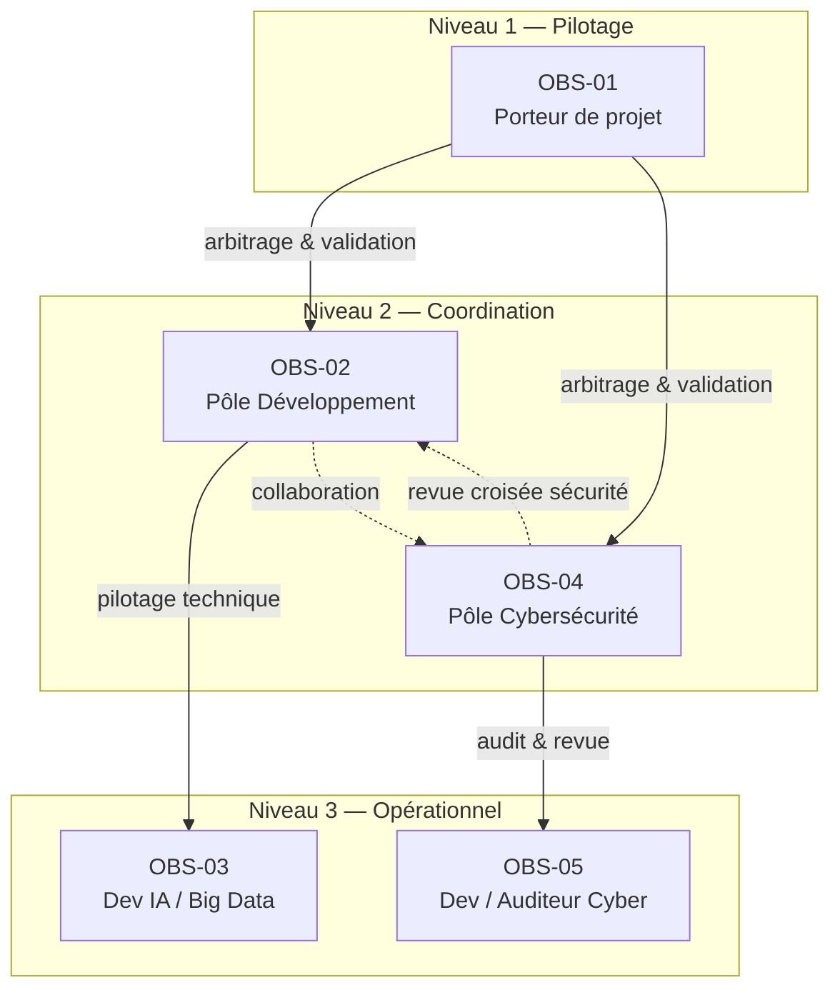
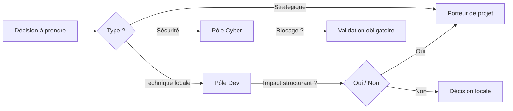
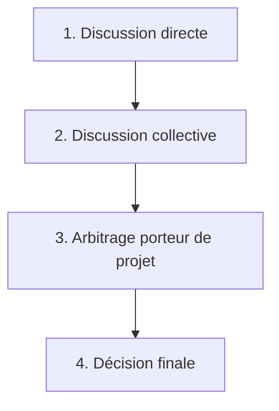

# Schéma OBS (Organizational Breakdown Structure) – Projet DopaLearn

---

## 1. Objectif du document

### Rôle du schéma OBS

L'OBS définit la structure organisationnelle du projet DopaLearn.

Il précise les rôles, responsabilités, autorités de décision et mécanismes de redevabilité applicables à l'ensemble du projet.

Il sert de référence officielle pour :

- la gouvernance,
- l'affectation des responsabilités,
- la traçabilité des décisions,
- l'évaluation pédagogique du projet.

### Différence avec WBS et organigramme

- **OBS** : structure organisationnelle (qui est responsable de quoi)
- **WBS** : structure du travail (quoi faire)
- **Organigramme** : hiérarchie RH formelle (non pertinente ici)

### Ce que l'OBS permet de clarifier

- Responsabilités exactes de chaque rôle
- Autorité de décision et niveaux de validation
- Redevabilité sur les livrables

---

## 2. Principes de construction de l'OBS

### Logique retenue

Découpage par **rôles fonctionnels**, indépendamment des individus, afin de :

- garantir la continuité du projet,
- permettre la polyvalence,
- maintenir une structure souple mais lisible.

### Niveau de granularité

Granularité volontairement intermédiaire, adaptée à :

- une équipe réduite,
- un projet évolutif,
- un contexte pédagogique.

### Alignement

L'OBS est aligné avec :

- l'Organisation Générale (modèle hybride),
- la DOD (qualité contractuelle),
- le planning et le WBS,
- le livret d'accueil.

---

## 3. Structure globale de l'OBS

### Niveaux organisationnels

**Niveau 1 – Pilotage / Gouvernance**

- Porteur de projet

**Niveau 2 – Coordination**

- Pôle Développement
- Pôle Cybersécurité

**Niveau 3 – Opérationnel**

- Développeurs IA / Big Data
- Développeurs / Auditeurs Cybersécurité

### Relations

- **Verticales** : arbitrage, validation, responsabilité finale
- **Horizontales** : collaboration, revue croisée, discussion prioritaire

### Schéma hiérarchique

---

## 4. Décomposition organisationnelle

### OBS-01 — Porteur de projet

| Élément | Description |
| --- | --- |
| **Position** | Niveau Pilotage |
| **Mission principale** | Porter la vision du projet et garantir sa cohérence globale. |
| **Périmètre de décision** | Total. |
| **Remplacement en absence** | Priorité à Nathan, à défaut Maxime. |

**Responsabilités**

- Vision produit et technique
- Définition PBS / WBS / Backlog
- Arbitrage stratégique et technique
- Validation finale des livrables
- Décision finale en cas de conflit
- Responsabilité finale en cas de bug critique

**Livrables** : Documents de cadrage, OBS, Livret d'accueil, MVP validé.

---

### OBS-02 — Pôle Développement

| Élément | Description |
| --- | --- |
| **Position** | Niveau Coordination |
| **Mission principale** | Concevoir et développer les fonctionnalités du produit. |
| **Périmètre de décision** | Implémentation technique locale, hors changements structurants. |

**Responsabilités**

- Implémentation technique
- Qualité du code
- Tests fonctionnels
- Documentation technique
- Correction de failles simples (sous validation cyber)

**Livrables** : Code applicatif, Tests, Documentation GitHub.

---

### OBS-03 — Développeur IA / Big Data

| Élément | Description |
| --- | --- |
| **Position** | Niveau Opérationnel |
| **Mission principale** | Développer les composants IA et data du projet. |
| **Périmètre de décision** | Technique locale IA. |

**Responsabilités**

- Implémentation modèles et pipelines
- Optimisation des performances
- Tests locaux
- Documentation IA

**Livrables** : Code IA, Scripts, Tests associés.

---

### OBS-04 — Pôle Cybersécurité

| Élément | Description |
| --- | --- |
| **Position** | Niveau Coordination transverse |
| **Mission principale** | Garantir la sécurité du système dès la conception. |
| **Périmètre de décision** | Sécurité (droit de blocage, décision non encore bornée dans le temps). |

**Responsabilités**

- Security by Design
- Audit de code
- Analyse des risques
- Validation cybersécurité bloquante avant merge

**Livrables** : Avis sécurité, Rapports d'audit, Validation cyber des PR.

---

### OBS-05 — Développeur / Auditeur Cybersécurité

| Élément | Description |
| --- | --- |
| **Position** | Niveau Opérationnel |
| **Mission principale** | Analyser et renforcer la sécurité du code. |
| **Périmètre de décision** | Technique sécurité. |

**Responsabilités**

- Revue de code orientée sécurité
- Tests de vulnérabilité
- Recommandations correctives

**Livrables** : Rapports d'analyse, Correctifs proposés, Validations cyber.

---

## 5. Affectation des responsabilités

- Responsabilités **collectives par pôle**
- Aucune responsabilité individuelle figée
- Validation finale centralisée

| Domaine | Responsable final | Contributeurs |
| --- | --- | --- |
| Vision / pilotage | Porteur de projet | Équipe |
| Développement | Pôle Dev | Dev IA |
| Sécurité | Pôle Cyber | Dev/Cyber |
| Validation finale | Porteur de projet | — |

---

## 6. Gouvernance et décision

### Décisions

- **Stratégiques** : Porteur de projet
- **Techniques locales** : Développeurs
- **Sécurité** : Pôle Cybersécurité (bloquant)

### Changements majeurs

Tout changement impactant fortement l'existant (techno, architecture) doit remonter au porteur de projet.

### Arbitrage

- Priorité à la discussion
- Décision révisable
- Report possible si non urgent

---

## 7. Gestion des conflits et escalade

1. Discussion directe entre parties
2. Discussion collective
3. Arbitrage du porteur de projet
4. Décision priorisant toujours la résolution du conflit

En cas de conflit de responsabilité :

- Discussion
- Vote
- Arbitrage par chef d'équipe (à définir ultérieurement)

---

## 8. Lisibilité et traçabilité

- Toute responsabilité OBS est traçable via :
    - Pull Requests
    - Historique GitHub
- L'OBS sert de référence pédagogique (école / jury).

---

## 9. Scalabilité de l'OBS

### Évolution prévue

- Ajout futur de **chefs d'équipe** si augmentation significative de l'effectif
- Rôles principalement **transverses**
- Hiérarchie minimale, structure linéaire privilégiée

### Seuil de structuration

À définir lors de l'augmentation de l'effectif.

---

## 10. Cohérence documentaire

L'OBS est cohérent avec :

| Livrable | Statut |
| --- | --- |
| Organisation Générale | Aligné |
| DOD | Aligné |
| WBS / Planning | Aligné |
| Livret d'accueil | Aligné |

Aucune contradiction identifiée.

---

## 11. Validation du schéma

| Élément | Description |
| --- | --- |
| **Responsable** | Jean-Baptiste Vigreux (Nathan en soutien) |
| **Moment de validation** | Avant lancement du MVP |
| **Mise à jour** | En cas d'évolution organisationnelle |
| **Versionnement** | Sur Notion |
