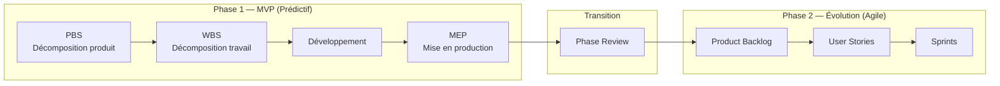
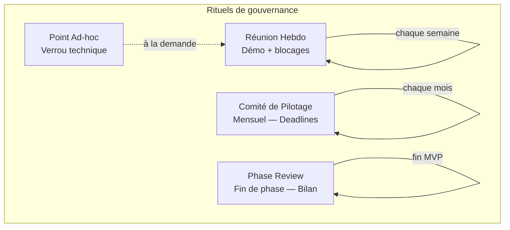
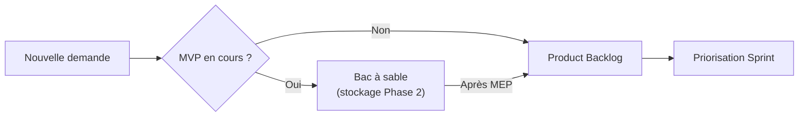

# Organisation Générale du Projet (Modèle Opérationnel)

---

## 1. Introduction et Objectif du Document

Ce document définit le cadre opérationnel, les méthodes de travail et les règles de gouvernance du projet. Il constitue le socle de référence pour assurer la cohésion de l'équipe, la clarté des responsabilités et la fluidité des processus de travail tout au long du cycle de vie du produit.

---

## 2. Approche Méthodologique (Modèle Hybride)

Le projet adopte une stratégie en deux temps pour concilier rigueur de livraison et flexibilité d'innovation.

**Justification de l'approche :**
Le choix d'un modèle hybride répond à deux besoins critiques :

1. **Sécuriser le lancement (Phase 1) :** L'approche prédictive garantit le respect de la deadline sur le MVP et la production d'un PBS et d'un WBS en limitant les changements de périmètre.
2. **Maximiser l'expérience utilisateurs (Phase 2) :** L'approche Agile permet ensuite de pivoter ou d'ajuster le produit en fonction des retours réels des utilisateurs, évitant de développer des fonctionnalités inutiles.

### 2.1. Phase 1 : Construction du MVP (Mode Prédictif)

- **Objectif :** Livraison d'un produit minimum viable fonctionnel à date fixe.
- **Pilotage :** Basé sur le **PBS (Product Breakdown Structure)** pour définir les composants du MVP et le **WBS (Work Breakdown Structure)** pour les tâches de réalisation.
- **Validation :** Respect strict des spécifications et de l'architecture définies en amont.

### 2.2. Phase 2 : Évolution et Run (Mode Agile)

- **Objectif :** Amélioration continue basée sur les retours utilisateurs.
- **Pilotage :** Utilisation d'un **Product Backlog** et de **User Stories**. Le Backlog centralise les évolutions du produit (faisant office de PBS/WBS dynamique).

### 2.3. Le Pivot (La Transition)

Le passage du mode WBS au mode Agile s'effectue dès la validation de la **Mise en Production (MEP)** du MVP et la **Phase Review**.

---

## 3. Instances de Gouvernance (Les Rituels)

| Instance | Fréquence | Participants | Objectif | Traçabilité |
| --- | --- | --- | --- | --- |
| **Réunion d'Équipe (Hebdo)** | Hebdomadaire | Toute l'équipe | **Phase 1 (Dev) :** Démo des fonctionnalités implémentées. **Phase 2 (Cyber) :** Partage des failles trouvées et compte-rendu de Code Review. **Global :** Brainstorming et résolution de blocages. | Enregistrement Vidéo |
| **Point Ad-hoc / Technique** | À la demande | Membres concernés, Porteur de projet | Lever un verrou technique complexe ou approfondir un point spécifique du projet. | Enregistrement Vidéo |
| **Comité de Pilotage** | Mensuel | Porteur de projet, Toute l'équipe | Contrôle de l'avancement (deadlines). Redistribution des tâches pour optimiser la charge de travail et éviter les retards. | Prise de notes uniquement |
| **Phase Review** | Fin de phase | Toute l'équipe | Faire le point sur l'organisation, partager les apprentissages et organiser la transition (ex: passage à l'Agile). | Enregistrement Vidéo |

---

## 4. Rôles et Responsabilités

*Se référer au schéma OBS pour l'attribution nominative des rôles.*

| Rôle | Responsabilités |
| --- | --- |
| **Porteur de Projet** | Vision stratégique, définition des besoins (Backlog), pilotage opérationnel (PBS, WBS, planning). |
| **Pôle Cybersécurité** (2 personnes) | Robustesse du système, analyse des risques, Security by Design, revue de code sécurité. |
| **Équipe de Développement** (Multidisciplinaire) | Conception et réalisation technique (IA, Web, Infrastructure), qualité du code, performance des modèles, respect des bonnes pratiques. |

---

## 5. Environnement de Travail et Outils

| Catégorie | Outil | Usage |
| --- | --- | --- |
| **Gestion de tâches** | GitHub Projects | Suivi du WBS puis du Backlog |
| **Communication** | Discord | Échanges quotidiens |
| **Documentation (brouillon)** | Notion | Rédaction collaborative, retouches en équipe |
| **Documentation (validée)** | GitHub (Wiki/Dépôt) | Référentiel officiel — Single Source of Truth |
| **Dépôt de code** | GitHub | Code source et versioning |

---

## 6. Gestion de la Qualité (DOD)

Chaque livrable doit répondre à la **Definition of Done (DOD)**.

La DOD est définie :

- **Globalement** : critères applicables à tous les livrables (revue de code, documentation, tests, pas de régression).
- **Par feature** : critères spécifiques à chaque composant du PBS/WBS.

Les fichiers DOD par feature sont disponibles dans `dod/<catégorie>/dod-X.X-<nom>.md`.

---

## 7. Gestion du Changement

- **Pendant le MVP :** Toute demande de nouvelle fonctionnalité est stockée dans un "Bac à sable" pour être traitée lors de la phase Agile (Phase 2).
- **Après le MVP :** Les changements sont priorisés lors de la planification de chaque Sprint.

