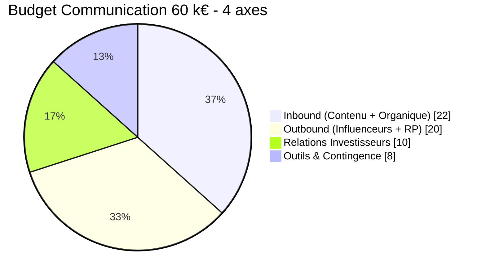
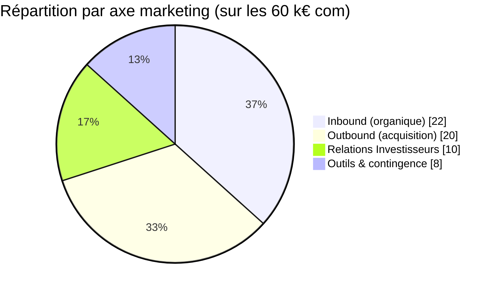
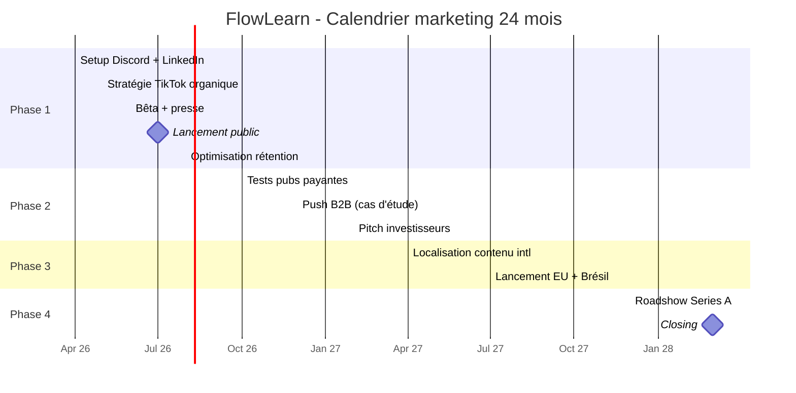
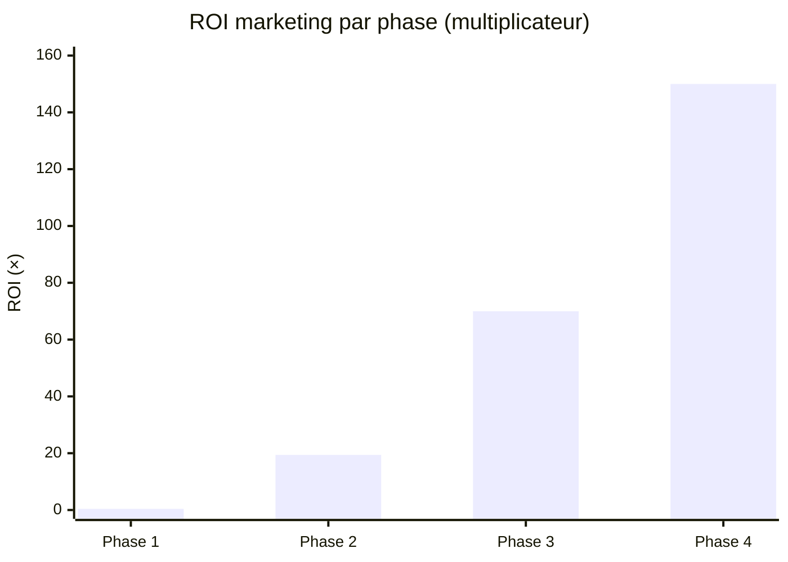
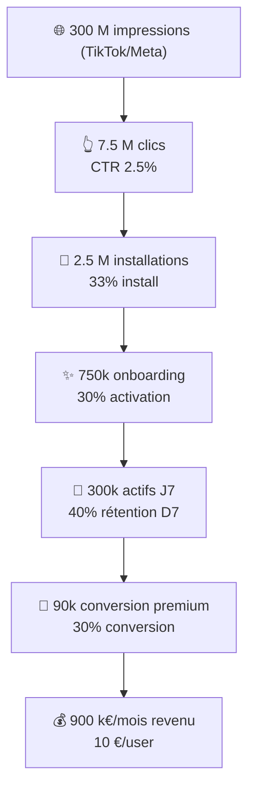

# 📢 FLOWLEARN — Plan de Communication 24 mois

> **Période couverte :** Avril 2026 → Mars 2028 (24 mois)
> **Budget Communication dédié :** 60 k€ (sous-ensemble du Pôle Croissance de 125 k€ — voir §3)

---

## 🧭 Comment lire ce document

```
┌─────────────────────────────────────────────────────────────────┐
│  À QUI EST-IL DESTINÉ ?                                         │
│  ──────────────────────                                         │
│  • L'équipe FlowLearn (qui parle de quoi, à qui, quand)         │
│  • Les futurs investisseurs (story de croissance)               │
│  • L'école porteuse (transparence sur le go-to-market)          │
│  • Les recrues marketing/com (onboarding rapide)                │
└─────────────────────────────────────────────────────────────────┘
```

### 5 niveaux de lecture

| Tu as… | Lis… | Tu sauras… |
| --- | --- | --- |
| **30 secondes** | §1 Synthèse | Budget total + 4 phases |
| **2 minutes** | §1 + §2 Parcours user | Le storytelling 24 mois |
| **10 minutes** | §1 → §5 Funnel | La logique d'acquisition |
| **30 minutes** | Tout sauf annexes | Tu peux le présenter |
| **1 heure** | Tout + glossaire | Tu peux le défendre |

### Légende des codes visuels

| Code | Signification |
| --- | --- |
| 🎯 | Objectif chiffré (cible KPI) |
| 🔴 ALERTE ROUGE | Action immédiate requise |
| 🟡 ALERTE JAUNE | Surveillance rapprochée |
| 🟢 OK | Tout est sur les rails |
| ⏱️ | Calendrier / fenêtre temporelle |
| 💡 EN BREF | Résumé en 3 lignes max |

---

## 📖 Glossaire (les termes à connaître)

| Terme | Définition simple |
| --- | --- |
| **Inbound** | Les gens viennent à nous (contenu, SEO, communauté) |
| **Outbound** | On va chercher les gens (pubs, influenceurs, démarchage) |
| **CAC** | Customer Acquisition Cost — coût pour gagner 1 user |
| **LTV** | Lifetime Value — combien rapporte 1 user sur sa vie |
| **ROAS** | Return on Ad Spend — combien rapporte 1€ de pub |
| **CTR** | Click-Through Rate — % de gens qui cliquent une pub |
| **CPC** | Cost Per Click — combien on paie par clic |
| **DAU / MAU** | Daily / Monthly Active Users |
| **Conversion premium** | % d'users qui passent à la version payante |
| **Churn** | % d'utilisateurs qui partent par mois |
| **MRR / ARR** | Monthly / Annual Recurring Revenue |
| **Funnel** | Entonnoir : du clic à l'achat (étapes successives) |
| **PMF** | Product-Market Fit — preuve que le marché veut le produit |
| **Persona** | Profil-type d'un utilisateur (ex : "Étudiant 18-25 ans") |
| **Seeding** | Envoyer le produit gratuitement à des influenceurs |
| **PR** | Public Relations — relations presse |
| **B2B / B2C** | Business-to-Business / Business-to-Consumer |
| **Pitch deck** | Présentation projet pour investisseurs (~20 slides) |
| **Series A** | Tour de financement de croissance (~2-5 M€) |
| **Due diligence** | Audit complet par un investisseur |

---

## 1. SYNTHÈSE EXÉCUTIVE

### 💡 EN BREF

> **60 k€ de communication sur 24 mois** pour passer de **0 à 1.5M DAU**.
> Stratégie : **organique d'abord** (Discord, contenu, SEO), **payant ensuite** (TikTok, Meta) une fois la rétention prouvée.
> ROI cible : **100×** (60 k€ → 1.5M€/mois de revenu en M24).

### Vision communication globale

```
Budget Communication : 60 k€ sur 24 mois

AXES STRATÉGIQUES :
├─ Inbound (Contenu + Organique)    : 22 k€  (37%)
├─ Outbound (Influenceurs + RP)     : 20 k€  (33%)
├─ Relations Investisseurs          : 10 k€  (17%)
└─ Outils & Contingence             :  8 k€  (13%)

OBJECTIFS PAR PHASE :
├─ Phase 1 (M1-M6)   ▶ Construire CRÉDIBILITÉ  → 50k DAU
├─ Phase 2 (M7-M12)  ▶ Prouver TRACTION         → 300k DAU + B2B
├─ Phase 3 (M13-M20) ▶ Dominer GLOBAL          → 1M DAU + intl
└─ Phase 4 (M21-M24) ▶ Préparer EXIT            → Series A / M&A
```

### Mermaid : répartition budget com



---

## 2. PARCOURS UTILISATEUR — 24 MOIS

> **Idée centrale :** à chaque phase, le message change car l'audience change.
> En Phase 1 on parle aux **early adopters** (curieux). En Phase 4 aux **investisseurs**.

```
┌─────────────────────────────────────────────────────────────────┐
│           PARCOURS UTILISATEUR - 24 MOIS COMPLET                │
├─────────────────────────────────────────────────────────────────┤
│                                                                   │
│  PHASE 1 (M1-M6) : SENSIBILISATION → ESSAI                      │
│  ─────────────────────────────────────────────                  │
│  Question  : "Pourquoi ça existe ?"                            │
│  Canaux    : Discord, Blog, LinkedIn, TikTok organique         │
│  Message   : "L'apprentissage est cassé. On répare."           │
│  Objectif  : 500 membres Discord, 1k inscriptions bêta         │
│                                                                   │
│  PHASE 2 (M7-M12) : ESSAI → ADOPTION                            │
│  ─────────────────────────────────────────────                  │
│  Question  : "Comment ça marche ?"                              │
│  Canaux    : TikTok payant, Cas d'étude, Ventes B2B            │
│  Message   : "300k utilisateurs l'utilisent déjà"              │
│  Objectif  : 10+ contrats B2B, 50 k€+ ARR                      │
│                                                                   │
│  PHASE 3 (M13-M20) : ADOPTION → SCALING                         │
│  ─────────────────────────────────────────────                  │
│  Question  : "Comment on prend le marché ?"                     │
│  Canaux    : International, Partenariats, Prix industrie       │
│  Message   : "Le standard global du learning personnalisé"     │
│  Objectif  : 1M DAU, 40% international, 300 k€+/mois revenu   │
│                                                                   │
│  PHASE 4 (M21-M24) : SCALING → EXIT                             │
│  ─────────────────────────────────────────────                  │
│  Question  : "Comment on lève des fonds ?"                      │
│  Canaux    : Pitches Series A, Diligence, M&A                  │
│  Message   : "Valuation 100-200 M€, trajectoire licorne"       │
│  Objectif  : Series A 2-3 M€ ou acquisition 100 M€+            │
│                                                                   │
└─────────────────────────────────────────────────────────────────┘
```

---

## 3. ARTICULATION AVEC LE BUDGET GLOBAL

> ⚠️ **Important pour comprendre les chiffres :**
> - Le **budget global FlowLearn** = **656 k€** (cf. [`budget-previsionnel.md`](../budgetaire/budget-previsionnel.md))
> - Dont le **Pôle Croissance** = **125 k€** (toute la machine de croissance : pubs, contenu, influenceurs, RP, community)
> - Dont le **budget Communication pure** présenté ici = **60 k€** (Inbound + Outbound + IR + Outils)
> - Les **65 k€** restants du Pôle Croissance couvrent les **publicités payantes pures** (51 k€) + **production contenu vidéo/SEO** (14 k€) qui sont budgétées à part.

### Schéma de répartition

```
Pôle CROISSANCE (125 k€)
│
├─ Communication (ce document)             60 k€
│  ├─ Inbound (contenu, communauté, SEO)   22 k€
│  ├─ Outbound (influenceurs, RP, events)  20 k€
│  ├─ Relations Investisseurs              10 k€
│  └─ Outils & contingence com              8 k€
│
└─ Acquisition payante & production        65 k€
   ├─ Publicités TikTok/Meta/YouTube       51 k€
   └─ Production contenu (vidéo, SEO)      14 k€
```

---

## 4. MATRICE 3 AXES MARKETING

> **Logique :** chaque axe a un objectif différent, un coût/user différent, un horizon différent.

### 💡 EN BREF

> **Inbound** = construire la marque (long terme, peu cher).
> **Outbound** = acquérir vite (court terme, plus cher).
> **Investisseurs** = financer la croissance (rare mais critique).

```
┌──────────────────────────────────────────────────────────────────┐
│                    3 AXES MARKETING                               │
├──────────────────────────────────────────────────────────────────┤
│                                                                    │
│  AXE 1 : INBOUND (22 k€) — CRÉDIBILITÉ ORGANIQUE                 │
│  ├─ Contenu fondateur (leadership éclairé)    : 5 k€            │
│  ├─ Communauté (Discord + Slack)               : 4 k€            │
│  ├─ Réseaux sociaux organiques                 : 3 k€            │
│  ├─ Blogs & pensée stratégique                 : 3 k€            │
│  ├─ Email marketing                            : 2 k€            │
│  └─ Podcasts & speaking                        : 5 k€            │
│  ──────────────────────────────────────────────────             │
│  Objectif   : Crédibilité + SEO + Croissance organique          │
│  Coût/user  : ~0.04 €  (organique = pas cher)                   │
│  Force      : Construction marque long-terme                    │
│                                                                   │
│  ────────────────────────────────────────────────────────────   │
│                                                                   │
│  AXE 2 : OUTBOUND (20 k€) — ACQUISITION RAPIDE                   │
│  ├─ Publicités payantes (échantillon)         : 8 k€            │
│  ├─ Influenceurs & partenariats                : 6 k€            │
│  ├─ Relations publiques & presse               : 3 k€            │
│  ├─ Événements & salons                        : 2 k€            │
│  └─ Programmes d'affiliation                   : 1 k€            │
│  ──────────────────────────────────────────────────             │
│  Objectif   : Acquisition rapide + visibilité                   │
│  Coût/user  : 2-5 €  (payant = plus cher)                       │
│  Force      : Croissance rapide, test marché                    │
│                                                                   │
│  ────────────────────────────────────────────────────────────   │
│                                                                   │
│  AXE 3 : RELATIONS INVESTISSEURS (10 k€) — FINANCEMENT EXIT      │
│  ├─ Pitch deck & narratives                   : 3 k€            │
│  ├─ Matériaux due diligence                   : 2 k€            │
│  ├─ Réunions investisseurs & outreach         : 3 k€            │
│  ├─ Modélisation financière & projections     : 1.5 k€          │
│  └─ M&A & conversations stratégiques          : 0.5 k€          │
│  ──────────────────────────────────────────────────             │
│  Objectif   : Series A 2-3 M€ ou acquisition 100 M€+           │
│  Coût/levée : ~0.1 € par 1 € levé (très efficace)               │
│  Force      : Stratégie exit long-terme                         │
│                                                                   │
└──────────────────────────────────────────────────────────────────┘

SYNERGIES ENTRE AXES :
└─ Crédibilité inbound        → Meilleur ROAS outbound
└─ Traction outbound          → Meilleur intérêt investisseurs
└─ Financement investisseurs  → Plus de ressources inbound
```

### Mermaid : 3 axes en proportion



---

## 5. CALENDRIER MARKETING — VUE GANTT

### Mermaid : calendrier macro



### M1-M6 (Phase 1 : Lancement)

```
M1 (Avril 2026) — SETUP & MODE STEALTH
├─ S1 : Discord lancé, équipe setup
├─ S2 : Premier article blog ("Pourquoi FlowLearn")
├─ S3 : Outreach influenceurs (liste de 20)
└─ S4 : Croissance LinkedIn (premier post)
   Budget : 2 k€ | KPI : 100 membres Discord

M2 (Mai 2026) — MOMENTUM
├─ S1-S2 : Article Medium + enregistrement podcast
├─ S2-S3 : Stratégie TikTok finalisée
└─ S3-S4 : Seeding influenceurs (gifts envoyés)
   Budget : 5.5 k€ | KPI : 300 Discord, 1.5k email

M3 (Juin 2026) — PRÉPARATION BÊTA
├─ S1 : Landing page en ligne
├─ S2 : Vidéos teaser publiées (TikTok)
├─ S3 : Inscriptions bêta ouvertes (cible 500)
└─ S4 : Premier article presse publié
   Budget : 13.5 k€ | KPI : 1k inscriptions bêta

M4 (Juillet 2026) — LANCEMENT PUBLIC
├─ S1 : Lancement Product Hunt
├─ S2 : Communiqué presse distribué
├─ S3 : Campagne jour lancement (coordonnée)
└─ S4 : Push rétention post-lancement
   Budget : 26.5 k€ | KPI : 10k téléchargements

M5-M6 (Août-Sept 2026) — CROISSANCE & STABILISATION
├─ Hebdo : Contenu TikTok 2×/sem
├─ Hebdo : Séquences email nurture
├─ Hebdo : Collecte témoignages
└─ Hebdo : Engagement communauté
   Budget : 40 k€ cumulé | KPI : 50k DAU, D7 ≥ 30%

PHASE 1 BUDGET TOTAL : 12 k€ (sur 60 k€ com)
PHASE 1 SUCCÈS       : 50k DAU, produit stable, presse OK
```

### M7-M12 (Phase 2 : Traction)

```
M7-M8 (Oct-Nov 2026) — TEST PUBLICITÉS PAYANTES
├─ TikTok Ads : 3 variations créatives
├─ Meta Ads   : 3 variations créatives
├─ Mesure     : CTR, CPC, ROAS
└─ Recherche  : Creative gagnant (CTR > 2%)

M9-M10 (Déc 26-Jan 27) — SCALING + PUSH B2B
├─ Scale TikTok créative gagnante
├─ Cas d'étude #1 : réussite école produite
├─ Pitch ventes B2B : 50 cibles
└─ Objectif : 3 pilotes B2B signés

M11-M12 (Fév-Mar 2027) — OPTIMISATION + INVESTISSEURS
├─ Optimisation CAC (cible < 3 €)
├─ Couverture presse (5+ mentions)
├─ Réunions VC (10+ meetings)
└─ Objectif : 300k DAU, 10 contrats B2B

PHASE 2 BUDGET TOTAL : 18 k€
PHASE 2 SUCCÈS       : 300k DAU, 10 contrats B2B, 50 k€+ ARR
```

---

## 6. ROI MARKETING PAR PHASE

> 👉 **Comprendre :** combien on investit, combien ça rapporte.

### 💡 EN BREF

> Phase 1 = phase d'investissement (ROI 0.4×). Phase 4 = phase de récolte (ROI 150×).
> ROI total 24 mois : **~100×** (60 k€ → 1.5 M€/mois MRR en M24).

### Mermaid : ROI par phase



### Détail phase par phase

```
┌──────────────────────────────────────────────────────────────┐
│        ROI MARKETING - 24 MOIS (60 k€ investis)              │
├──────────────────────────────────────────────────────────────┤
│                                                                │
│ PHASE 1 (M1-M6) : FONDATION                                  │
│ ─────────────────────────────────────────────────────────    │
│ Input    : 12 k€ marketing + 54.5 k€ équipe                 │
│ Output   : 50k DAU, 1k premium (2% conv)                    │
│ Revenue  : 5 k€/mois (5 € × 1k premium)                     │
│ ROI      : 0.4× (phase d'investissement)                     │
│                                                                │
│ Répartition par canal :                                      │
│ ├─ Organique           : 30k DAU (60%) | Coût : 0 €         │
│ ├─ Seeding influenceurs: 15k DAU (30%) | Coût : 2 k€        │
│ └─ Publicités         : 5k DAU (10%) | Coût : 10 k€ | CAC 2 €│
│                                                                │
│ ───────────────────────────────────────────────────────────  │
│                                                                │
│ PHASE 2 (M7-M12) : TRACTION                                  │
│ ─────────────────────────────────────────────────────────    │
│ Input    : 18 k€ marketing + 71.75 k€ équipe                │
│ Output   : 300k DAU, 30k premium (10% conv)                 │
│ Revenue  : 350 k€/mois (300 k€ premium + 50 k€ B2B)         │
│ ROI      : 19.4× (TRÈS PROFITABLE !)                         │
│                                                                │
│ Répartition par canal :                                      │
│ ├─ Organique           : 150k DAU (50%) | Coût : 2 k€       │
│ ├─ Publicités payantes : 120k DAU (40%) | Coût : 10 k€      │
│ └─ Influenceurs        : 30k DAU (10%) | Coût : 6 k€        │
│                                                                │
│ ───────────────────────────────────────────────────────────  │
│                                                                │
│ PHASE 3 (M13-M20) : SCALING                                  │
│ ─────────────────────────────────────────────────────────    │
│ Input    : 20 k€ marketing + 109.4 k€ équipe                │
│ Output   : 1M DAU, 120k premium (12% conv)                  │
│ Revenue  : 1.4 M€/mois (1.2 M premium + 200 k B2B)          │
│ ROI      : 70× (EXTRÊMEMENT PROFITABLE)                     │
│                                                                │
│ Répartition par canal :                                      │
│ ├─ Organique           : 600k DAU (60%) | Coût : 3 k€       │
│ ├─ Publicités payantes : 300k DAU (30%) | Coût : 12 k€      │
│ └─ Partenariats        : 100k DAU (10%) | Coût : 5 k€       │
│                                                                │
│ ───────────────────────────────────────────────────────────  │
│                                                                │
│ PHASE 4 (M21-M24) : OPTIMISATION & EXIT                      │
│ ─────────────────────────────────────────────────────────    │
│ Input    : 10 k€ marketing + 52.5 k€ équipe                 │
│ Output   : 1.5M DAU (focus rétention)                        │
│ Revenue  : 1.5 M€+/mois                                       │
│ ROI      : 150× (PROFIT PUR)                                 │
│                                                                │
│ Répartition par canal :                                      │
│ ├─ Organique           : 1.2M DAU (80%) | Coût : 5 k€       │
│ ├─ Parrainage          : 250k DAU (17%) | Coût : 0 € (viral)│
│ └─ Retargeting         : 50k DAU (3%)   | Coût : 5 k€       │
│                                                                │
│ ROI TOTAL 24 MOIS : ~100×                                    │
│ (60 k€ → 1.5 M€/mois MRR)                                    │
│                                                                │
└──────────────────────────────────────────────────────────────┘
```

---

## 7. FUNNEL DE CONVERSION

> **Funnel = entonnoir.** À chaque étape, on perd des gens. L'objectif est d'optimiser chaque étape.

### Mermaid : funnel macro Phase 2



### Détail Phase 1 (sensibilisation)

```
1 MILLION D'IMPRESSIONS
│
├─ 50k clics  (CTR 5%)
│  │
│  ├─ 10k visites site  (20% conv site)
│  │  │
│  │  ├─ 2.5k inscriptions bêta  (25%)
│  │  │  │
│  │  │  ├─ 1k utilisateurs bêta actifs  (40% activation)
│  │  │  │  │
│  │  │  │  └─ 500 retenus  (50% D7)

Métriques clés :
├─ CAC      : 12 k€ / 50k DAU = 0.24 €  (excellent !)
├─ Conv     : 50k impressions → 50k DAU = 5%
└─ CPM      : 0.012 € par impression
```

### Détail Phase 2 (essai → adoption)

```
300 MILLIONS D'IMPRESSIONS (payant)
│
├─ 7.5M clics  (CTR 2.5%)
│  │
│  ├─ 2.5M installations  (33%)
│  │  │
│  │  ├─ 750k onboarding complet  (30%)
│  │  │  │
│  │  │  ├─ 300k actifs J7  (40% D7)
│  │  │  │  │
│  │  │  │  ├─ 90k conversion premium  (30%)
│  │  │  │  │  → REVENU : 900 k€/mois (10 €/user)

Métriques :
├─ CAC      : 18 k€ / 250k nouveaux DAU = 0.07 €
├─ Conv     : 0.08% impressions → DAU
└─ CPM      : 0.00006 € par impression
```

### Détail Phase 3 (international scaling)

```
1 MILLIARD D'IMPRESSIONS (organique + payant intl)
│
├─ 50M clics  (CTR 5% organique)
│  │
│  ├─ 10M installations  (20%)
│  │  │
│  │  ├─ 3M onboarding  (30%)
│  │  │  │
│  │  │  ├─ 900k DAU mensuel  (30%)
│  │  │  │  │
│  │  │  │  ├─ 180k premium  (20% — moins dans nouveaux marchés)
│  │  │  │  │  → REVENU : 1.8 M€/mois premium + 200 k€ B2B

Métriques :
├─ CAC      : 20 k€ / 700k nouveaux DAU = 0.03 €
├─ LTV:CAC  : 1000:1  (scaling durable)
└─ CPI      : 0.002 € par installation
```

### Détail Phase 4 (rétention & exit)

```
BOUCLES VIRALES + BOUCHE-À-OREILLE UNIQUEMENT
│
├─ Croissance organique : 1M DAU → 1.5M DAU  (+50%)
│  │
│  ├─ Pas de pubs payantes (organique only)
│  ├─ Taux parrainage : 50% nouveaux users via referral
│  └─ Piloté par communauté

Métriques :
├─ CAC               : 10 k€ / 500k nouveaux = 0.02 €
├─ Période rembours. : < 1 sem (users s'auto-financent)
└─ LTV:CAC           : 1500:1 (moat défendable)
```

---

## 8. PERSONAS & MESSAGING

> **3 personas = 3 audiences = 3 messages distincts.**

### 💡 EN BREF

> **Étudiant** = "C'est fun et efficace" (TikTok, 15s).
> **Professeur** = "Mes élèves restent" (LinkedIn, cas d'étude).
> **Investisseur** = "Trajectoire licorne" (pitch deck, data room).

### Persona 1 : Étudiant (16-25 ans)

| Phase | Accroche | Canal | Format | Objectif |
| --- | --- | --- | --- | --- |
| **Ph1** Sensibilisation | "Pourquoi la révision est ennuyeuse" | TikTok, Instagram | Vidéo 15-30 s | 100k vues |
| **Ph2** Considération | "J'ai appris le français en 30 jours" | TikTok, YouTube, témoignages | Cas d'étude 60s | 300k DAU, 30% conv |
| **Ph3** Adoption | "1M étudiants l'utilisent" | Global, multi-langues | Stories réussite | 1M DAU, 40% intl |
| **Ph4** Rétention | "Rejoins le futur de l'éducation" | Email, push, communauté | Engagement long-terme | 1.5M DAU, < 5% churn |

### Persona 2 : Professeur (25-50 ans)

| Phase | Accroche | Canal | Format | Objectif |
| --- | --- | --- | --- | --- |
| **Ph1** Sensibilisation | "Mes élèves abandonnent. Comment les garder ?" | LinkedIn, email | Article leadership | 5k impressions |
| **Ph2** Considération | "École X a +40% rétention" | LinkedIn, cas d'étude, webinar | Cas d'étude 2 pages | 10 contrats B2B |
| **Ph3** Adoption | "10 pays, 50+ écoles partenaires" | LinkedIn, partenariats, events | Certif, white papers | 100k profs |
| **Ph4** Rétention | "Le standard global du learning" | Account management B2B | Revues annuelles | < 10% churn annuel |

### Persona 3 : Investisseur

| Phase | Accroche | Canal | Format | Objectif |
| --- | --- | --- | --- | --- |
| **Ph1** Sensibilisation | "Fondateur EdTech qui résout l'engagement" | Anges, events fondateurs | Pitch ascenseur 30s | 10 cafés anges |
| **Ph2** Due diligence | "300k DAU, 10 contrats B2B, Series A ready" | Réunions pitch, data room | Pitch deck 20 slides | 50 réunions VC |
| **Ph3** Term sheet | "1M DAU, 50% intl, 2 M€+ ARR" | Réunions VC, updates investisseurs | Modèle financier | 3-5 term sheets |
| **Ph4** Exit | "Series A 2-3 M€ @ 150 M€ valuation" | Board, newsletters | Updates trimestrielles | Closing ou M&A |

---

## 9. RÉPARTITION CANAUX PAR PHASE

> **Logique :** au début, organique. Au milieu, payant. À la fin, viral.

### Phase 1 (12 k€) — Tester l'organique

```
Canaux organiques (40%)        4.8 k€
├─ Discord communauté            2.0 k€  ████░░░░░░░░░░
├─ Blog & SEO                    1.5 k€  ███░░░░░░░░░░░
├─ LinkedIn organique            0.8 k€  ██░░░░░░░░░░░░
└─ Email sequences               0.5 k€  █░░░░░░░░░░░░░

Seeding influenceurs (17%)      2.0 k€
└─ Cadeaux + relations           2.0 k€  ████░░░░░░░░░░

Publicités payantes (25%)       3.0 k€
├─ Test TikTok                   1.5 k€  ███░░░░░░░░░░░
└─ Test Meta                     1.5 k€  ███░░░░░░░░░░░

Production (18%)                2.2 k€
├─ Création vidéo                1.5 k€  ███░░░░░░░░░░░
└─ Landing page                  0.7 k€  ██░░░░░░░░░░░░
```

### Phase 2 (18 k€) — Scale le payant

```
Publicités payantes (45%)       8.0 k€
├─ Scaling TikTok                5.0 k€  █████░░░░░░░░░
├─ Scaling Meta                  2.0 k€  ██░░░░░░░░░░░░
└─ YouTube                       1.0 k€  █░░░░░░░░░░░░░

Influenceurs (33%)              6.0 k€
├─ Micro-influenceurs            4.0 k€  ████░░░░░░░░░░
└─ Mid-tier                      2.0 k€  ██░░░░░░░░░░░░

Canaux organiques (22%)         4.0 k€
├─ Gestion communauté            2.0 k€  ██░░░░░░░░░░░░
└─ Création contenu              2.0 k€  ██░░░░░░░░░░░░
```

### Phase 3 (20 k€) — International

```
Publicités payantes (35%)       7.0 k€
├─ TikTok intl                   4.0 k€
├─ Meta + YouTube                2.0 k€
└─ Plateformes régionales        1.0 k€

Canaux organiques (30%)         6.0 k€
├─ Leadership fondateur          3.0 k€
├─ Contenu intl                  2.0 k€
└─ Scaling communauté            1.0 k€

Partenariats (20%)              4.0 k€
├─ Co-marketing deals            2.0 k€
└─ Intégrations B2B              2.0 k€

RP & Événements (15%)           3.0 k€
├─ Couverture presse             1.5 k€
└─ Sponsorships conf             1.5 k€
```

### Phase 4 (10 k€) — Viral / rétention

```
Organique (70%)                 7.0 k€
├─ Programme ambassadeurs        3.0 k€
├─ Contenu généré users          2.0 k€
└─ Récompenses parrainage        2.0 k€

Retargeting payant (20%)        2.0 k€
└─ Email + push                  2.0 k€

Misc (10%)                      1.0 k€
└─ Test nouveau canal            1.0 k€
```

---

## 10. CALENDRIER DÉTAILLÉ — VUE MENSUELLE

```
╔════════════════════════════════════════════════════════════════╗
║         CALENDRIER COMMUNICATION - 24 MOIS COMPLET            ║
╠════════════════════════════════════════════════════════════════╣
║                                                                  ║
║ M1 (AVRIL 2026) — SETUP                                       ║
║ ─────────────────────────────────────                         ║
║ S1 │ Discord lancé + setup bot                                ║
║ S2 │ Article blog "Pourquoi FlowLearn" + SEO                  ║
║ S3 │ Outreach influenceurs (liste de 20)                      ║
║ S4 │ Profil LinkedIn upgradé + premier post                   ║
║ Activités: 4 | Budget: 2 k€ | KPI: 100 Discord                ║
║                                                                  ║
║ M2 (MAI 2026) — MOMENTUM                                      ║
║ ─────────────────────────────────────                         ║
║ S1 │ Article Medium publié                                    ║
║ S2 │ Enregistrement podcast (3 épisodes)                      ║
║ S3 │ Stratégie TikTok finalisée                               ║
║ S4 │ Seeding influenceurs (gifts envoyés)                     ║
║ Activités: 6 | Budget: 5.5 k€ | KPI: 300 Discord, 1.5k email  ║
║                                                                  ║
║ M3 (JUIN 2026) — PRÉPARATION BÊTA                             ║
║ ─────────────────────────────────────                         ║
║ S1 │ Landing page en ligne                                    ║
║ S2 │ Vidéos teaser publiées (3 TikToks)                       ║
║ S3 │ Formulaire inscription bêta ouvert                       ║
║ S4 │ Premier article presse publié                            ║
║ Activités: 10 | Budget: 13.5 k€ | KPI: 1k bêta, presse        ║
║                                                                  ║
║ M4 (JUILLET 2026) — LANCEMENT PUBLIC                          ║
║ ─────────────────────────────────────                         ║
║ S1 │ Jour Lancement Product Hunt                              ║
║ S2 │ Communiqué presse distribué                              ║
║ S3 │ Campagne jour lancement (coordonnée)                     ║
║ S4 │ Push rétention post-lancement                            ║
║ Activités: 15 | Budget: 26.5 k€ | KPI: 10k DL                 ║
║                                                                  ║
║ M5-M6 (AOÛT-SEPT 2026) — CROISSANCE                           ║
║ ─────────────────────────────────────                         ║
║ Hebdo │ Contenu TikTok (2×/sem)                               ║
║ Hebdo │ Email sequences nurture                               ║
║ Hebdo │ Témoignages influenceurs                              ║
║ Hebdo │ Sprints engagement communauté                         ║
║ Activités: 20 | Budget: 40 k€ cumul | KPI: 50k DAU, 30% D7    ║
║                                                                  ║
║ ──────────────────────────────────────────────────────────── ║
║                                                                  ║
║ M7-M8 (OCT-NOV 2026) — TEST PUBS PAYANTES                     ║
║ ─────────────────────────────────────                         ║
║ S1 │ TikTok Ads : 3 créatifs lancés                           ║
║ S2 │ Meta Ads : 3 créatifs lancés                             ║
║ S3 │ YouTube Ads : test                                       ║
║ S4 │ Optimisation hebdo data-driven                           ║
║ Mesure: CTR, CPC, ROAS | Cible: CTR > 2%                      ║
║                                                                  ║
║ M9-M10 (DÉC 26-JAN 27) — PUSH B2B                             ║
║ ─────────────────────────────────────                         ║
║ S1-S2 │ Cas d'étude #1 produit                                ║
║ S3    │ Pitch ventes B2B finalisé                             ║
║ S4    │ 50 cibles écoles + outreach                           ║
║ Hebdo │ Réunions pitch (5-10/sem)                             ║
║ Cible : 3 pilotes B2B signés                                  ║
║                                                                  ║
║ M11-M12 (FÉV-MAR 2027) — SCALE + INVESTISSEURS                ║
║ ─────────────────────────────────────                         ║
║ S1 │ Push optimisation CAC                                    ║
║ S2 │ 5+ mentions presse                                       ║
║ S3 │ Pitch deck Series A prêt                                 ║
║ S4 │ Premiers meetings VC                                     ║
║ Cible : 300k DAU, 10 contrats B2B, intérêt VC                 ║
║                                                                  ║
║ ──────────────────────────────────────────────────────────── ║
║                                                                  ║
║ M13-M15 (AVR-JUIN 2027) — PRÉPA INTERNATIONAL                 ║
║ ─────────────────────────────────────                         ║
║ S1-S2 │ Préparation tournée fondateur                         ║
║ S3    │ Localisation contenu intl                             ║
║ S4    │ Lancement roadshow VC Series A                        ║
║ Cible : Fondateur en scène, conv Series A actives             ║
║                                                                  ║
║ M16-M20 (JUIL-NOV 2027) — LANCEMENT INTL                      ║
║ ─────────────────────────────────────                         ║
║ S1 │ Campagne lancement Espagne                               ║
║ S2 │ Campagne lancement Allemagne                             ║
║ S3 │ Campagne lancement Brésil                                ║
║ S4 │ Partenariats plateformes EdTech                          ║
║ Cible : 40% intl, prix gagnés                                 ║
║                                                                  ║
║ M21-M24 (DÉC 2027 - MARS 2028) — EXIT                         ║
║ ─────────────────────────────────────                         ║
║ S1 │ Closing Series A (ou conv M&A)                           ║
║ S2 │ Achèvement diligence                                     ║
║ S3 │ Annonce + couverture presse                              ║
║ S4 │ Post-financement : phase suivante                        ║
║ Cible : Series A 2-3 M€ @ 150 M€ valuation                    ║
║                                                                  ║
╚════════════════════════════════════════════════════════════════╝
```

---

## 11. TABLEAU DE BORD KPI

### Cibles par phase

```
┌────────────────────────────────────────────────────────────────┐
│       TABLEAU DE BORD KPI - COMMUNICATION                      │
├────────────────────────────────────────────────────────────────┤
│                                                                  │
│ PHASE 1 CIBLES (M6)                                            │
│ ───────────────────────────────────────────────────────────   │
│ Visites site mensuelles    : 2k                                │
│ Followers réseaux totaux   : 2k                                │
│ Membres Discord            : 500                               │
│ Abonnés email              : 2k                                │
│ Mentions presse            : 0                                 │
│ DAU                        : 50k                               │
│ Coût/utilisateur (CAC)     : 0.24 €                            │
│                                                                  │
│ PHASE 2 CIBLES (M12)                                           │
│ ───────────────────────────────────────────────────────────   │
│ Visites site               : 20k/mois                          │
│ Followers réseaux          : 15k                               │
│ Mentions presse            : 5+                                │
│ Contrats B2B               : 10+                               │
│ DAU                        : 300k                              │
│ Conversion premium         : 10%                               │
│ CAC                        : 0.07 €                            │
│ MRR                        : 50 k€                             │
│                                                                  │
│ PHASE 3 CIBLES (M18)                                           │
│ ───────────────────────────────────────────────────────────   │
│ Visites site               : 100k/mois                         │
│ Followers réseaux          : 100k                              │
│ Mentions presse            : 20+                               │
│ Prix gagnés                : 1-2                               │
│ % International            : 40%                               │
│ DAU                        : 750k                              │
│ ARR B2B                    : 300 k€                            │
│ CAC                        : 0.03 €                            │
│ MRR Total                  : 200 k€                            │
│                                                                  │
│ PHASE 4 CIBLES (M24)                                           │
│ ───────────────────────────────────────────────────────────   │
│ Visites site               : 500k/mois                         │
│ Followers réseaux          : 500k                              │
│ Mentions presse            : 50+                               │
│ DAU                        : 1.5M                              │
│ % Croissance organique     : 80%                               │
│ % International            : 50%                               │
│ CAC                        : 0.02 €                            │
│ MRR Total                  : 400 k€+                           │
│ Ratio LTV:CAC              : 150:1                             │
│                                                                  │
└────────────────────────────────────────────────────────────────┘
```

---

## 12. PLANS DE CONTINGENCE

> 👉 **Si la com sous-performe, voici les plans B.**

### 🔴 Si CAC TikTok > 2 € en Phase 2

```
État: 🔴 ALERTE ROUGE

ACTIONS IMMÉDIATES :
1. Pause TikTok (optimisation 2 semaines)
2. Augmente seeding influenceurs
3. Scale Meta (si CAC y reste OK)
4. Test YouTube Shorts
5. Focus croissance organique

RÉALLOCATION BUDGET :
TikTok      : 5 k€ → 0 k€
Influencers : 4 k€ → 8 k€
YouTube     : 1 k€ → 4 k€
Discord     : 1 k€ → 3 k€
```

### 🟡 Si Intérêt B2B = 0 en M10

```
État: 🟡 ALERTE JAUNE

ACTIONS PIVOT :
1. Augmente marketing B2C
2. Valide messaging B2B (pourquoi pas d'intérêt ?)
3. Cible formation corporate (pas que écoles)
4. Lance programme affiliation
5. Réduit budget B2B Phase 3 -50%
```

### 🟡 Si croissance organique stagne

```
État: 🟡 ALERTE JAUNE

ACTIONS CROISSANCE :
1. Augmente fréquence contenu ×3
2. Test nouveaux formats
3. Lance programme parrainage
4. Défis communauté (engagement)
5. Collaborations influenceurs
```

---

## 13. CONCLUSION & RECOMMANDATIONS

### 💡 EN BREF

> **60 k€ de communication** sur 24 mois pour faire :
> - **Phase 1** → 50k DAU + crédibilité produit
> - **Phase 2** → 300k DAU + 10 contrats B2B
> - **Phase 3** → 1M DAU + 40% international
> - **Phase 4** → Series A 2-3 M€ ou M&A 100 M€+

### Allocation par axe

```
┌────────────────────────────────────┐
│ Inbound (22 k€)        ::::::: 37% │
│ Outbound (20 k€)       ::::::: 33% │
│ Investisseurs (10 k€)  ::::::  17% │
│ Outils (8 k€)          ::::::  13% │
└────────────────────────────────────┘

ROI MARKETING TOTAL : ~100×
(60 k€ investis → 1.5 M€+/mois revenus)

SUCCÈS = construction d'un MOAT défendable
via communauté, contenu et crédibilité
```

### Tableau récapitulatif final

| Phase | Période | Budget Com | Cible DAU | Cible MRR |
| --- | --- | :-: | :-: | :-: |
| **Ph1** | Avr-Sept 2026 | 12 k€ | 50k | 5 k€ |
| **Ph2** | Oct 26-Mar 27 | 18 k€ | 300k | 50 k€ |
| **Ph3** | Avr-Nov 2027 | 20 k€ | 1M | 200 k€ |
| **Ph4** | Déc 27-Mar 28 | 10 k€ | 1.5M | 400 k€+ |
| **TOTAL** | 24 mois | **60 k€** | **1.5M** | **400 k€+** |

### Prochaines étapes

- [ ] Valider le plan avec l'école / l'équipe
- [ ] Lancer Discord + LinkedIn dès M1
- [ ] Briefing influenceurs (cibler 20 micro-influenceurs)
- [ ] Setup analytics (Amplitude, Mixpanel)
- [ ] Définir templates email + landing page
- [ ] Calendrier éditorial hebdomadaire (TikTok + blog)

---

**Document validé le :** [À remplir]
**Approuvé par :** [Équipe]
**Prochaine revue :** mensuelle (KPIs) + trimestrielle (ajustements stratégiques)

**FIN DU DOCUMENT COMMUNICATION**
