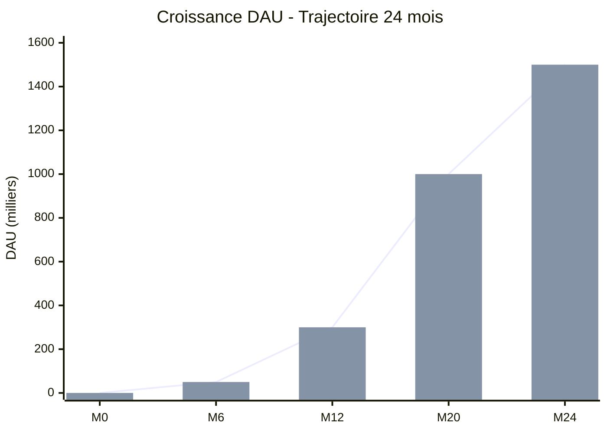
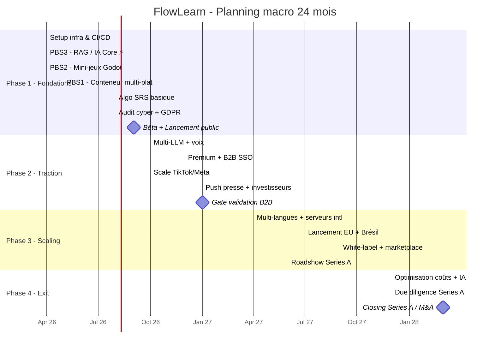
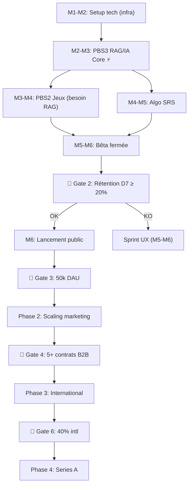
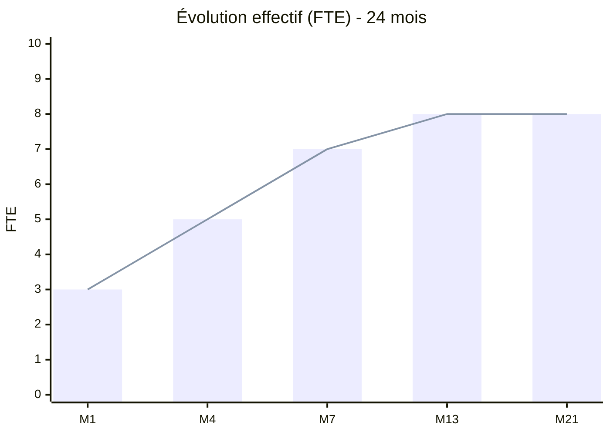
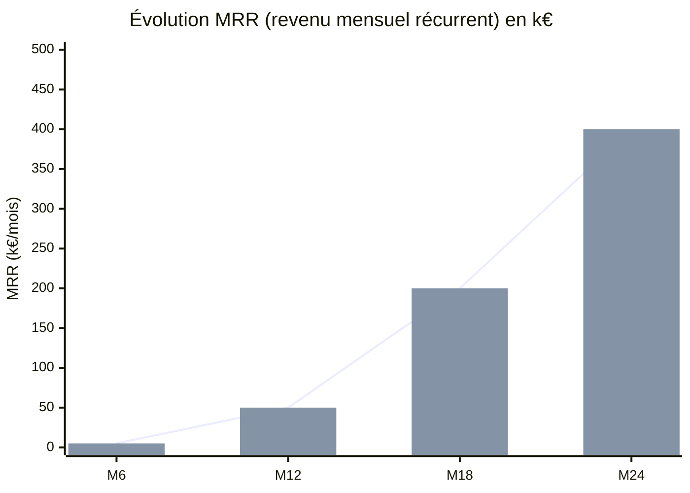

# 📅 FLOWLEARN — Planning Détaillé 24 mois

> **Période couverte :** Avril 2026 → Mars 2028 (24 mois)
> **Document de pilotage :** Gantt + Dépendances + Gates Go/No-Go + KPI

---

## 🧭 Comment lire ce document

```
┌─────────────────────────────────────────────────────────────────┐
│  À QUI EST-IL DESTINÉ ?                                         │
│  ──────────────────────                                         │
│  • L'équipe FlowLearn (qui fait quoi, quand)                    │
│  • L'école porteuse (jalons de validation)                      │
│  • Les investisseurs (story M1 → M24)                           │
│  • Les nouveaux arrivants (compréhension globale)               │
└─────────────────────────────────────────────────────────────────┘
```

### 5 niveaux de lecture

| Tu as… | Lis… | Tu comprendras… |
| --- | --- | --- |
| **30 secondes** | §1 Synthèse | Les 4 phases + KPIs cibles |
| **2 minutes** | §1 + §2 Gantt macro | La chronologie globale |
| **10 minutes** | §1 → §4 Gates | Les 8 décisions critiques |
| **30 minutes** | Tout sauf annexes | Tu peux le présenter |
| **1 heure** | Tout + glossaire | Tu peux le défendre |

### Légende des codes visuels

| Code | Signification |
| --- | --- |
| ████ | Travail réalisé / sur trajectoire |
| ░░░░ | Futur / non commencé |
| ╱╱╱╱ | En attente d'une dépendance |
| ⚡ | Chemin critique (bloque tout le reste) |
| 🚦 | Gate Go/No-Go (point de décision binaire) |
| 🎯 | KPI / cible chiffrée |
| 🔴🟡🟢 | Niveaux de priorité / criticité |

---

## 📖 Glossaire (les termes à connaître)

| Terme | Définition simple |
| --- | --- |
| **PBS** | Product Breakdown Structure — découpage produit en composants |
| **MVP** | Minimum Viable Product — version minimale qui marche |
| **DOD** | Definition of Done — critères pour qu'une feature soit "finie" |
| **Gate** | Point de décision Go/No-Go (passe-pas-passe) à un jalon clé |
| **PMF** | Product-Market Fit — preuve que le produit répond à un besoin |
| **DAU** | Daily Active Users — nb d'utilisateurs actifs par jour |
| **MAU** | Monthly Active Users — nb d'utilisateurs actifs par mois |
| **MRR / ARR** | Monthly / Annual Recurring Revenue |
| **Rétention D7 / D30** | % d'users encore présents à J+7 / J+30 |
| **Churn** | % d'utilisateurs qui partent par mois |
| **CAC / LTV** | Coût d'acquisition / Valeur sur la durée |
| **RAG** | Retrieval-Augmented Generation — IA qui cherche dans nos docs |
| **SRS** | Spaced Repetition System — algo de répétition espacée |
| **LLM** | Large Language Model — modèle d'IA (GPT, Mistral, etc.) |
| **Pydantic AI** | Framework Python pour orchestrer des LLMs |
| **LlamaIndex** | Framework pour construire un système RAG |
| **Godot** | Moteur de jeu open-source utilisé pour les mini-jeux |
| **Capacitor / Electron** | Frameworks mobile (Capacitor) et desktop (Electron) |
| **GTM** | Go-To-Market — stratégie de mise sur le marché |
| **Series A** | Tour de financement de croissance (~2-5 M€ généralement) |
| **M&A** | Mergers & Acquisitions — fusion ou acquisition |
| **Due diligence** | Audit complet par un investisseur avant d'investir |

---

## 1. SYNTHÈSE EXÉCUTIVE

### 💡 EN BREF

> **24 mois pour aller de 0 à 1.5M DAU**, en 4 phases bien distinctes, avec 8 gates Go/No-Go.
> Le plus dur est entre **M1 et M6** (livrer le MVP avec rétention prouvée).

### Vision planning global

```
TIMELINE : 24 mois (Avril 2026 → Mars 2028)

PHASES :
├─ Phase 1 (M1-M6)   ▶ FONDATIONS & LANCEMENT MVP        130 k€
├─ Phase 2 (M7-M12)  ▶ TRACTION & MONÉTISATION           165 k€
├─ Phase 3 (M13-M20) ▶ SCALING & INTERNATIONAL           245 k€
└─ Phase 4 (M21-M24) ▶ CONSOLIDATION & EXIT              116 k€

GATES CRITIQUES   : 8 points de décision Go/No-Go
LIVRABLES         : 50+ (tech + marketing + opérations)
ÉQUIPE            : 3 → 5 → 7 → 8 FTE
KPI DAU           : 0 → 50k → 300k → 1M → 1.5M
```

### Mermaid : objectifs DAU par phase



### Les 4 phases en 1 ligne chacune

| Phase | Objectif central | Question-clé |
| --- | --- | --- |
| **Ph1** Fondations | Sortir un MVP qui retient | "Le produit fonctionne-t-il ?" |
| **Ph2** Traction | Prouver qu'on peut grandir | "Peut-on scaler la croissance ?" |
| **Ph3** Scaling | Aller à l'international | "Le produit marche-t-il partout ?" |
| **Ph4** Exit | Lever ou se faire racheter | "Combien valons-nous ?" |

---

## 2. GANTT COMPLET — VISION MACRO

### 2.1 Vue Mermaid (rendu graphique)



### 2.2 Vue ASCII — détail par phase

```
╔═══════════════════════════════════════════════════════════════════╗
║         GANTT PROJET COMPLET - 24 MOIS (chaque ░ = ~2 sem)       ║
╠═══════════════════════════════════════════════════════════════════╣
║                                                                     ║
║ PHASE 1 : FONDATIONS & MVP (M1-M6) — Avril → Sept 2026           ║
║ ━━━━━━━━━━━━━━━━━━━━━━━━━━━━━━━━━━━━━━━━━━━━━━━━━━━━━━━━━━━━     ║
║                                                                     ║
║ PBS 1 : Conteneur (Electron + Capacitor)                          ║
║ ├─ Setup infrastructure       ████░░░░░░░░░░░░░░░░  (M1-M2)      ║
║ ├─ Construction pipelines CI-CD ╱████░░░░░░░░░░░░░░  (M2-M3)     ║
║ ├─ Builds desktop + mobile    ╱╱████░░░░░░░░░░░░░░  (M3-M4)      ║
║ └─ Déploiement multi-région   ╱╱╱████░░░░░░░░░░░░░  (M5-M6)      ║
║                                                                     ║
║ PBS 2 : Jeux (Godot)                                              ║
║ ├─ Intégration moteur jeu     ╱████░░░░░░░░░░░░░░░  (M2-M3)      ║
║ ├─ Premier prototype jeu      ╱╱████░░░░░░░░░░░░░░  (M3-M4)      ║
║ └─ Standardisation API        ╱╱╱████░░░░░░░░░░░░░  (M4-M5)      ║
║                                                                     ║
║ PBS 3 : Intelligence (FastAPI + RAG) ⚡ CHEMIN CRITIQUE           ║
║ ├─ FastAPI + Supabase         ████░░░░░░░░░░░░░░░░  (M1-M2)      ║
║ ├─ Pipeline RAG LlamaIndex    ╱████░░░░░░░░░░░░░░░  (M2-M3)      ║
║ ├─ Orchestrateur PydanticAI   ╱╱████░░░░░░░░░░░░░░  (M3-M4)      ║
║ ├─ Passerelle LLM (Groq+Ollama) ╱╱████░░░░░░░░░░░░  (M3-M4)      ║
║ └─ Algo répétition espacée    ╱╱╱████░░░░░░░░░░░░░  (M5-M6)      ║
║                                                                     ║
║ PBS 4 : Algo personnalisation (SRS)                               ║
║ ├─ Algo SRS basique           ╱╱░░░░░████░░░░░░░░░  (M4-M5)      ║
║ └─ Métriques rétention        ╱╱╱░░░░░░████░░░░░░░  (M5-M6)      ║
║                                                                     ║
║ PBS 5 : Sécurité GDPR                                             ║
║ ├─ Anonymisation données      ╱░░░░░░░░░░░░░░░░░░░  (M2-M3)      ║
║ ├─ Préparation audit sécurité ╱╱░░░░░░░░░░░░░░░░░░  (M3-M4)      ║
║ └─ Conformité GDPR vérifiée   ╱╱╱░░░░░░░░░░░░░░░░░  (M4-M5)      ║
║                                                                     ║
║ GTM (Go-To-Market)                                                ║
║ ├─ Communauté Discord         ████░░░░░░░░░░░░░░░░  (M1-M2)      ║
║ ├─ Lancement bêta doux        ╱╱░░████░░░░░░░░░░░░  (M3-M4)      ║
║ ├─ Campagne lancement public  ╱╱╱░░░░████░░░░░░░░░  (M4-M5)      ║
║ └─ Optimisation rétention     ╱╱╱╱░░░░░░████░░░░░░  (M5-M6)      ║
║                                                                     ║
║ ─────────────────────────────────────────────────────────────────║
║                                                                     ║
║ PHASE 2 : TRACTION (M7-M12) — Oct 2026 → Mars 2027               ║
║ ━━━━━━━━━━━━━━━━━━━━━━━━━━━━━━━━━━━━━━━━━━━━━━━━━━━━━━━━━━━━     ║
║                                                                     ║
║ PBS 2 : Support multi-jeux                                        ║
║ ├─ Deuxième jeu Godot        ████░░░░░░░░░░░░░░░░  (M7-M8)       ║
║ ├─ Modes jeu multiples       ╱████░░░░░░░░░░░░░░░  (M8-M9)       ║
║ └─ Standardisation API v2    ╱╱████░░░░░░░░░░░░░░  (M9-M10)      ║
║                                                                     ║
║ PBS 3 : IA Avancée                                                ║
║ ├─ Support multi-LLM         ████░░░░░░░░░░░░░░░░  (M7-M8)       ║
║ ├─ Entrée/sortie vocale      ╱████░░░░░░░░░░░░░░░  (M8-M9)       ║
║ └─ Personnalisation avancée  ╱╱████░░░░░░░░░░░░░░  (M9-M10)      ║
║                                                                     ║
║ Produit : Monétisation                                            ║
║ ├─ Tier premium en ligne     ╱╱░░░░████░░░░░░░░░░  (M9-M10)      ║
║ ├─ Modèle licence B2B        ╱╱╱░░░░░░████░░░░░░░  (M10-M11)     ║
║ └─ SSO entreprise            ╱╱╱╱░░░░░░░░████░░░░  (M11-M12)     ║
║                                                                     ║
║ GTM : Accélération croissance                                     ║
║ ├─ Scaling TikTok            ╱░░░░░░░░░░░░░░░░░░░  (M7-M12)      ║
║ ├─ Optimisation pubs Meta    ╱╱░░░░░░░░░░░░░░░░░░  (M7-M12)      ║
║ ├─ Partenariats influenceurs ╱╱╱░░░░░░░░░░░░░░░░░  (M8-M11)      ║
║ ├─ Démarrage équipe ventes B2B ╱╱╱╱░░░░░░░░░░░░░░  (M9-M12)      ║
║ └─ Push couverture presse    ╱╱╱╱╱░░░░░░░░░░░░░░░  (M10-M12)     ║
║                                                                     ║
║ ─────────────────────────────────────────────────────────────────║
║                                                                     ║
║ PHASE 3 : SCALING (M13-M20) — Avril → Nov 2027                    ║
║ ━━━━━━━━━━━━━━━━━━━━━━━━━━━━━━━━━━━━━━━━━━━━━━━━━━━━━━━━━━━━     ║
║                                                                     ║
║ PBS 3 : International & IA Avancée                                ║
║ ├─ Support multi-langues     ██████░░░░░░░░░░░░░░  (M13-M15)     ║
║ ├─ Serveurs régionaux EU/APAC ╱██████░░░░░░░░░░░░  (M15-M17)     ║
║ ├─ ML personnalisation       ╱╱██████░░░░░░░░░░░░  (M16-M18)     ║
║ └─ Certifications conformité ╱╱╱██████░░░░░░░░░░░  (M17-M19)     ║
║                                                                     ║
║ Produit : Expansion International                                 ║
║ ├─ Lancement Espagne + Allemagne ██████░░░░░░░░░░░ (M16-M17)     ║
║ ├─ Lancement Brésil          ╱██████░░░░░░░░░░░░░  (M17-M18)     ║
║ ├─ Plateforme white-label    ╱╱██████░░░░░░░░░░░░  (M18-M19)     ║
║ └─ Marketplace communauté    ╱╱╱██████░░░░░░░░░░░  (M19-M20)     ║
║                                                                     ║
║ GTM : Croissance Globale                                          ║
║ ├─ Pubs payantes intl        ██████░░░░░░░░░░░░░░  (M13-M20)     ║
║ ├─ Partenariats régionaux    ╱██████░░░░░░░░░░░░░  (M15-M20)     ║
║ ├─ Tournée speaker fondateur ╱╱██████░░░░░░░░░░░░  (M14-M19)     ║
║ ├─ Scaling ventes entreprise ╱╱╱██████░░░░░░░░░░░  (M15-M20)     ║
║ └─ Soumissions prix          ╱╱╱╱██████░░░░░░░░░░  (M16-M18)     ║
║                                                                     ║
║ ─────────────────────────────────────────────────────────────────║
║                                                                     ║
║ PHASE 4 : EXIT (M21-M24) — Déc 2027 → Mars 2028                   ║
║ ━━━━━━━━━━━━━━━━━━━━━━━━━━━━━━━━━━━━━━━━━━━━━━━━━━━━━━━━━━━━     ║
║                                                                     ║
║ Optimisation                                                      ║
║ ├─ Optimisation coûts infra  ████░░░░░░░░░░░░░░░░  (M21-M22)     ║
║ ├─ Améliorations modèle IA   ╱████░░░░░░░░░░░░░░░  (M22-M23)     ║
║ ├─ Durcissement sécurité     ╱╱████░░░░░░░░░░░░░░  (M21-M23)     ║
║ └─ Focus réduction churn     ╱╱╱████░░░░░░░░░░░░░  (M21-M24)     ║
║                                                                     ║
║ Due Diligence & Exit                                              ║
║ ├─ Modèle financier v3       ╱╱░░░████░░░░░░░░░░░  (M22-M23)     ║
║ ├─ Revue légale complète     ╱╱╱░░░░████░░░░░░░░░  (M22-M23)     ║
║ ├─ Réunions board investisseurs ╱╱╱╱░░░░░░████░░░  (M21, M24)    ║
║ └─ Fermeture Series A / M&A  ╱╱╱╱╱░░░░░░░░████░░░  (M23-M24)     ║
║                                                                     ║
╚═══════════════════════════════════════════════════════════════════╝
```

---

## 3. DÉPENDANCES CRITIQUES

> 👉 **Le chemin critique = la chaîne de tâches qui détermine la durée totale du projet.**
> Si ces tâches glissent, **TOUT** glisse.

### 3.1 Diagramme Mermaid (flux de dépendances)



### 3.2 Détail textuel des points de blocage

```
┌──────────────────────────────────────────────────────────────┐
│      DÉPENDANCES - CHEMIN CRITIQUE IDENTIFIÉ                 │
├──────────────────────────────────────────────────────────────┤
│                                                                │
│  M1-M2 : SETUP TECH (Infrastructure)                          │
│  ━━━━━━━━━━━━━━━━━━━━━━━━━━━━━━━━━━                          │
│        ↓ BLOQUE TOUT LE RESTE                                 │
│  Si retard 2 semaines → tous les timelines décalés            │
│  Impact : 🔴 CRITIQUE                                          │
│                                                                │
│  PBS 3 (Intelligence / RAG) ⚡                                 │
│  ━━━━━━━━━━━━━━━━━━━━━━━━━━━━━━━━━                            │
│        ↓ Bloque PBS 2 (les jeux ont besoin du RAG)            │
│  Si retard 2 semaines → PBS 2 retard 2 semaines               │
│  Impact : 🔴 ÉLEVÉ (démo produit bloquée)                     │
│                                                                │
│  M6 : VALIDATION BÊTA (50k DAU + rétention D7 ≥ 20%)          │
│  ━━━━━━━━━━━━━━━━━━━━━━━━━━━━━━━━━                            │
│        ↓ Active Phase 2 (pubs payantes peuvent procéder)      │
│  Si rétention < 20% → impossible de justifier le scaling      │
│  Impact : 🔴 ÉLEVÉ (ajustement budget)                        │
│                                                                │
│  M10 : VALIDATION B2B (5+ contrats)                           │
│  ━━━━━━━━━━━━━━━━━━━━━━━━━━━━━━━━━                            │
│        ↓ Active expansion entreprise Phase 3                  │
│  Si aucun intérêt B2B → réduire scope entreprise Phase 3      │
│  Impact : 🟡 MOYEN (pivot modèle affaires)                    │
│                                                                │
│  M12 : PREUVE MONÉTISATION (revenus fonctionnent)             │
│  ━━━━━━━━━━━━━━━━━━━━━━━━━━━━━━━━━                            │
│        ↓ Conversations Series A peuvent commencer             │
│  Si conversion premium < 5% → stratégie pricing différente    │
│  Impact : 🔴 ÉLEVÉ (changement stratégie revenus)             │
│                                                                │
│  M15 : NARRATIVE SERIES A PRÊTE                               │
│  ━━━━━━━━━━━━━━━━━━━━━━━━━━━━━━━━━                            │
│        ↓ Roadshow VC peut lancer                              │
│  Si retard → Series A close repoussée M19-M20                 │
│  Impact : 🟡 MOYEN (impact timing)                            │
│                                                                │
│  M18 : VALIDATION INTERNATIONAL (40% utilisateurs intl)        │
│  ━━━━━━━━━━━━━━━━━━━━━━━━━━━━━━━━━                            │
│        ↓ Conversations investisseurs s'accélèrent             │
│  Si intl < 30% → réduire attentes Series A                    │
│  Impact : 🔴 ÉLEVÉ (impact valuation)                         │
│                                                                │
└──────────────────────────────────────────────────────────────┘
```

---

## 4. GATING STRATEGY — 8 GATES CRITIQUES

> **Un gate = un passage obligé.** À chaque gate, on regarde les chiffres et on décide :
> ✅ **GO** = on continue / ❌ **NO-GO** = on ajuste avant de continuer.

### 4.1 Vue d'ensemble des 8 gates

| # | Mois | Nom | Critère clé | Si KO |
| :-: | :-: | --- | --- | --- |
| 1 | M3 | MVP DOD | Tous les features core marchent | +2 sem |
| 2 | M4 | Rétention bêta | D7 ≥ 20% | Sprint UX, +4 sem |
| 3 | M6 | Lancement public | 50k DAU, rétention stable | -30% budget Ph2 |
| 4 | M10 | Validation B2B | 5+ contrats signés | Pause B2B, focus B2C |
| 5 | M12 | Preuve croissance | 300k DAU + 10% conv premium | Extension Ph2 |
| 6 | M18 | Validation scaling | 40% utilisateurs intl | Pause intl |
| 7 | M23 | Due diligence | Tout clean pour Series A | +1-2 mois |
| 8 | M24 | Prêt exit | Series A fermée ou M&A | Bootstrap |

### 4.2 Détail de chaque gate

```
╔═══════════════════════════════════════════════════════════════╗
║       STRATÉGIE GATING - POINTS DÉCISION GO/NO-GO             ║
╠═══════════════════════════════════════════════════════════════╣
║                                                                 ║
║ 🚦 GATE 1 — Fin M3 : Features MVP "Definition of Done"         ║
║ ─────────────────────────────────────────────────────────     ║
║ Question     : Tous les features core fonctionnent ?         ║
║ Ligne Go     : ✅ Tous les features core OK, pas de bloquant  ║
║ Si No-Go     : ❌ Extension 2 sem, bêta décalée à M4          ║
║ Responsable  : Tech Lead + Product Manager                   ║
║ Bloquants    : PBS 3 (RAG), PBS 2 (Jeu), PBS 1 (Mobile)      ║
║                                                                 ║
║ ─────────────────────────────────────────────────────────────  ║
║                                                                 ║
║ 🚦 GATE 2 — Fin M4 : Preuve rétention bêta                    ║
║ ─────────────────────────────────────────────────────────     ║
║ Question     : Rétention D7 ≥ 20% ? Le produit "colle" ?     ║
║ Ligne Go     : ✅ D7 ≥ 20%, pas de bug critique               ║
║ Si No-Go     : ❌ Reste en bêta, pivot features (M5-M6)       ║
║ Responsable  : Product Manager + Analytics                   ║
║ Bloquants    : UX onboarding, design core loop               ║
║ Impact       : Si KO → impossible de lancer public            ║
║                                                                 ║
║ ─────────────────────────────────────────────────────────────  ║
║                                                                 ║
║ 🚦 GATE 3 — Fin M6 : Succès lancement public                  ║
║ ─────────────────────────────────────────────────────────     ║
║ Question     : 50k DAU ? Rétention stable ? Path to revenue ?║
║ Ligne Go     : ✅ 50k+ DAU, rétention stable, presse OK       ║
║ Si No-Go     : ❌ Ajuste scope, lancement public retardé +4s  ║
║ Responsable  : CEO + Growth Lead                             ║
║ Bloquants    : Stabilité infra, effets réseau                ║
║ Impact       : Si KO → budget Phase 2 réduit -30%             ║
║                                                                 ║
║ ─────────────────────────────────────────────────────────────  ║
║                                                                 ║
║ 🚦 GATE 4 — Fin M10 : Validation B2B                          ║
║ ─────────────────────────────────────────────────────────     ║
║ Question     : 5+ contrats B2B ? Intérêt entreprises ?       ║
║ Ligne Go     : ✅ 5+ contrats signés, 50k€+ ARR, pilots OK    ║
║ Si No-Go     : ❌ Pause B2B, focus consumer (M11-M12)         ║
║ Responsable  : Sales Manager + Product                       ║
║ Bloquants    : Process ventes, B2B product fit               ║
║ Impact       : Si KO → réduit scope enterprise Phase 3        ║
║                                                                 ║
║ ─────────────────────────────────────────────────────────────  ║
║                                                                 ║
║ 🚦 GATE 5 — Fin M12 : Preuve croissance                       ║
║ ─────────────────────────────────────────────────────────     ║
║ Question     : 300k DAU ? Premium marche ? LTV:CAC > 2:1 ?   ║
║ Ligne Go     : ✅ 300k+ DAU, 10% conv premium, unit econ OK   ║
║ Si No-Go     : ❌ Extension Phase 2, ajuste scope Phase 3     ║
║ Responsable  : CEO + Product                                 ║
║ Bloquants    : Premium pricing, monétisation                 ║
║ Impact       : Si KO → conversation Series A retardée         ║
║                                                                 ║
║ ─────────────────────────────────────────────────────────────  ║
║                                                                 ║
║ 🚦 GATE 6 — Fin M18 : Validation scaling international        ║
║ ─────────────────────────────────────────────────────────     ║
║ Question     : International marche ? 40% utilisateurs intl ?║
║ Ligne Go     : ✅ 40%+ intl, monétisation locale OK           ║
║ Si No-Go     : ❌ Pause intl, focus marchés core (M19-M20)    ║
║ Responsable  : Growth Manager + International Lead           ║
║ Bloquants    : Localisation, partenariats régionaux          ║
║ Impact       : Si KO → réduire valuation Series A             ║
║                                                                 ║
║ ─────────────────────────────────────────────────────────────  ║
║                                                                 ║
║ 🚦 GATE 7 — Fin M23 : Due diligence complète                  ║
║ ─────────────────────────────────────────────────────────     ║
║ Question     : Tout clean pour Series A ? Prêt levée ?       ║
║ Ligne Go     : ✅ Docs légal/financier clean, audits OK       ║
║ Si No-Go     : ❌ Fix issues, retarde Series A 1-2 mois       ║
║ Responsable  : CFO + Legal + CEO                             ║
║ Bloquants    : Compliance, comptabilité, IP                  ║
║ Impact       : Si KO → impossible Series A                    ║
║                                                                 ║
║ ─────────────────────────────────────────────────────────────  ║
║                                                                 ║
║ 🚦 GATE 8 — Fin M24 : Prêt exit                               ║
║ ─────────────────────────────────────────────────────────     ║
║ Question     : Series A fermée ou M&A attractif ?            ║
║ Ligne Go     : ✅ 1.5M+ DAU, valuation 50-100M€, fund OK      ║
║ Si No-Go     : ❌ Bootstrap ou pivot stratégie (IPO plus tard)║
║ Responsable  : Board + CEO                                   ║
║ Bloquants    : Conditions marché, intérêt investisseurs      ║
║ Impact       : Si KO → ajuste timeline exit à 30 mois         ║
║                                                                 ║
╚═══════════════════════════════════════════════════════════════╝
```

---

## 5. ASSIGNATION RH — TIMELINE RECRUTEMENT

### 💡 EN BREF

> **3 → 5 → 7 → 8 FTE** sur 24 mois.
> 5 nouveaux recrutements répartis stratégiquement aux moments où on en a besoin.

### Mermaid : évolution effectif



### Détail recrutement par phase

```
┌──────────────────────────────────────────────────────────────┐
│        TIMELINE RH — 3 → 5 → 7 → 8 FTE                       │
├──────────────────────────────────────────────────────────────┤
│                                                                │
│ PHASE 1 (M1-M6) : Setup équipe core                          │
│ ─────────────────────────────────────────────────────────── │
│                                                                │
│ M1-M3 (3 personnes)                                          │
│ ├─ Tech Lead (Backend)       : 1 FTE                        │
│ ├─ Dev Python/RAG            : 1 FTE                        │
│ └─ Cyber/DevOps              : 0.5 FTE (PT)                 │
│ Coût : ~5.25 k€/mois × 3m = 15.75 k€                        │
│                                                                │
│ M4-M6 (5 personnes) — ajoute 2 hires                         │
│ ├─ Dev Frontend/React        : 1 FTE (NOUVEAU M4)           │
│ └─ Product Manager           : 0.8 FTE (NOUVEAU M4)         │
│ Coût : ~8.75 k€/mois × 3m = 26.25 k€                        │
│                                                                │
│ TOTAL RH PHASE 1 : ~42 k€ (+ buffer = 54.5 k€)               │
│                                                                │
│ ─────────────────────────────────────────────────────────── │
│                                                                │
│ PHASE 2 (M7-M12) : Équipe growth                             │
│ ─────────────────────────────────────────────────────────── │
│                                                                │
│ M7-M12 (6-7 personnes) — ajoute 1-2                          │
│ ├─ Dev Godot/Jeux            : 1 FTE (NOUVEAU M7)           │
│ └─ Content/Community Mgr     : 0.5 FTE (NOUVEAU M7)         │
│ Coût : ~12 k€/mois × 6m ≈ 72 k€                             │
│                                                                │
│ TOTAL RH PHASE 2 : 71.75 k€                                  │
│                                                                │
│ ─────────────────────────────────────────────────────────── │
│                                                                │
│ PHASE 3 (M13-M20) : Équipe scale                             │
│ ─────────────────────────────────────────────────────────── │
│                                                                │
│ M13-M20 (7-8 personnes) — ajoute 1-2                         │
│ ├─ Cyber/DevOps (FTE complet) : passe de PT à FTE M13      │
│ ├─ Growth Manager            : 1 FTE (NOUVEAU M13)         │
│ └─ Sales Manager (PT)        : 0.5 FTE (NOUVEAU M13)       │
│ Coût : ~14 k€/mois × 8m ≈ 109 k€                            │
│                                                                │
│ TOTAL RH PHASE 3 : 109.4 k€                                  │
│                                                                │
│ ─────────────────────────────────────────────────────────── │
│                                                                │
│ PHASE 4 (M21-M24) : Mode optimisation                        │
│ ─────────────────────────────────────────────────────────── │
│                                                                │
│ M21-M24 (7-8 personnes) — maintient niveau                   │
│ Coût : ~13.125 k€/mois × 4m = 52.5 k€                       │
│                                                                │
│ TOTAL RH PHASE 4 : 52.5 k€                                   │
│                                                                │
│ ─────────────────────────────────────────────────────────── │
│                                                                │
│ TOTAL RH 24 MOIS : 54.5 + 71.75 + 109.4 + 52.5 = 288 k€      │
│ + buffer (primes, charges variables) = 302 k€                │
│ ✅ Cohérent avec budget-previsionnel.md                       │
│                                                                │
└──────────────────────────────────────────────────────────────┘
```

---

## 6. TABLEAU DE BORD KPI

### 💡 EN BREF

> **5 KPIs par phase**. À chaque fin de phase, on compare cible vs réel.
> Les chiffres "Référence" sont des standards EdTech ; nos cibles sont volontairement ambitieuses.

### Mermaid : trajectoire MRR



### KPI par phase

```
╔══════════════════════════════════════════════════════════════╗
║      TABLEAU DE BORD KPI - 24 MOIS DE SUIVI COMPLET          ║
╠══════════════════════════════════════════════════════════════╣
║                                                                ║
║ PHASE 1 (M1-M6) : PRODUCT-MARKET FIT                         ║
║ ─────────────────────────────────────────────────────────── ║
║                                                                ║
║ DAU (Utilisateurs actifs/jour)                              ║
║ Cible : 50k     | Référence EdTech : 0 → 50k en 6m          ║
║ Statut: 🎯 mesure à M6 (Gate 3)                              ║
║                                                                ║
║ Rétention D7 (jour 7)                                        ║
║ Cible : ≥ 30%   | Référence : 20-30%                         ║
║ Statut: 🎯 critère Gate 2 (M4)                               ║
║                                                                ║
║ Rétention D30 (jour 30)                                      ║
║ Cible : ≥ 15%   | Référence : 10-15%                         ║
║ Statut: 🎯 mesure à M6                                       ║
║                                                                ║
║ Conversion Premium                                           ║
║ Cible : 2%      | Référence : 1-2%                           ║
║ Statut: 🎯 mesure à M6                                       ║
║                                                                ║
║ CAC (€/utilisateur)                                          ║
║ Cible : ≤ 5€    | Référence : 2-5€                           ║
║ Statut: 🎯 attendu très bas (organique 0.24€ visé)           ║
║                                                                ║
║ ─────────────────────────────────────────────────────────── ║
║                                                                ║
║ PHASE 2 (M7-M12) : TRACTION & MONÉTISATION                   ║
║ ─────────────────────────────────────────────────────────── ║
║                                                                ║
║ DAU              : 50k → 300k       (×6)                     ║
║ Conversion Premium : 2% → 10%       (×5)                     ║
║ Contrats B2B     : 0 → 10+          (Gate 4)                 ║
║ MRR              : 5 k€ → 50 k€     (×10)                    ║
║ CAC              : 5€ → 3€          (-40%)                   ║
║ LTV:CAC          : 10:1 → 67:1      (×6.7)                   ║
║                                                                ║
║ ─────────────────────────────────────────────────────────── ║
║                                                                ║
║ PHASE 3 (M13-M20) : SCALING & INTERNATIONAL                  ║
║ ─────────────────────────────────────────────────────────── ║
║                                                                ║
║ DAU              : 300k → 1M        (×3.3)                   ║
║ % International  : 10% → 40%        (×4)                     ║
║ ARR B2B          : 50 k€ → 300 k€   (×6)                     ║
║ MRR Total        : 50 k€ → 200 k€   (×4)                     ║
║ CAC              : 3€ → 2€          (-33%)                   ║
║                                                                ║
║ ─────────────────────────────────────────────────────────── ║
║                                                                ║
║ PHASE 4 (M21-M24) : EXIT READY                               ║
║ ─────────────────────────────────────────────────────────── ║
║                                                                ║
║ DAU              : 1M → 1.5M        (×1.5)                   ║
║ Churn mensuel    : 8% → < 5%        (-37%)                   ║
║ LTV:CAC          : 67:1 → 150:1     (×2.2)                   ║
║ Valuation cible  : 50-100 M€ (Series A à 150 M€)             ║
║                                                                ║
╚══════════════════════════════════════════════════════════════╝
```

---

## 7. RISQUES & MITIGATIONS — VUE PLANNING

> **Document détaillé :** [`gestion-des-risques.md`](../risques/gestion-des-risques.md) (registre complet de 18 risques).
> Ici on liste les **8 risques planning principaux**.

```
┌───────────────────────────────────────────────────────────────┐
│       MATRICE RISQUES - PLANNING & EXÉCUTION                  │
├───────────────────────────────────────────────────────────────┤
│                                                                 │
│ R1 : Retard PBS3 (Intelligence/RAG) 🔴                        │
│ ─────────────────────────────────────────────────────────── │
│ Probabilité  : MOYENNE (25%)                                 │
│ Impact       : CRITIQUE (bloque tout produit)               │
│ Fenêtre      : M2-M4                                          │
│ Mitigation   :                                                │
│ ├─ Buffer 2 sem intégré (M2-M3)                             │
│ ├─ Prototype LlamaIndex tôt (M1)                            │
│ ├─ Fallback OpenAI prêt si Groq instable                    │
│ └─ Daily standups chemin critique                           │
│                                                                 │
│ R2 : Rétention < 20% (Gate 2 fail) 🔴                          │
│ ─────────────────────────────────────────────────────────── │
│ Probabilité  : BASSE (15%)                                   │
│ Impact       : ÉLEVÉ (retarde lancement public)             │
│ Fenêtre      : M3-M4                                          │
│ Mitigation   :                                                │
│ ├─ A/B test onboarding dès M2                               │
│ ├─ Core loop validé en M1                                   │
│ ├─ User interviews hebdo                                    │
│ └─ Feature pivots prêts (sprint M4)                         │
│                                                                 │
│ R3 : Surcoût APIs LLM 🔴                                      │
│ ─────────────────────────────────────────────────────────── │
│ Probabilité  : MOYENNE (30%)                                 │
│ Impact       : MOYEN (ajustement budget)                     │
│ Fenêtre      : M7-M12                                         │
│ Mitigation   :                                                │
│ ├─ Ollama local prêt M1                                     │
│ ├─ Suivi tokens quotidien (Datadog)                         │
│ ├─ Fallback Groq → Mistral                                  │
│ └─ Batch API off-peak (-20-30%)                             │
│                                                                 │
│ R4 : Intérêt B2B = 0 (Gate 4 fail) 🟡                          │
│ ─────────────────────────────────────────────────────────── │
│ Mitigation : early conversations B2B M6, pilotes 3-5 écoles  │
│                                                                 │
│ R5 : Pivot marché urgent (algo SRS échoue) 🟡                  │
│ ─────────────────────────────────────────────────────────── │
│ Mitigation : Algo SRS validé tôt (M5), métriques rétention   │
│                                                                 │
│ R6 : Turnover dev clé 🟡                                       │
│ ─────────────────────────────────────────────────────────── │
│ Mitigation : Wiki interne, bus factor ≥ 2, freelance backup  │
│                                                                 │
│ R7 : Problème cybersécurité 🔴                                 │
│ ─────────────────────────────────────────────────────────── │
│ Mitigation : Audit M5-M6 obligatoire avant public           │
│                                                                 │
│ R8 : Levée fonds échoue 🟡                                     │
│ ─────────────────────────────────────────────────────────── │
│ Mitigation : Hit tous KPIs, multi-channels (VC + anges + corp)│
│                                                                 │
└───────────────────────────────────────────────────────────────┘
```

---

## 8. DÉPENDANCES INTER-PHASES

### Cascade d'impacts

```
╔═══════════════════════════════════════════════════════════════╗
║          DÉPENDANCES INTER-PHASES - CASCADE IMPACTS           ║
╠═══════════════════════════════════════════════════════════════╣
║                                                                 ║
║ ✅ SUCCÈS PHASE 1 ──────▶ PHASE 2 ACTIVÉE                     ║
║    (50k DAU + rétention) ──▶ (Scaling marketing autorisé)    ║
║                                                                 ║
║    Si Gate 1 (MVP) KO    : Retard 2s → tous décalés 2s       ║
║    Si Gate 2 (Rétent) KO : Lancement public retardé +4s      ║
║    Si Gate 3 (Lanct) KO  : Budget Phase 2 réduit -30%        ║
║                                                                 ║
║ ─────────────────────────────────────────────────────────────║
║                                                                 ║
║ ✅ SUCCÈS PHASE 2 ──────▶ PHASE 3 ACTIVÉE                     ║
║    (300k DAU + B2B + rev) ──▶ (Internationalisation OK)       ║
║                                                                 ║
║    Si Gate 4 (B2B) KO   : Pause enterprise, focus consumer   ║
║    Si Gate 5 (Crois) KO : Extension Phase 2, réduit Ph3      ║
║                                                                 ║
║ ─────────────────────────────────────────────────────────────║
║                                                                 ║
║ ✅ SUCCÈS PHASE 3 ──────▶ PHASE 4 ACTIVÉE                     ║
║    (1M DAU + intl) ──▶ (Conversations Series A)              ║
║                                                                 ║
║    Si Gate 6 (Intl) KO : Réduit scope Phase 4, bootstrap     ║
║                                                                 ║
║ ─────────────────────────────────────────────────────────────║
║                                                                 ║
║ ✅ SUCCÈS PHASE 4 ──────▶ EXIT RÉUSSI                         ║
║    (KPIs + docs clean) ──▶ (Series A ou M&A)                 ║
║                                                                 ║
║    Si Gate 8 (Exit) KO : Extension M30, croissance bootstrap ║
║                                                                 ║
╚═══════════════════════════════════════════════════════════════╝
```

---

## 9. CONCLUSION & RECOMMANDATIONS

### 💡 EN BREF

```
JALONS TIMELINE :

Fin M6  ▶ 50k DAU, MVP stable, product-market fit validé
Fin M12 ▶ 300k DAU, 10 contrats B2B, 50k€+ MRR
Fin M18 ▶ 750k DAU, 40% international, 200k€+ MRR
Fin M24 ▶ 1.5M DAU, Series A fermée @ 150 M€ valuation

DISCIPLINE GATING :

8 gates critiques pour éviter les surprises.
Décisions Go/No-Go aux mois M3, M4, M6, M10, M12, M18, M23, M24.
Chaque gate a des critères clairs.
Mitigations prêtes si gates KO.

PLANNING RH :

3 → 5 → 7 → 8 FTE (recrutement régulier).
Chaque hire justifié par la croissance.
Budget : 302 k€ total 24 mois.

CONTINGENCE :

Plans détaillés pour 8 risques majeurs (cf. [gestion-des-risques.md](../risques/gestion-des-risques.md)).
Chemins d'escalade clairs.
Décideurs assignés.
```

### Tableau récapitulatif

| Phase | Période | Mois | Budget | DAU cible | Gate principal |
| --- | --- | :-: | :-: | :-: | --- |
| **Ph1** Fondations | Avr-Sept 2026 | 6 | 130 k€ | 50k | Rétention D7 ≥ 20% |
| **Ph2** Traction | Oct 26-Mar 27 | 6 | 165 k€ | 300k | 10+ contrats B2B |
| **Ph3** Scaling | Avr-Nov 2027 | 8 | 245 k€ | 1M | 40% intl |
| **Ph4** Exit | Déc 27-Mar 28 | 4 | 116 k€ | 1.5M | Series A close |

---

**Document validé le :** [À remplir]
**Approuvé par :** [Équipe]
**Prochaine revue :** mensuelle (KPIs) + trimestrielle (replanification)

**FIN DU PLANNING ULTRA-DÉTAILLÉ**
