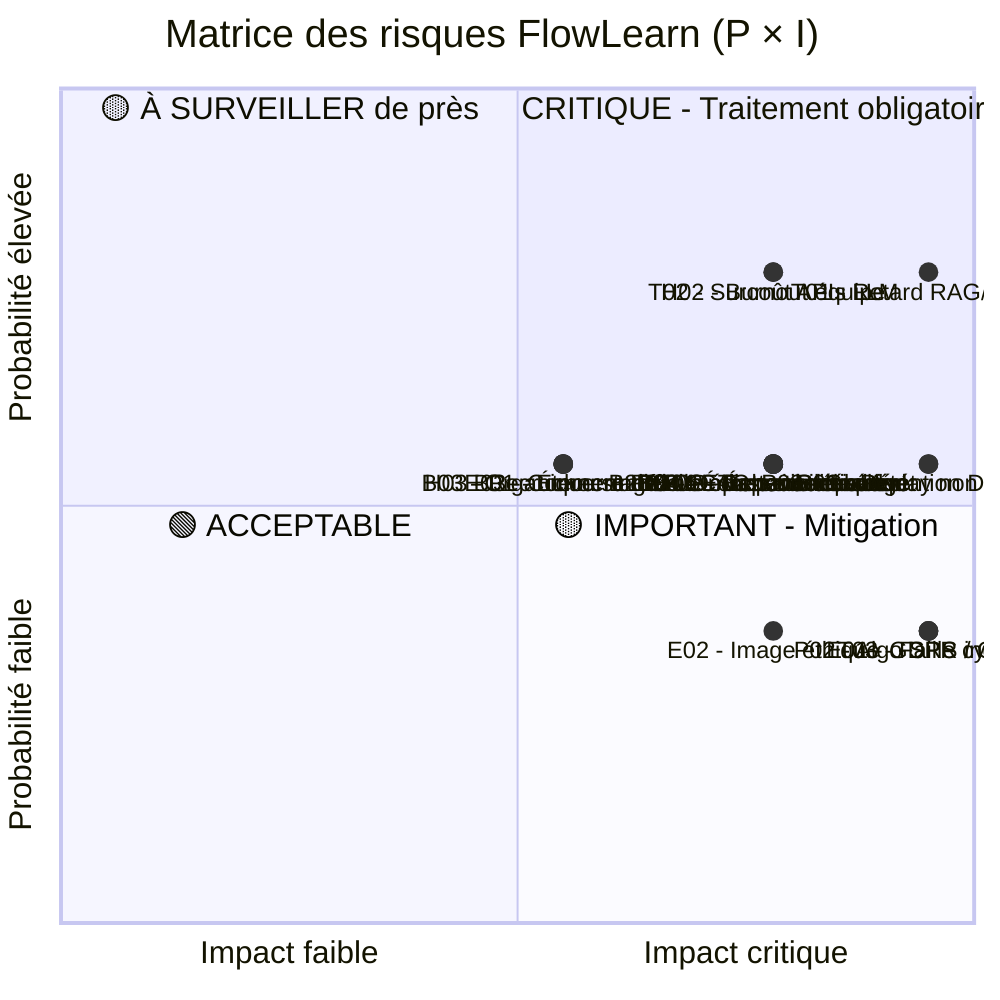
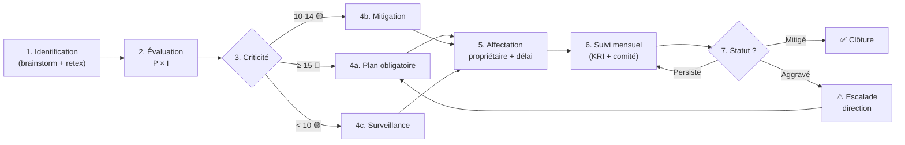

# 🛡️ FLOWLEARN
## Gestion des Risques 24 mois
### ULTRA-VISUEL : Registre + Matrices + KRI + Plans de réponse
**Document de pilotage des risques - VERSION FRANÇAISE**

> Ce document est aligné avec :
> - [`budget-previsionnel.md`](../budgetaire/budget-previsionnel.md) (654k€ / contingence 98k€)
> - [`planning-detaille.md`](../planning/planning-detaille.md) (24 mois, 8 gates Go/No-Go)
> - [`plan-de-communication.md`](../plan-de-communication/plan-de-communication.md) (60k€ / 4 phases marketing)

---

## 1. SYNTHÈSE EXÉCUTIVE

### Vision Risques Global

```
HORIZON DE COUVERTURE : 24 mois (Avril 2026 - Mars 2028)

CARTOGRAPHIE :
├─ Risques Techniques (T)        : 5 risques  | 28% du registre
├─ Risques Produit (P)           : 3 risques  | 17% du registre
├─ Risques Humains / RH (H)      : 3 risques  | 17% du registre
├─ Risques Business / Growth (B) : 4 risques  | 22% du registre
├─ Risques Financiers (F)        : 2 risques  | 11% du registre
└─ Risques Externes (E)          : 3 risques  | 17% du registre

RÉSERVE DE COUVERTURE :
├─ Contingence financière        : 98k€  (15% du budget global)
├─ Buffer planning par phase     : 2 semaines / phase
└─ Plans de mitigation actifs    : 18 (un par risque)

OBJECTIF DOCUMENT :
├─ Anticiper avant impact (ne pas subir)
├─ Décider vite avec critères clairs
├─ Préserver la roadmap, le budget et l'équipe
└─ Outiller chaque mois la revue projet
```

### Principe d'or : "Pas de surprise"

> Chaque risque a : un **propriétaire**, un **seuil de déclenchement**, une **action préventive**, une **action corrective** et un **délai**.

---

## 2. CARTOGRAPHIE GLOBALE DES RISQUES (HEATMAP)

### Vue d'ensemble par catégorie

```
╔══════════════════════════════════════════════════════════════════╗
║                  HEATMAP RISQUES - 18 RISQUES                    ║
║                (Plus l'écart est rouge, plus c'est urgent)       ║
╠══════════════════════════════════════════════════════════════════╣
║                                                                    ║
║  TECHNIQUE (T)        🔴🔴🔴🟡🟢   → 5 risques | top : T01, T02 ║
║  PRODUIT (P)          🔴🔴🟡       → 3 risques | top : P01, P03 ║
║  HUMAIN (H)           🔴🟡🟢       → 3 risques | top : H02      ║
║  BUSINESS (B)         🟡🟡🟡🟢     → 4 risques | top : B02, B04 ║
║  FINANCIER (F)        🟡🟡         → 2 risques | top : F01, F02 ║
║  EXTERNE (E)          🟡🟢🟢       → 3 risques | top : E01      ║
║                                                                    ║
║  ──────────────────────────────────────────────────────────────  ║
║                                                                    ║
║  LÉGENDE :                                                       ║
║  🔴 CRITIQUE  (criticité ≥ 15)  → traitement OBLIGATOIRE         ║
║  🟡 IMPORTANT (criticité 10-14) → mitigation recommandée         ║
║  🟢 ACCEPTABLE (criticité < 10) → surveillance                   ║
║                                                                    ║
╚══════════════════════════════════════════════════════════════════╝
```

### Top 5 risques à surveiller en priorité

```
┌──────────────────────────────────────────────────────────────────┐
│            TOP 5 - ACTION IMMÉDIATE / SUIVI HEBDO                │
├──────────────────────────────────────────────────────────────────┤
│                                                                    │
│ #1 🔴 T01 - Retard PBS3 (RAG/IA Core)        Criticité : 20      │
│ #2 🔴 H02 - Charge humaine / burnout         Criticité : 16      │
│ #3 🔴 T02 - Surcoût APIs LLM                 Criticité : 16      │
│ #4 🔴 P01 - Rétention D7 < 20% en bêta       Criticité : 15      │
│ #5 🔴 P03 - Gameplay non engageant           Criticité : 15      │
│                                                                    │
└──────────────────────────────────────────────────────────────────┘
```

---

## 3. MÉTHODOLOGIE & ÉCHELLES

### 3.1 Évaluation Probabilité × Impact

```
┌─────────────────────────────────────────────────────────────┐
│                  ÉCHELLES UTILISÉES                          │
├─────────────────────────────────────────────────────────────┤
│                                                               │
│ PROBABILITÉ (P) - 1 à 5                                      │
│ ───────────────────────────────────────────                  │
│ 1 = Très faible (< 5%)    | "Quasi improbable"               │
│ 2 = Faible (5-20%)        | "Possible mais peu probable"     │
│ 3 = Moyenne (20-50%)      | "Pourrait arriver"               │
│ 4 = Élevée (50-80%)       | "Probablement"                   │
│ 5 = Très élevée (> 80%)   | "Quasi certain"                  │
│                                                               │
│ IMPACT (I) - 1 à 5                                           │
│ ───────────────────────────────────────────                  │
│ 1 = Mineur     | < 2k€ impact ou < 1 sem retard             │
│ 2 = Faible     | 2-10k€ impact ou 1-2 sem retard            │
│ 3 = Modéré     | 10-30k€ impact ou 2-4 sem retard           │
│ 4 = Majeur     | 30-80k€ impact ou 1-2 mois retard          │
│ 5 = Critique   | > 80k€ impact ou compromet le projet       │
│                                                               │
│ CRITICITÉ = P × I  (de 1 à 25)                               │
│                                                               │
│ SEUILS DE TRAITEMENT :                                       │
│ 🔴 Critique  : ≥ 15  → Plan d'action obligatoire             │
│ 🟡 Important : 10-14 → Plan de mitigation recommandé         │
│ 🟢 Acceptable : < 10  → Surveillance simple                  │
│                                                               │
└─────────────────────────────────────────────────────────────┘
```

### 3.2 Stratégies de réponse possibles

| Stratégie | Quand l'utiliser | Exemple FlowLearn |
| --- | --- | --- |
| **Éviter** | Risque inacceptable | Refuser fonctionnalité hors GDPR |
| **Réduire** | Risque maîtrisable | Multi-LLM, cache, fallback |
| **Transférer** | Risque externalisable | Audit cyber par tiers, assurance |
| **Accepter** | Coût > impact | Variations mineures de CAC |

---

## 4. REGISTRE COMPLET DES RISQUES (18 RISQUES)

### 4.1 RISQUES TECHNIQUES (5)

| ID | Risque | Cause racine | P | I | Criticité | Niveau |
| --- | --- | --- | :-: | :-: | :-: | :-: |
| **T01** | Retard PBS3 (RAG / IA Core) bloque le MVP | Sur-ingénierie, intégration LlamaIndex + Pydantic AI complexe | 4 | 5 | **20** | 🔴 |
| **T02** | Surcoût APIs LLM (Groq, ElevenLabs, etc.) | Volume tokens > prévu, scaling viral | 4 | 4 | **16** | 🔴 |
| **T03** | Faille cybersécurité majeure / fuite GDPR | Vulnérabilité non détectée avant audit | 2 | 5 | **10** | 🟡 |
| **T04** | Indisponibilité Cloud / Crash scaling | Pic d'usage non anticipé, infra Supabase/AWS | 3 | 4 | **12** | 🟡 |
| **T05** | Dette technique / Sur-ingénierie MCP | Trop de features, manque de scope | 3 | 4 | **12** | 🟡 |

### 4.2 RISQUES PRODUIT (3)

| ID | Risque | Cause racine | P | I | Criticité | Niveau |
| --- | --- | --- | :-: | :-: | :-: | :-: |
| **P01** | Rétention D7 < 20% à GATE 2 (M4) | Onboarding faible, core loop non addictif | 3 | 5 | **15** | 🔴 |
| **P02** | Algo SRS / personnalisation inefficace | Modèle de rétention mal calibré | 2 | 5 | **10** | 🟡 |
| **P03** | Gameplay non engageant (boucle dopamine) | Difficulté à transformer cours en jeu | 3 | 5 | **15** | 🔴 |

### 4.3 RISQUES HUMAINS / RH (3)

| ID | Risque | Cause racine | P | I | Criticité | Niveau |
| --- | --- | --- | :-: | :-: | :-: | :-: |
| **H01** | Turnover d'un dev clé (M6-M15) | Charge, salaire SMIC, opportunités externes | 3 | 4 | **12** | 🟡 |
| **H02** | Burnout / charge humaine équipe | Polyvalence forte sur 7 FTE, sprint serrés | 4 | 4 | **16** | 🔴 |
| **H03** | Recrutement difficile aux moments clés | Marché tendu IA, salaires non concurrentiels | 3 | 3 | **9** | 🟢 |

### 4.4 RISQUES BUSINESS / GROWTH (4)

| ID | Risque | Cause racine | P | I | Criticité | Niveau |
| --- | --- | --- | :-: | :-: | :-: | :-: |
| **B01** | Échec validation B2B à GATE 4 (M10) | Cycle vente long, produit mal positionné | 3 | 3 | **9** | 🟢 |
| **B02** | CAC paid trop élevé (TikTok > 2€) | Créatifs moyens, audience mal ciblée | 3 | 4 | **12** | 🟡 |
| **B03** | Croissance organique stagnante | Faible rythme contenu, communauté inactive | 3 | 3 | **9** | 🟢 |
| **B04** | Échec monétisation premium (conv < 5%) | Pricing inadapté, friction paywall | 3 | 4 | **12** | 🟡 |

### 4.5 RISQUES FINANCIERS (2)

| ID | Risque | Cause racine | P | I | Criticité | Niveau |
| --- | --- | --- | :-: | :-: | :-: | :-: |
| **F01** | Dépassement budget global (> 654k€) | Multiplication des aléas, contingence dépassée | 3 | 4 | **12** | 🟡 |
| **F02** | Échec levée Series A (M21-M24) | KPIs sous cibles, marché VC fermé | 3 | 4 | **12** | 🟡 |

### 4.6 RISQUES EXTERNES / RÉGLEMENTAIRES (3)

| ID | Risque | Cause racine | P | I | Criticité | Niveau |
| --- | --- | --- | :-: | :-: | :-: | :-: |
| **E01** | Non-conformité GDPR / sanction CNIL | Données sensibles, audit manqué | 2 | 5 | **10** | 🟡 |
| **E02** | Image éthique dégradée (dopamine = addiction) | Discours "hack dopamine" mal interprété | 2 | 4 | **8** | 🟢 |
| **E03** | Concurrence agressive / pivot marché | Acteur EdTech avec IA équivalente | 3 | 3 | **9** | 🟢 |

---

## 5. MATRICE PROBABILITÉ × IMPACT

### 5.1 Matrice synthétique 5×5

```
                IMPACT
              1     2     3     4     5
           ┌─────┬─────┬─────┬─────┬─────┐
P    5     │     │     │     │     │     │
R          ├─────┼─────┼─────┼─────┼─────┤
O    4     │     │     │     │ H02 │ T01 │  🔴 Critiques (>=15)
B          │     │     │     │ T02 │     │
A          ├─────┼─────┼─────┼─────┼─────┤
B    3     │     │     │ B01 │ T04 │ P01 │  🔴 Critiques (>=15)
I          │     │     │ B03 │ T05 │ P03 │
L          │     │     │ E03 │ H01 │     │
I          │     │     │ H03 │ B02 │     │
T          │     │     │     │ B04 │     │
É          │     │     │     │ F01 │     │
           │     │     │     │ F02 │     │
           ├─────┼─────┼─────┼─────┼─────┤
     2     │     │     │     │ E02 │ T03 │
           │     │     │     │     │ E01 │
           │     │     │     │     │ P02 │
           ├─────┼─────┼─────┼─────┼─────┤
     1     │     │     │     │     │     │
           └─────┴─────┴─────┴─────┴─────┘
```

### 5.2 Matrice Mermaid (visuel)



---

## 6. RISQUES PAR PHASE (TIMELINE 24 MOIS)

### Quel risque surveiller à quel moment

```
╔═══════════════════════════════════════════════════════════════════╗
║       CALENDRIER DES RISQUES - 24 MOIS (M1 → M24)                ║
╠═══════════════════════════════════════════════════════════════════╣
║                                                                     ║
║ PHASE 1 (M1-M6) : FONDATIONS - Risques EXÉCUTION                 ║
║ ━━━━━━━━━━━━━━━━━━━━━━━━━━━━━━━━━━━━━━━━━━━━━━━━━━━━━━━━━━━━━━  ║
║                                                                     ║
║   M1-M2 │ T01 (RAG)       🔴 PIC          ████░░░░░░░░░░░░░░░    ║
║   M2-M3 │ P03 (Gameplay)  🔴 PIC          ░████░░░░░░░░░░░░░░    ║
║   M3-M4 │ T01 (RAG livré) 🔴 GATE 1       ░░████░░░░░░░░░░░░░    ║
║   M3-M4 │ P01 (Rétention) 🔴 GATE 2       ░░████░░░░░░░░░░░░░    ║
║   M5-M6 │ T03 (Cyber)     🟡 AUDIT        ░░░░░████░░░░░░░░░░    ║
║   M5-M6 │ E01 (GDPR)      🟡 AUDIT        ░░░░░████░░░░░░░░░░    ║
║                                                                     ║
║ ─────────────────────────────────────────────────────────────────║
║                                                                     ║
║ PHASE 2 (M7-M12) : TRACTION - Risques CROISSANCE                 ║
║ ━━━━━━━━━━━━━━━━━━━━━━━━━━━━━━━━━━━━━━━━━━━━━━━━━━━━━━━━━━━━━━  ║
║                                                                     ║
║   M7-M9  │ T02 (APIs LLM)   🔴 PIC SCALE  ████░░░░░░░░░░░░░░░    ║
║   M7-M12 │ B02 (CAC paid)   🟡 SUIVI      ████████████░░░░░░░    ║
║   M9-M10 │ B04 (Premium)    🟡 LANCEMENT  ░░██░░░░░░░░░░░░░░░    ║
║   M9-M10 │ B01 (B2B)        🟢 GATE 4     ░░██░░░░░░░░░░░░░░░    ║
║   M6-M12 │ H01 (Turnover)   🟡 RISQUE     ████████████░░░░░░░    ║
║   M6-M12 │ H02 (Burnout)    🔴 ALERTE     ████████████░░░░░░░    ║
║                                                                     ║
║ ─────────────────────────────────────────────────────────────────║
║                                                                     ║
║ PHASE 3 (M13-M20) : SCALING - Risques INTERNATIONAL              ║
║ ━━━━━━━━━━━━━━━━━━━━━━━━━━━━━━━━━━━━━━━━━━━━━━━━━━━━━━━━━━━━━━  ║
║                                                                     ║
║   M13-M16 │ T04 (Cloud)      🟡 SCALING    ████░░░░░░░░░░░░░░    ║
║   M13-M20 │ T02 (APIs intl)  🔴 SUIVI      ████████░░░░░░░░░░    ║
║   M13-M18 │ E03 (Concurrence)🟢 VEILLE     ████████░░░░░░░░░░    ║
║   M15-M18 │ F02 (Series A)   🟡 PRÉPARATIO ░░░████░░░░░░░░░░    ║
║   M18-M20 │ T05 (Dette tech) 🟡 REFACTOR   ░░░░░██░░░░░░░░░░    ║
║                                                                     ║
║ ─────────────────────────────────────────────────────────────────║
║                                                                     ║
║ PHASE 4 (M21-M24) : EXIT - Risques FINANCEMENT                   ║
║ ━━━━━━━━━━━━━━━━━━━━━━━━━━━━━━━━━━━━━━━━━━━━━━━━━━━━━━━━━━━━━━  ║
║                                                                     ║
║   M21-M23 │ F02 (Series A close) 🔴 PIC    ████░░░░░░░░░░░░░░    ║
║   M21-M24 │ F01 (Budget overshoot)🟡 SUIVI ████████░░░░░░░░░░    ║
║   M21-M24 │ E02 (Image éthique)  🟢 PR     ████████░░░░░░░░░░    ║
║                                                                     ║
╚═══════════════════════════════════════════════════════════════════╝
```

---

## 7. PLANS DE MITIGATION DÉTAILLÉS (TOP 10)

### Format : 1 fiche action par risque

---

### 🔴 R-T01 — Retard PBS3 (RAG / IA Core)

```
┌─────────────────────────────────────────────────────────────────┐
│  T01 - RETARD PBS3 (RAG/IA CORE)         Criticité : 20 (🔴)   │
├─────────────────────────────────────────────────────────────────┤
│  Catégorie       : Technique                                    │
│  Fenêtre         : M2 → M4                                      │
│  Propriétaire    : Tech Lead (Backend)                          │
│  Impact si actif : MVP non livré, GATE 1 bloqué, planning -4s   │
│                                                                   │
│  ─── DÉCLENCHEURS (KRI) ─────────────────────────────────────   │
│  • Avancement PBS3 < 70% en fin M3                              │
│  • Pipeline LlamaIndex non testé en bout-en-bout                │
│  • Daily retards cumulés > 5 jours                              │
│                                                                   │
│  ─── ACTIONS PRÉVENTIVES ────────────────────────────────────   │
│  ✅ Buffer 2 semaines intégré au planning M2-M3                 │
│  ✅ Prototype LlamaIndex démarré dès M1 (en parallèle)          │
│  ✅ Daily standup chemin critique animé par Tech Lead           │
│  ✅ Spike technique Pydantic AI / Groq en M1                    │
│  ✅ Code review obligatoire pour PBS3                           │
│                                                                   │
│  ─── ACTIONS CORRECTIVES ────────────────────────────────────   │
│  ⚠️  Plan A : réduire scope RAG (cache + retrieval simple)      │
│  ⚠️  Plan B : fallback OpenAI ou Mistral si Groq instable       │
│  ⚠️  Plan C : freelance senior 2-3 sem (budget contingence)     │
│                                                                   │
│  ─── BUDGET MOBILISABLE ─────────────────────────────────────   │
│  💰 Contingence Phase 1 : 3k€ (freelance/extra cloud)           │
│  💰 Contingence générale APIs : 5k€                             │
│                                                                   │
│  ─── SI ÉCHEC TOTAL ─────────────────────────────────────────   │
│  → Décalage GATE 1 et GATE 2 de 2 sem                           │
│  → Scope MVP réduit (1 jeu au lieu de 2)                        │
│                                                                   │
└─────────────────────────────────────────────────────────────────┘
```

---

### 🔴 R-H02 — Burnout / charge humaine équipe

```
┌─────────────────────────────────────────────────────────────────┐
│  H02 - BURNOUT / CHARGE HUMAINE          Criticité : 16 (🔴)   │
├─────────────────────────────────────────────────────────────────┤
│  Catégorie       : Humain                                       │
│  Fenêtre         : M6 → M20 (toute la phase scale)              │
│  Propriétaire    : Project Manager / Product Owner              │
│  Impact si actif : Turnover, perte vélocité, qualité dégradée   │
│                                                                   │
│  ─── DÉCLENCHEURS (KRI) ─────────────────────────────────────   │
│  • Heures sup déclarées > 10h/sem sur 3 sem                     │
│  • Nb tickets en retard > 30%                                   │
│  • Score "weekly mood" < 6/10                                   │
│  • Plus de 1 arrêt maladie en 1 mois                            │
│                                                                   │
│  ─── ACTIONS PRÉVENTIVES ────────────────────────────────────   │
│  ✅ Sprint capacité réaliste (max 80% capa engagée)             │
│  ✅ 1:1 hebdomadaire avec chaque FTE                            │
│  ✅ Pas de week-end working "par défaut"                        │
│  ✅ Roadmap mensuelle = 1 thème seulement                       │
│  ✅ Revue mensuelle de la charge (Linear)                       │
│                                                                   │
│  ─── ACTIONS CORRECTIVES ────────────────────────────────────   │
│  ⚠️  Gel d'1 sprint sur 4 = rattrapage / refacto                │
│  ⚠️  Repri : embauche freelance pour features secondaires      │
│  ⚠️  Décalage objectifs phase au prochain comité pilotage      │
│                                                                   │
│  ─── BUDGET MOBILISABLE ─────────────────────────────────────   │
│  💰 Contingence RH : 10k€ (freelance replacement)               │
│                                                                   │
└─────────────────────────────────────────────────────────────────┘
```

---

### 🔴 R-T02 — Surcoût APIs LLM

```
┌─────────────────────────────────────────────────────────────────┐
│  T02 - SURCOÛT APIs LLM                  Criticité : 16 (🔴)   │
├─────────────────────────────────────────────────────────────────┤
│  Catégorie       : Technique / Financier                        │
│  Fenêtre         : M7 → M24 (montée en charge)                  │
│  Propriétaire    : Tech Lead + CFO                              │
│  Impact si actif : Marge produit attaquée, contingence brûlée   │
│                                                                   │
│  ─── DÉCLENCHEURS (KRI) ─────────────────────────────────────   │
│  • Coût API > +30% du budget mensuel sur 2 mois                 │
│  • Tokens consommés > 1.5x prévision                            │
│  • Coût par DAU > 0.05€                                         │
│                                                                   │
│  ─── ACTIONS PRÉVENTIVES ────────────────────────────────────   │
│  ✅ Ollama local prêt dès M1 (fallback gratuit)                 │
│  ✅ Cache de réponses (LlamaIndex Cloud + Redis)                │
│  ✅ Daily monitoring tokens (Datadog dashboard)                 │
│  ✅ Quotas par utilisateur (rate limiting)                      │
│                                                                   │
│  ─── ACTIONS CORRECTIVES ────────────────────────────────────   │
│  ⚠️  Bascule progressive vers LLM local (Ollama)                │
│  ⚠️  Renégo Groq / passage Mistral / batch off-peak             │
│  ⚠️  Réduction qualité audio (ElevenLabs → Google TTS)          │
│                                                                   │
│  ─── BUDGET MOBILISABLE ─────────────────────────────────────   │
│  💰 Contingence APIs : 5k€ (référence budget)                   │
│                                                                   │
└─────────────────────────────────────────────────────────────────┘
```

---

### 🔴 R-P01 — Rétention D7 < 20% (GATE 2)

```
┌─────────────────────────────────────────────────────────────────┐
│  P01 - RÉTENTION D7 < 20% À GATE 2       Criticité : 15 (🔴)   │
├─────────────────────────────────────────────────────────────────┤
│  Catégorie       : Produit                                      │
│  Fenêtre         : M3 → M4 (validation bêta)                    │
│  Propriétaire    : Product Manager + Analytics                  │
│  Impact si actif : Lancement public retardé, budget P2 réduit   │
│                                                                   │
│  ─── DÉCLENCHEURS (KRI) ─────────────────────────────────────   │
│  • D1 < 40% en bêta fermée                                      │
│  • D7 < 20% sur 200 testeurs minimum                            │
│  • Taux activation < 30%                                        │
│  • NPS < 10                                                     │
│                                                                   │
│  ─── ACTIONS PRÉVENTIVES ────────────────────────────────────   │
│  ✅ A/B test onboarding dès M2 (pas attendre bêta)              │
│  ✅ Core loop validé en M1 (paper prototyping)                  │
│  ✅ Interviews users hebdo (5 users / sem)                      │
│  ✅ Feature flags actifs pour toggle rapide                     │
│                                                                   │
│  ─── ACTIONS CORRECTIVES ────────────────────────────────────   │
│  ⚠️  Sprint M4 100% UX rework                                   │
│  ⚠️  Pivot d'1 mécanique de jeu non engageante                  │
│  ⚠️  Décalage GATE 3 (lancement public) de 4 semaines           │
│                                                                   │
│  ─── BUDGET MOBILISABLE ─────────────────────────────────────   │
│  💰 Pas de coût direct, mais retarde dépenses paid de P2        │
│                                                                   │
└─────────────────────────────────────────────────────────────────┘
```

---

### 🔴 R-P03 — Gameplay non engageant

```
┌─────────────────────────────────────────────────────────────────┐
│  P03 - GAMEPLAY NON ENGAGEANT             Criticité : 15 (🔴)   │
├─────────────────────────────────────────────────────────────────┤
│  Catégorie       : Produit                                      │
│  Fenêtre         : M2 → M6                                      │
│  Propriétaire    : Game Designer + Product Manager              │
│  Impact si actif : Toute la promesse "dopamine learning" cassée │
│                                                                   │
│  ─── DÉCLENCHEURS (KRI) ─────────────────────────────────────   │
│  • Temps de session moyen < 4 min                               │
│  • Sessions/jour < 1.5 par user actif                           │
│  • Feedback "pas fun" > 30% des interviews                      │
│                                                                   │
│  ─── ACTIONS PRÉVENTIVES ────────────────────────────────────   │
│  ✅ Prototype Godot fun-first dès M2                            │
│  ✅ Tests "30 min de fun" sur 10 users avant intégration RAG    │
│  ✅ Inspiration directe : Vampire Survivors, Archero            │
│                                                                   │
│  ─── ACTIONS CORRECTIVES ────────────────────────────────────   │
│  ⚠️  Pivot mécanique : remplacer le jeu non engageant           │
│  ⚠️  Réduire à 1 seul jeu très bien fait au lieu de 2 moyens    │
│  ⚠️  Embaucher consultant game design (sprint 2 sem)            │
│                                                                   │
│  ─── BUDGET MOBILISABLE ─────────────────────────────────────   │
│  💰 Contingence pivot produit : 10k€                            │
│                                                                   │
└─────────────────────────────────────────────────────────────────┘
```

---

### 🟡 R-T03 — Faille cybersécurité majeure

```
┌─────────────────────────────────────────────────────────────────┐
│  T03 - FAILLE CYBERSÉCURITÉ MAJEURE      Criticité : 10 (🟡)   │
├─────────────────────────────────────────────────────────────────┤
│  Catégorie       : Technique / Externe                          │
│  Fenêtre         : M5-M6 (avant lancement public) + continu     │
│  Propriétaire    : Cyber/DevOps Lead                            │
│  Impact si actif : Perte de confiance, sanctions CNIL, pivot    │
│                                                                   │
│  ─── DÉCLENCHEURS (KRI) ─────────────────────────────────────   │
│  • CVE critique remontée par Snyk                               │
│  • Audit ANSSI signale faille bloquante                         │
│  • Tentative d'intrusion détectée par Sentry/Cloudflare         │
│                                                                   │
│  ─── ACTIONS PRÉVENTIVES ────────────────────────────────────   │
│  ✅ Audit cybersécurité externe M5-M6 (5k€)                     │
│  ✅ Pentest annuel M12 + M24 (3k€/audit)                        │
│  ✅ Snyk + npm audit en CI (2k€)                                │
│  ✅ AWS Shield + Cloudflare WAF (3k€)                           │
│  ✅ Encryption "at rest" + "in transit"                         │
│                                                                   │
│  ─── ACTIONS CORRECTIVES ────────────────────────────────────   │
│  ⚠️  Gel marketing immédiat                                     │
│  ⚠️  Mobilisation contingence cyber (15k€)                      │
│  ⚠️  Communication transparente (PR, email users)               │
│                                                                   │
│  ─── BUDGET MOBILISABLE ─────────────────────────────────────   │
│  💰 Contingence cyber d'urgence : 15k€                          │
│                                                                   │
└─────────────────────────────────────────────────────────────────┘
```

---

### 🟡 R-H01 — Turnover dev clé

```
┌─────────────────────────────────────────────────────────────────┐
│  H01 - TURNOVER D'UN DEV CLÉ              Criticité : 12 (🟡)   │
├─────────────────────────────────────────────────────────────────┤
│  Catégorie       : Humain                                       │
│  Fenêtre         : M6 → M15                                     │
│  Propriétaire    : CEO / Project Manager                        │
│  Impact si actif : Perte d'expertise, retard 2-4 sem            │
│                                                                   │
│  ─── ACTIONS PRÉVENTIVES ────────────────────────────────────   │
│  ✅ Documentation systématique (wiki interne)                   │
│  ✅ Bus factor ≥ 2 sur chaque système critique                  │
│  ✅ Code reviews croisées (jamais 1 seul propriétaire)          │
│  ✅ Programme d'équité / bonus rétention                        │
│  ✅ 1:1 mensuel orienté satisfaction                            │
│                                                                   │
│  ─── ACTIONS CORRECTIVES ────────────────────────────────────   │
│  ⚠️  Freelance senior en 1 sem (réseau pré-qualifié)            │
│  ⚠️  Sprint "knowledge transfer" 2 sem                          │
│  ⚠️  Re-priorisation roadmap au comité mensuel                  │
│                                                                   │
│  ─── BUDGET MOBILISABLE ─────────────────────────────────────   │
│  💰 Contingence freelance : 8k€                                 │
│                                                                   │
└─────────────────────────────────────────────────────────────────┘
```

---

### 🟡 R-B02 — CAC paid trop élevé

```
┌─────────────────────────────────────────────────────────────────┐
│  B02 - CAC PAID TROP ÉLEVÉ                Criticité : 12 (🟡)   │
├─────────────────────────────────────────────────────────────────┤
│  Catégorie       : Business / Growth                            │
│  Fenêtre         : M7 → M20                                     │
│  Propriétaire    : Growth Manager                               │
│  Impact si actif : Brûle budget marketing, ROAS négatif         │
│                                                                   │
│  ─── DÉCLENCHEURS (KRI) ─────────────────────────────────────   │
│  • CAC TikTok > 2€                                              │
│  • CAC Meta > 4€                                                │
│  • ROAS < 1.0 sur 3 sem                                         │
│                                                                   │
│  ─── ACTIONS PRÉVENTIVES ────────────────────────────────────   │
│  ✅ Tests créatifs A/B (3 variations / canal)                   │
│  ✅ Plafonds quotidiens stricts                                 │
│  ✅ Canal de secours organique préparé                          │
│                                                                   │
│  ─── ACTIONS CORRECTIVES ────────────────────────────────────   │
│  ⚠️  Pause canal sous-perf (TikTok → 0€)                        │
│  ⚠️  Réallocation vers organique + influenceurs                 │
│  ⚠️  Refonte landing + reciblage audience                       │
│                                                                   │
└─────────────────────────────────────────────────────────────────┘
```

---

### 🟡 R-F02 — Échec levée Series A

```
┌─────────────────────────────────────────────────────────────────┐
│  F02 - ÉCHEC LEVÉE SERIES A               Criticité : 12 (🟡)   │
├─────────────────────────────────────────────────────────────────┤
│  Catégorie       : Financier                                    │
│  Fenêtre         : M21 → M24                                    │
│  Propriétaire    : CEO + CFO + Board                            │
│  Impact si actif : Pas de runway > 24 mois, pivot bootstrap     │
│                                                                   │
│  ─── ACTIONS PRÉVENTIVES ────────────────────────────────────   │
│  ✅ KPI cibles M18 atteints (1M DAU, 40% intl)                  │
│  ✅ Diversification : VC + business angels + corp               │
│  ✅ Pitch deck M14 + roadshow M15                               │
│  ✅ Conversations M&A en parallèle                              │
│                                                                   │
│  ─── ACTIONS CORRECTIVES ────────────────────────────────────   │
│  ⚠️  Trajectoire bootstrap rentable (M18 break-even)            │
│  ⚠️  Cost cuts ciblés (-20% scénario "Lean")                    │
│  ⚠️  Bridge round avec investisseurs existants                  │
│                                                                   │
└─────────────────────────────────────────────────────────────────┘
```

---

### 🟡 R-E01 — Non-conformité GDPR / sanction CNIL

```
┌─────────────────────────────────────────────────────────────────┐
│  E01 - NON-CONFORMITÉ GDPR                Criticité : 10 (🟡)   │
├─────────────────────────────────────────────────────────────────┤
│  Catégorie       : Externe / Réglementaire                      │
│  Fenêtre         : M1 → M24 (continu, pic M4-M6)                │
│  Propriétaire    : Cyber Lead + DPO PT                          │
│  Impact si actif : Sanctions CNIL, fermeture B2B école          │
│                                                                   │
│  ─── ACTIONS PRÉVENTIVES ────────────────────────────────────   │
│  ✅ Privacy by Design dès M1                                    │
│  ✅ DPIA réalisée en M3                                         │
│  ✅ Revue juridique GDPR M6 (3k€)                               │
│  ✅ Process consentement, suppression, portabilité              │
│  ✅ DPO consultant à temps partiel (M6+)                        │
│                                                                   │
│  ─── ACTIONS CORRECTIVES ────────────────────────────────────   │
│  ⚠️  Gel des features non conformes                             │
│  ⚠️  Communication CNIL proactive                               │
│  ⚠️  Mise en conformité accélérée                               │
│                                                                   │
└─────────────────────────────────────────────────────────────────┘
```

---

## 8. KEY RISK INDICATORS (KRI) - TABLEAU DE BORD

### Indicateurs d'alerte précoce

```
╔══════════════════════════════════════════════════════════════════╗
║         KRI - INDICATEURS D'ALERTE PRÉCOCE (suivi mensuel)       ║
╠══════════════════════════════════════════════════════════════════╣
║                                                                    ║
║ TECHNIQUE                                                          ║
║ ────────────────────────────────────────────────────────────     ║
║ KRI-T1  │ Avancement PBS3 (RAG)        │ 🟢 ≥80%  🟡 60-80% 🔴 <60%║
║ KRI-T2  │ Coût API mensuel vs budget   │ 🟢 <100%  🟡 +30%  🔴 +50%║
║ KRI-T3  │ Uptime infra (Cloudflare)    │ 🟢 99.9%  🟡 99%   🔴 <99%║
║ KRI-T4  │ Latence p95 backend          │ 🟢 <300ms 🟡 600ms 🔴 >1s║
║ KRI-T5  │ Vulnérabilités Snyk High+    │ 🟢 0      🟡 1-2   🔴 ≥3 ║
║                                                                    ║
║ PRODUIT                                                            ║
║ ────────────────────────────────────────────────────────────     ║
║ KRI-P1  │ Rétention D1                 │ 🟢 ≥50%  🟡 35-50% 🔴 <35%║
║ KRI-P2  │ Rétention D7                 │ 🟢 ≥30%  🟡 20-30% 🔴 <20%║
║ KRI-P3  │ Rétention D30                │ 🟢 ≥15%  🟡 10-15% 🔴 <10%║
║ KRI-P4  │ Temps de session             │ 🟢 ≥6min 🟡 4-6min 🔴 <4m║
║ KRI-P5  │ NPS                          │ 🟢 ≥30   🟡 10-30  🔴 <10║
║                                                                    ║
║ HUMAIN                                                             ║
║ ────────────────────────────────────────────────────────────     ║
║ KRI-H1  │ Heures sup déclarées         │ 🟢 <5h/s 🟡 5-10h  🔴 >10h║
║ KRI-H2  │ Tickets en retard            │ 🟢 <15%  🟡 15-30% 🔴 >30%║
║ KRI-H3  │ Mood score équipe            │ 🟢 ≥7/10 🟡 6-7    🔴 <6 ║
║ KRI-H4  │ Turnover annualisé           │ 🟢 0%    🟡 1 dép  🔴 ≥2 ║
║                                                                    ║
║ BUSINESS / GROWTH                                                  ║
║ ────────────────────────────────────────────────────────────     ║
║ KRI-B1  │ CAC paid (TikTok)            │ 🟢 ≤2€   🟡 2-5€   🔴 >5€║
║ KRI-B2  │ ROAS                         │ 🟢 ≥1.5  🟡 1-1.5  🔴 <1 ║
║ KRI-B3  │ Conversion premium           │ 🟢 ≥10%  🟡 5-10%  🔴 <5%║
║ KRI-B4  │ Pipeline B2B (LOIs/mois)     │ 🟢 ≥3    🟡 1-2    🔴 0  ║
║                                                                    ║
║ FINANCIER                                                          ║
║ ────────────────────────────────────────────────────────────     ║
║ KRI-F1  │ Burn rate vs budget          │ 🟢 ≤100% 🟡 100-110%🔴 >110%║
║ KRI-F2  │ Conso contingence            │ 🟢 <30%  🟡 30-50% 🔴 >50%║
║ KRI-F3  │ Runway restant               │ 🟢 ≥9m   🟡 6-9m   🔴 <6m║
║                                                                    ║
╚══════════════════════════════════════════════════════════════════╝
```

### Règle de revue

> Un KRI **🔴 rouge** déclenche un point dédié au prochain comité de pilotage.  
> Trois KRI **🟡 jaunes** dans la même catégorie sur 1 mois = traitement obligatoire.

---

## 9. PROCESSUS DE GESTION D'UN RISQUE

### 9.1 Cycle de vie



### 9.2 Niveaux d'escalade

```
┌─────────────────────────────────────────────────────────────┐
│              ESCALADE - QUI DÉCIDE QUOI ?                    │
├─────────────────────────────────────────────────────────────┤
│                                                               │
│ NIVEAU 1 : Équipe opérationnelle (hebdo)                    │
│ ───────────────────────────────────────────                 │
│ • Risques 🟢 acceptables                                     │
│ • Suivi KRI dans Linear / Sentry                            │
│ • Décide : actions techniques de mitigation                 │
│                                                               │
│ NIVEAU 2 : Comité de pilotage mensuel                       │
│ ───────────────────────────────────────────                 │
│ • Risques 🟡 importants                                      │
│ • Revue registre + KRI                                      │
│ • Décide : réallocation budget < 5k€                        │
│                                                               │
│ NIVEAU 3 : Comité projet trimestriel                        │
│ ───────────────────────────────────────────                 │
│ • Risques 🔴 critiques                                       │
│ • Décide : pivot scope, contingence > 5k€                   │
│                                                               │
│ NIVEAU 4 : Board / direction (urgence)                      │
│ ───────────────────────────────────────────                 │
│ • Crise majeure (cyber, GDPR, levée)                        │
│ • Décide : stop projet, pivot stratégique                   │
│                                                               │
└─────────────────────────────────────────────────────────────┘
```

---

## 10. RÔLES & RESPONSABILITÉS

### Matrice RACI risques

| Activité | Tech Lead | Product Manager | Project Manager | Cyber Lead | CEO/CFO |
| --- | :-: | :-: | :-: | :-: | :-: |
| Identifier risque tech | **R** | C | A | C | I |
| Identifier risque produit | C | **R** | A | I | I |
| Identifier risque cyber | C | I | A | **R** | I |
| Identifier risque RH/budget | I | I | **R** | I | A |
| Évaluation P×I | C | C | **R** | C | A |
| Piloter mitigation | **R** | **R** | A | **R** | I |
| Décision contingence > 5k€ | I | C | C | C | **R** |
| Communication crise | I | C | A | C | **R** |
| Reporting board | I | I | A | I | **R** |

> **R** = Responsable / **A** = Approuve / **C** = Consulté / **I** = Informé

---

## 11. SUIVI MENSUEL & GOUVERNANCE

### 11.1 Rituel mensuel des risques

```
╔══════════════════════════════════════════════════════════════╗
║         REVUE MENSUELLE DES RISQUES (1h fixe)                ║
╠══════════════════════════════════════════════════════════════╣
║                                                                ║
║ 1️⃣  Lecture KRI tableau de bord (10 min)                      ║
║ 2️⃣  Mise à jour registre des risques (15 min)                 ║
║ 3️⃣  Top 5 risques actifs - statut (15 min)                    ║
║ 4️⃣  Décision contingence si nécessaire (10 min)               ║
║ 5️⃣  Action items + responsables + délais (10 min)             ║
║                                                                ║
║ Participants : Tech Lead, PM, Project Manager, Cyber Lead    ║
║ Output       : Compte-rendu + KRI à jour + actions Linear    ║
║                                                                ║
╚══════════════════════════════════════════════════════════════╝
```

### 11.2 Template de fiche de revue

```
MOIS : ____________  | PHASE : ____________

┌──────────────────────────────────────────────────────────┐
│ TOP 5 RISQUES ACTIFS                                     │
├──────────────────────────────────────────────────────────┤
│ ID │ Risque       │ Statut │ Action     │ Responsable    │
├──────────────────────────────────────────────────────────┤
│ T01│ Retard RAG   │ 🟡     │ Buffer+1s  │ Tech Lead      │
│ H02│ Burnout      │ 🟢     │ 1:1 hebdo  │ PM             │
│ T02│ Coût LLM     │ 🟢     │ Cache OK   │ Tech Lead      │
│ P01│ Rétention    │ 🟡     │ Test UX    │ Product Mgr    │
│ ...│ ...          │ ...    │ ...        │ ...            │
└──────────────────────────────────────────────────────────┘

┌──────────────────────────────────────────────────────────┐
│ CONTINGENCE UTILISÉE CE MOIS                             │
├──────────────────────────────────────────────────────────┤
│ Poste            │ Montant │ Risque associé │ Validation │
├──────────────────────────────────────────────────────────┤
│ Freelance senior │ 4k€     │ T01 retard     │ ✅ CEO     │
└──────────────────────────────────────────────────────────┘

CUMUL CONTINGENCE UTILISÉE : ____ / 98k€  (___%)
```

---

## 12. LIEN AVEC LES AUTRES LIVRABLES

```
┌──────────────────────────────────────────────────────────────┐
│         INTÉGRATION RISQUES ↔ AUTRES DOCUMENTS               │
├──────────────────────────────────────────────────────────────┤
│                                                                │
│ 📅 PLANNING ([planning-detaille.md](../planning/planning-detaille.md))                            │
│ ├─ 8 gates Go/No-Go = checkpoints risques                    │
│ ├─ Buffers 2 sem / phase = absorption retards                │
│ └─ Chemin critique PBS3 = risque T01                         │
│                                                                │
│ 💰 BUDGET ([budget-previsionnel.md](../budgetaire/budget-previsionnel.md))                            │
│ ├─ Contingence 98k€ = réserve risques                        │
│ ├─ Postes alloués par risque type                            │
│ │  ├─ Cyber 15k€ → T03, E01                                  │
│ │  ├─ RH freelance 10k€ → H01, H02                           │
│ │  ├─ APIs LLM 5k€ → T02                                     │
│ │  └─ Pivot produit 10k€ → P01, P03                          │
│ └─ Règles d'or pilotage = discipline anti-risque             │
│                                                                │
│ 📢 COMMUNICATION ([plan-de-communication.md](../plan-de-communication/plan-de-communication.md))                   │
│ ├─ Plans de secours canaux = risque B02                      │
│ ├─ Messages PR de crise = risques T03, E01                   │
│ └─ Investor relations P4 = risque F02                        │
│                                                                │
└──────────────────────────────────────────────────────────────┘
```

---

## 13. CONCLUSION & RECOMMANDATIONS

### 13.1 Synthèse

```
╔══════════════════════════════════════════════════════════════╗
║   RÉSUMÉ - GESTION DES RISQUES FLOWLEARN                     ║
╠══════════════════════════════════════════════════════════════╣
║                                                                ║
║ RISQUES IDENTIFIÉS  : 18 répartis en 6 catégories            ║
║ RISQUES CRITIQUES   : 5 (T01, T02, H02, P01, P03)            ║
║ RISQUES IMPORTANTS  : 8                                       ║
║ RISQUES ACCEPTABLES : 5                                       ║
║                                                                ║
║ PLANS DE MITIGATION : 1 par risque (18 plans actifs)         ║
║ KRI EN PLACE        : 18 indicateurs d'alerte précoce        ║
║ RESERVE BUDGET      : 98k€ (15% du budget total)             ║
║                                                                ║
║ ─────────────────────────────────────────────────────────────║
║                                                                ║
║ 3 PRIORITÉS ABSOLUES                                          ║
║ ──────────────────────────────                                ║
║ 1. 🔴 T01 - Sécuriser PBS3 (RAG/IA Core) en M1-M3            ║
║ 2. 🔴 H02 - Protéger l'équipe (charge, mood, 1:1)            ║
║ 3. 🔴 P01/P03 - Valider rétention et gameplay en bêta        ║
║                                                                ║
╚══════════════════════════════════════════════════════════════╝
```

### 13.2 Prochaines étapes

- [ ] Valider le registre avec l'équipe complète
- [ ] Affecter chaque risque à un propriétaire nommé
- [ ] Mettre en place les KRI dans Linear / Datadog / Sheets
- [ ] Programmer la 1ère revue mensuelle des risques (M1)
- [ ] Lier chaque ligne de contingence budget à un risque
- [ ] Communiquer le top 5 à l'équipe (transparence)

---

**Document validé le :** [À remplir]  
**Approuvé par :** [Équipe]  
**Prochaine revue :** mensuelle (suivi KRI) + trimestrielle (mise à jour registre)

**FIN DU DOCUMENT GESTION DES RISQUES**
