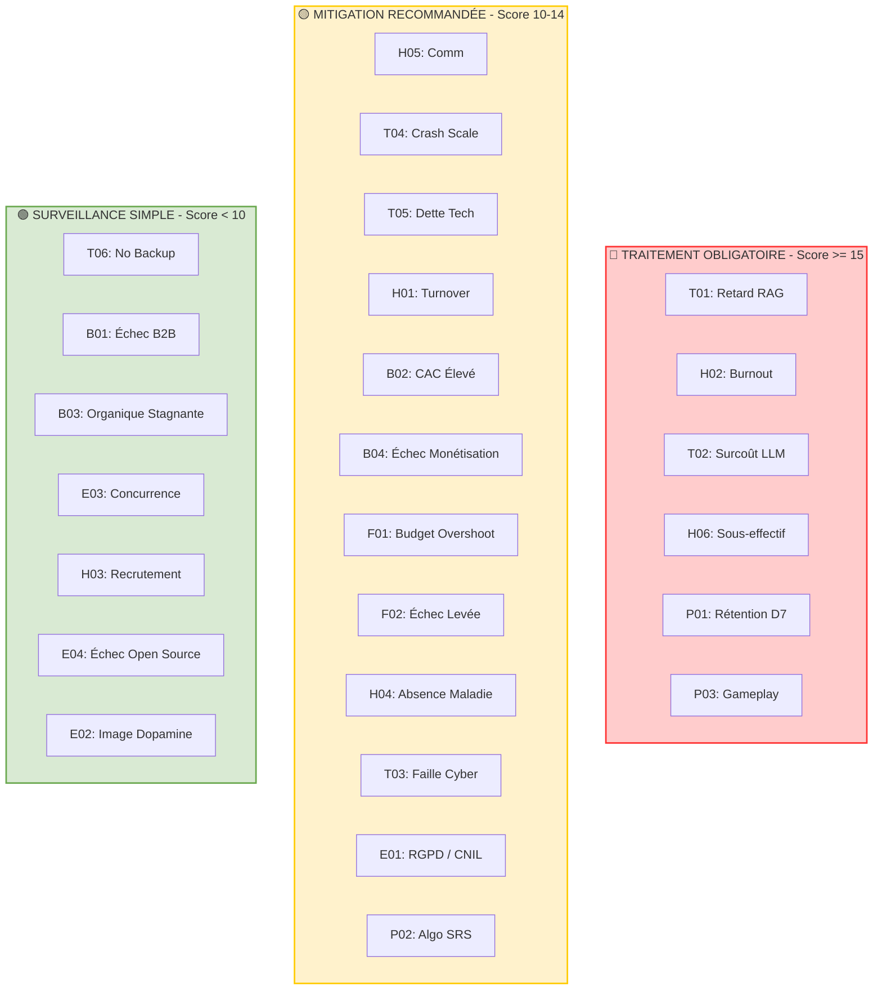
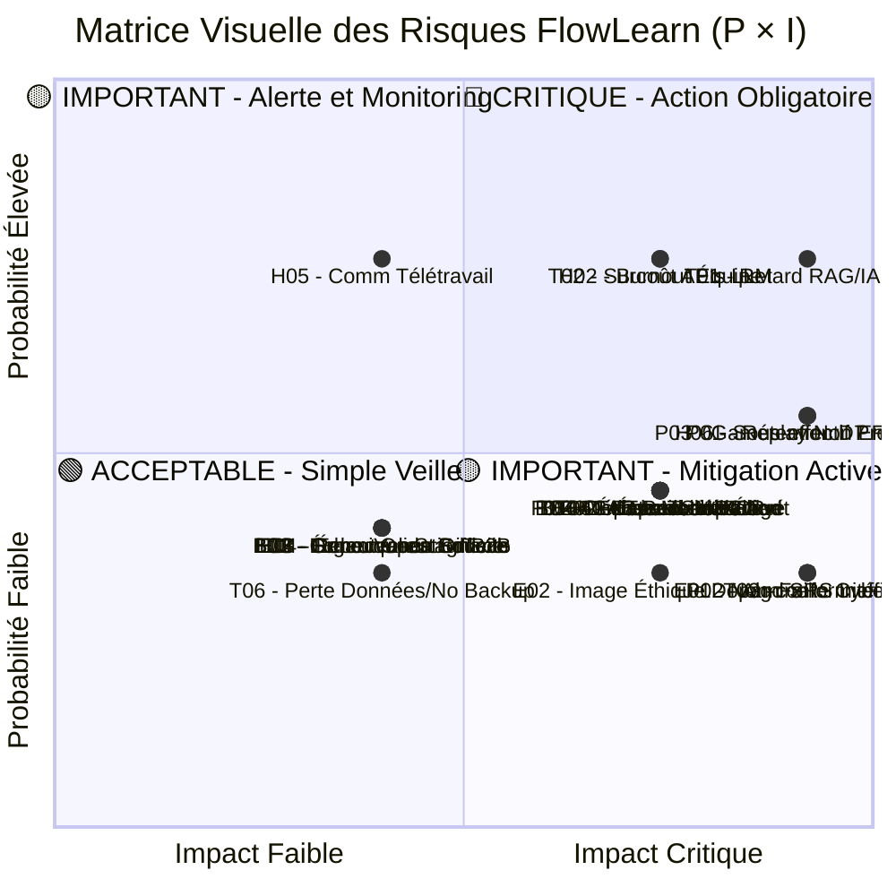
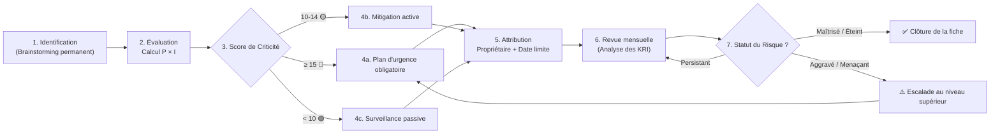

# 🛡️ FLOWLEARN — GESTION DES RISQUES (24 MOIS)
### Registre Unifié, Matrices d'Impact, KRI & Plans de Réponse Opérationnels
**Document de pilotage vivant - Version consolidée**

> Ce document est aligné avec :
> - [`budget-previsionnel.md`](../budgetaire/budget-previsionnel.md) (654k€ / contingence 98k€)
> - [`planning-detaille.md`](../planning/planning-detaille.md) (24 mois, 8 gates Go/No-Go)
> - [`plan-de-communication.md`](../plan-de-communication/plan-de-communication.md) (60k€ / 4 phases marketing)

---

## 1. SYNTHÈSE EXÉCUTIVE

```
HORIZON DE COUVERTURE : 24 mois (Avril 2026 - Mars 2028)

RÉPARTITION DES 25 RISQUES IDENTIFIÉS :
├─ Risques Techniques (T)        : 6 risques  | 24% du registre
├─ Risques Produit (P)           : 3 risques  | 12% du registre
├─ Risques Humains / RH (H)      : 6 risques  | 24% du registre
├─ Risques Business / Growth (B) : 4 risques  | 16% du registre
├─ Risques Financiers (F)        : 2 risques  | 08% du registre
└─ Risques Externes / OS (E)     : 4 risques  | 16% du registre

NOTRE BOUCLIER DE SÉCURITÉ :
├─ Enveloppe de contingence financière : 98k€ (soit 15% du budget global)
├─ Buffer planning de sécurité         : 2 semaines par grande phase projet
└─ Plans de traitement actifs          : 25 fiches action prêtes à être dégainées
```

> 🎯 **Notre principe d'or : "Zéro surprise".** Chaque risque est associé à un propriétaire unique, un indicateur de déclenchement clair, une action préventive pour l'esquiver et une action corrective pour l'éteindre si le feu se déclare.

---

## 2. CARTOGRAPHIE GLOBALE DES RISQUES (HEATMAP)

### Vue d'ensemble par criticité

```
╔══════════════════════════════════════════════════════════════════════════╗
║                    HEATMAP DES 25 RISQUES REFAITS                       ║
║             (Plus l'écart est rouge, plus l'action est urgente)          ║
╠══════════════════════════════════════════════════════════════════════════╣
║                                                                          ║
║  TECHNIQUE (T)        🔴🔴🟡🟡🟡🟢    → 6 risques | Top : T01, T02       ║
║  PRODUIT (P)          🔴🔴🟡          → 3 risques | Top : P01, P03       ║
║  HUMAIN & ORG (H)     🔴🔴🟡🟡🟡🟢    → 6 risques | Top : H02, H06       ║
║  BUSINESS (B)         🟡🟡🟢🟢        → 4 risques | Top : B02, B04       ║
║  FINANCIER (F)        🟡🟡            → 2 risques | Top : F01, F02       ║
║  EXTERNE & OS (E)     🟡🟢🟢🟢        → 4 risques | Top : E01            ║
║                                                                          ║
║  ──────────────────────────────────────────────────────────────────────  ║
║                                                                          ║
║  LÉGENDE DE TRAITEMENT :                                                 ║
║  🔴 CRITIQUE  (criticité >= 15)  → Plan d'action immédiat et obligatoire  ║
║  🟡 IMPORTANT (criticité 10-14) → Mitigation active recommandée          ║
║  🟢 ACCEPTABLE (criticité < 10) → Surveillance simple et passive        ║
║                                                                          ║
╚══════════════════════════════════════════════════════════════════════════╝
```

### Le Top 6 de nos priorités absolues (Suivi Hebdomadaire)
1. 🔴 **T01 — Retard PBS3 (RAG/IA Core) :** Notre moteur plante ou prend du retard. *(Criticité : 20)*
2. 🔴 **H02 — Surcharge humaine & Épuisement :** L'équipe s'essouffle sur un périmètre trop large. *(Criticité : 16)*
3. 🔴 **T02 — Explosion des coûts des APIs LLM :** Le volume de tokens consommé s'envole. *(Criticité : 16)*
4. 🔴 **H06 — Sous-effectif prolongé :** Un départ ou un recrutement manqué bloque la prod. *(Criticité : 15)*
5. 🔴 **P01 — Rétention D7 < 20% en Bêta :** Les utilisateurs viennent mais ne restent pas. *(Criticité : 15)*
6. 🔴 **P03 — Gameplay ennuyeux :** On a créé un outil de cours déguisé, pas un vrai jeu fun. *(Criticité : 15)*

---

## 3. MÉTHODOLOGIE & SEUILS DE TOLÉRANCE

### 3.1 Évaluation Probabilité × Impact
Notre évaluation se veut pragmatique et basée sur des réalités terrain, croisant la Probabilité (P) et l'Impact (I) sur une échelle de 1 à 5.

* **Formule :** Criticité = P x I (Score final de 1 à 25).
* **Seuil de déclenchement :** Tout risque obtenant un score Criticité >= 10 fait l'objet d'un plan de traitement écrit et budgétisé.

```
PROBABILITÉ (P)                                IMPACT (I)
1 = Très faible (< 5%)                         1 = Mineur     | < 2k€ impact ou < 1 sem de retard
2 = Faible (5-20%)                             2 = Faible     | 2-10k€ impact ou 1-2 sem de retard
3 = Moyenne (20-50%)                           3 = Modéré     | 10-30k€ impact ou 2-4 sem de retard
4 = Élevée (50-80%)                            4 = Majeur     | 30-80k€ impact ou 1-2 mois de retard
5 = Très élevée (> 80%)                        5 = Critique   | > 80k€ impact ou mort du projet
```

### 3.2 Nos 4 postures stratégiques
* **Éviter :** Refuser catégoriquement l'action (ex: exclure toute fonctionnalité non conforme au RGPD).
* **Réduire :** Mettre en place des pare-feux (ex: architecture multi-LLM, systèmes de cache robustes, fallbacks).
* **Transférer :** Déléguer la responsabilité (ex: confier l'audit de cybersécurité à un cabinet tiers spécialisé).
* **Accepter :** Assumer le risque si le coût de sa résolution dépasse son impact potentiel (ex: légères fluctuations du coût d'acquisition).

---

## 4. REGISTRE COMPLET DES 25 RISQUES

### 4.1 Risques Techniques (T)
| ID | Risque | Cause Racine | P | I | Criticité | Niveau | Propriétaire |
| --- | --- | --- | :-: | :-: | :-: | :-: | --- |
| **T01** | Retard noyau PBS3 (RAG / IA) | Intégration complexe LlamaIndex + Pydantic AI | 4 | 5 | **20** | 🔴 | Tech Lead |
| **T02** | Explosion des coûts d'API LLM | Volume de tokens hors de contrôle ou scale viral | 4 | 4 | **16** | 🔴 | Tech Lead / CFO |
| **T03** | Faille de sécurité / Fuite de données | Vulnérabilité majeure non détectée sur le backend | 2 | 5 | **10** | 🟡 | Cyber Lead |
| **T04** | Crash serveur / Problème de scaling | Pic d'audience soudain mal absorbé par Supabase/AWS | 3 | 4 | **12** | 🟡 | DevOps |
| **T05** | Dette technique / Sur-ingénierie MCP | Volonté de trop bien faire, perte de focus sur le MVP | 3 | 4 | **12** | 🟡 | Tech Lead |
| **T06** | Perte de matériel ou de données | Absence de politique stricte de backup cloud/local | 2 | 3 | **6** | 🟢 | DevOps |

### 4.2 Risques Produit (P)
| ID | Risque | Cause Racine | P | I | Criticité | Niveau | Propriétaire |
| --- | --- | --- | :-: | :-: | :-: | :-: | --- |
| **P01** | Rétention J+7 < 20% au Jalon 2 | Onboarding laborieux, boucle d'engagement faible | 3 | 5 | **15** | 🔴 | Product Manager |
| **P02** | Algorithme SRS (répétition) inefficace | Modèle de mémorisation mal calibré pour l'utilisateur | 2 | 5 | **10** | 🟡 | Data Scientist |
| **P03** | Gameplay mou ou non engageant | Difficulté à injecter du vrai fun dans les cours | 3 | 5 | **15** | 🔴 | Game Designer |

### 4.3 Risques Humains & Organisationnels (H)
| ID | Risque | Cause Racine | P | I | Criticité | Niveau | Propriétaire |
| --- | --- | --- | :-: | :-: | :-: | :-: | --- |
| **H01** | Turnover d'un développeur clé | Charge mentale élevée, salaire d'amorçage bas | 3 | 4 | **12** | 🟡 | CEO |
| **H02** | Épuisement de l'équipe (Burnout) | Polyvalence extrême demandée sur seulement 7 FTE | 4 | 4 | **16** | 🔴 | Project Manager |
| **H03** | Recrutement difficile sur l'IA | Marché ultra-tendu, salaires non compétitifs | 3 | 3 | **9** | 🟢 | CEO |
| **H04** | Absence imprévue (Maladie/Accident) | Équipe très réduite sans doublons opérationnels | 3 | 4 | **12** | 🟡 | Project Manager |
| **H05** | Perte d'alignement / Mauvaise comm' | Équipe en télétravail complet, manque de rituels | 4 | 3 | **12** | 🟡 | Project Manager |
| **H06** | Sous-effectif prolongé sur la prod | Échec de recrutement ou départ non remplacé vite | 3 | 5 | **15** | 🔴 | CEO / PM |

### 4.4 Risques Business & Growth (B)
| ID | Risque | Cause Racine | P | I | Criticité | Niveau | Propriétaire |
| --- | --- | --- | :-: | :-: | :-: | :-: | --- |
| **B01** | Rejet de la validation B2B (Jalon 4) | Cycles de vente trop longs en milieu scolaire | 3 | 3 | **9** | 🟢 | Head of Sales |
| **B02** | Coût d'Acquisition (CAC) trop haut | Campagnes TikTok/Meta mal ciblées ou créas moyennes | 3 | 4 | **12** | 🟡 | Growth Manager |
| **B03** | Croissance organique au point mort | Rythme de contenu trop faible, communauté inactive | 3 | 3 | **9** | 🟢 | Community Mgr |
| **B04** | Échec de la conversion Premium (< 5%) | Friction sur le paywall, pricing mal accepté | 3 | 4 | **12** | 🟡 | Product Manager |

### 4.5 Risques Financiers (F)
| ID | Risque | Cause Racine | P | I | Criticité | Niveau | Propriétaire |
| --- | --- | --- | :-: | :-: | :-: | :-: | --- |
| **F01** | Dépassement du budget des 654k€ | Accumulation de petits retards, imprévus en cascade | 3 | 4 | **12** | 🟡 | CFO |
| **F02** | Échec de la levée de fonds Série A | KPIs métriques insatisfaisants, frilosité des VCs | 3 | 4 | **12** | 🟡 | CEO / CFO |

### 4.6 Risques Externes & Réglementaires (E)
| ID | Risque | Cause Racine | P | I | Criticité | Niveau | Propriétaire |
| --- | --- | --- | :-: | :-: | :-: | :-: | --- |
| **E01** | Non-conformité RGPD / Sanction CNIL | Mauvaise gestion des données mineurs, audit raté | 2 | 5 | **10** | 🟡 | DPO / Cyber Lead |
| **E02** | Crise d'image éthique (Dopamine) | Concept "Hack dopamine" mal perçu par les parents | 2 | 4 | **8** | 🟢 | Communication |
| **E03** | Attaque de la concurrence frontale | Pivot rapide d'un gros acteur de l'EdTech existant | 3 | 3 | **9** | 🟢 | Product Manager |
| **E04** | Échec de la dynamique Open Source | Manque de visibilité, documentation technique pauvre | 3 | 3 | **9** | 🟢 | Tech Lead |

---

## 5. MATRICE PROBABILITÉ × IMPACT

### 5.1 Répartition Visuelle 5×5

| Probabilité \ Impact | 1. Mineur | 2. Faible | 3. Modéré | 4. Majeur | 5. Critique |
| :--- | :---: | :---: | :---: | :---: | :---: |
| **5. Très Élevée** | | | | | |
| **4. Élevée** | | | H05 | H02, T02 | **T01** 🔴 |
| **3. Moyenne** | | | B01, B03, E03, H03, E04 | T04, T05, H01, H04, B02, B04, F01, F02 | **P01**, **P03**, **H06** 🔴 |
| **2. Faible** | | | T06 | E02 | T03, E01, P02 |
| **1. Très Faible** | | | | | |

🔴 Critiques (>=15)

### 5.2 Répartition Visuelle par Priorité d'Action


```mermaid
graph TD
    subgraph Red [🔴 TRAITEMENT OBLIGATOIRE - Score >= 15]
        T01[T01: Retard RAG]
        H02[H02: Burnout]
        T02[T02: Surcoût LLM]
        H06[H06: Sous-effectif]
        P01[P01: Rétention D7]
        P03[P03: Gameplay]
    end
    subgraph Yellow [🟡 MITIGATION RECOMMANDÉE - Score 10-14]
        H05[H05: Comm]
        T04[T04: Crash Scale]
        T05[T05: Dette Tech]
        H01[H01: Turnover]
        B02[B02: CAC Élevé]
        B04[B04: Échec Monétisation]
        F01[F01: Budget Overshoot]
        F02[F02: Échec Levée]
        H04[H04: Absence Maladie]
        T03[T03: Faille Cyber]
        E01[E01: RGPD / CNIL]
        P02[P02: Algo SRS]
    end
    subgraph Green [🟢 SURVEILLANCE SIMPLE - Score < 10]
        T06[T06: No Backup]
        B01[B01: Échec B2B]
        B03[B03: Organique Stagnante]
        E03[E03: Concurrence]
        H03[H03: Recrutement]
        E04[E04: Échec Open Source]
        E02[E02: Image Dopamine]
    end
    
    style Red fill:#ffcccc,stroke:#ff3333,stroke-width:2px
    style Yellow fill:#fff2cc,stroke:#ffcc00,stroke-width:2px
    style Green fill:#d9ead3,stroke:#6aa84f,stroke-width:2px
```

### 5.3 Cartographie Interactive (Heatmap Quadrant)


```mermaid
quadrantChart
    title Matrice Visuelle des Risques FlowLearn (P × I)
    x-axis "Impact Faible" --> "Impact Critique"
    y-axis "Probabilité Faible" --> "Probabilité Élevée"
    quadrant-1 "🔴 CRITIQUE - Action Obligatoire"
    quadrant-2 "🟡 IMPORTANT - Alerte et Monitoring"
    quadrant-3 "🟢 ACCEPTABLE - Simple Veille"
    quadrant-4 "🟡 IMPORTANT - Mitigation Active"
    T01 - Retard RAG/IA Core: [0.92, 0.76]
    T02 - Surcoût APIs LLM: [0.74, 0.76]
    H02 - Burnout Équipe: [0.74, 0.76]
    H05 - Comm Télétravail: [0.40, 0.76]
    P01 - Rétention D7 Faible: [0.92, 0.55]
    P03 - Gameplay Non Engageant: [0.92, 0.55]
    H06 - Sous-effectif Prolongé: [0.92, 0.55]
    T04 - Indisponibilité Cloud: [0.74, 0.45]
    T05 - Dette Tech MCP: [0.74, 0.45]
    H01 - Turnover Dev: [0.74, 0.45]
    H04 - Absence Maladie: [0.74, 0.45]
    B02 - CAC Paid trop Élevé: [0.74, 0.45]
    B04 - Échec Monétisation: [0.74, 0.45]
    F01 - Dépassement Budget: [0.74, 0.45]
    F02 - Échec Series A: [0.74, 0.45]
    T03 - Faille Cyber: [0.92, 0.34]
    E01 - Non-conformité GDPR: [0.92, 0.34]
    P02 - Algo SRS Inefficace: [0.92, 0.34]
    E02 - Image Éthique Dopamine: [0.74, 0.34]
    T06 - Perte Données/No Backup: [0.40, 0.34]
    B01 - Échec Validation B2B: [0.40, 0.40]
    B03 - Organique Stagnante: [0.40, 0.40]
    E03 - Concurrence EdTech: [0.40, 0.40]
    H03 - Recrutement Difficile: [0.40, 0.40]
    E04 - Échec Open Source: [0.40, 0.40]
```

---

## 6. TIMELINE DU SPRINT DES RISQUES (SUR 24 MOIS)

L'exposition aux risques évolue selon la maturité de Flowlearn. Voici notre calendrier de vigilance :

### 🚀 Phase 1 (Mois 1 à 6) : Les Fondations — Focus "Exécution Technique"
* **M1 - M2 :** `T01 (RAG)` et `P03 (Gameplay)` sont à leur pic de probabilité. On valide les prototypes urgemment.
* **M3 - M4 :** Passage des **GATES 1 & 2**. Si `P01 (Rétention)` ou le RAG ne passent pas les tests, la prod s'arrête.
* **M5 - M6 :** Audits obligatoires `T03 (Cyber)` et `E01 (RGPD)` avant d'ouvrir les vannes au grand public. On surveille aussi la communication interne `(H05)` et l'installation de rituels solides.

### 📈 Phase 2 (Mois 7 à 12) : La Traction — Focus "Gestion du Scale"
* **M7 - M9 :** Le produit commence à buzzer. Risque d'emballement des coûts d'API `(T02)`. 
* **M10 :** **GATE 4** (Validation B2B écoles). On surveille de près le coût d'acquisition `(B02)` et la conversion payante `(B04)`.
* **En continu :** Alerte maximale sur la fatigue de l'équipe `(H02)` et les risques de sous-effectif `(H06)`.

### 🌍 Phase 3 (Mois 13 à 20) : Le Passage à l'Échelle — Focus "International"
* **M13 - M16 :** Robustesse des serveurs face à l'internationalisation `(T04)`.
* **M15 - M18 :** Préparation active du deck pour la Series A `(F02)` et veille concurrentielle accrue `(E03)`.
* **M18 - M20 :** Chantier obligatoire de nettoyage de la dette technique `(T05)` accumulée pendant la croissance.

### 💰 Phase 4 (Mois 21 à 24) : La Pérennisation — Focus "Financement"
* **M21 - M23 :** Closing de la Series A `(F02)`. Si le marché est gelé, déclenchement du scénario "Lean/Bootstrap".
* **M24 :** Atterrissage budgétaire global `(F01)`.

---

## 7. PLANS DE MITIGATION DÉTAILLÉS (SÉLECTION CLÉ)

Voici les fiches d'action immédiate pour nos risques majeurs, enrichies des processus opérationnels du quotidien.

### 🔴 T01 — Retard Noyau PBS3 (RAG / IA Core)
* **Fenêtre critique :** M2 à M4 | **Propriétaire :** Tech Lead
* **Indicateurs d'alerte (KRI) :** Avancement des tâches PBS3 < 70% à la fin du mois 3, ou retard cumulé sur les dailies > 5 jours.
* **🛡️ Actions Préventives :**
    * Intégration systématique d'un buffer de 2 semaines d'office dans le planning M2-M3.
    * Lancement d'un prototype jetable LlamaIndex dès la première semaine en parallèle pour dérisquer la technique.
    * Mise en place d'un Spike technique immédiat sur Pydantic AI / Groq.
* **🔥 Actions Correctives (En cas d'activation) :**
    * **Plan A :** Éléguer le scope fonctionnel du RAG (passer sur un système de cache robuste + retrieval simplifié).
    * **Plan B :** Fallback immédiat vers les APIs OpenAI ou Mistral si Groq montre des signes d'instabilité.
    * **Plan C :** Recrutement en 48h d'un freelance senior expert (financé par l'enveloppe de contingence).

### 🔴 H02 — Épuisement de l'équipe & Surcharge (Burnout)
* **Fenêtre critique :** M6 à M20 (Phase de forte traction) | **Propriétaire :** Project Manager
* **Indicateurs d'alerte (KRI) :** Heures supplémentaires déclarées > 10h/semaine pendant 3 semaines consécutives, ou score d'humeur de l'équipe (Weekly Mood) inférieur à 6/10.
* **🛡️ Actions Préventives :**
    * Planification des sprints basée sur une capacité réaliste plafonnée à 80% maximum de la charge théorique.
    * Priorisation ultra-stricte : gel immédiat des "nice-to-have features" au moindre signal.
    * Rituels 1:1 hebdomadaires focalisés sur le bien-être et la charge mentale, pas uniquement sur les KPIs.
* **🔥 Actions Correctives (En cas d'activation) :**
    * Gel complet d'un sprint sur 4 dédié exclusivement au nettoyage de code, à la documentation ou au repos (Sprint de respiration).
    * Externalisation immédiate des fonctionnalités secondaires à des partenaires ou freelances via le budget dédié.

### 🔴 H06 — Sous-effectif prolongé (Départ ou Échec de Recrutement)
* **Fenêtre critique :** En continu | **Propriétaire :** CEO
* **Indicateurs d'alerte (KRI) :** Poste clé resté vacant plus de 45 jours, ou départ surprise d'un contributeur majeur du code.
* **🛡️ Actions Préventives :**
    * Standardisation poussée de nos processus et de notre stack technique pour permettre un onboarding express (en moins de 5 jours).
    * Création et entretien régulier d'un vivier de freelances "top-tier" pré-qualifiés et activables immédiatement.
* **🔥 Actions Correctives (En cas d'activation) :**
    * Recours immédiat à un freelance spécialisé de notre réseau pour couvrir la période transitoire.
    * Réallocation immédiate des priorités de la roadmap au niveau du sprint en cours en accord avec le Product Manager.

### 🟡 H04 — Absence Imprévue Majeure (Maladie / Accident)
* **Fenêtre critique :** En continu | **Propriétaire :** Project Manager
* **Indicateurs d'alerte (KRI) :** Arrêt maladie soudain d'un membre de l'équipe sans doublon opérationnel disponible.
* **🛡️ Actions Préventives :**
    * Politique stricte de partage de connaissances : organisation de sessions de binômage régulières sur les briques ultra-critiques du code.
    * Documentation asynchrone obligatoire ("Si tu te fais renverser par un bus demain, quelqu'un doit pouvoir reprendre ton travail avec ton wiki").
* **🔥 Actions Correctives (En cas d'activation) :**
    * Mise à plat instantanée des objectifs du sprint en cours : gel des tâches non essentielles et transfert des priorités sur la gestion de l'urgence.

### 🟡 H05 — Mauvaise communication interne liée au Télétravail
* **Fenêtre critique :** M1 à M6 (Création de la culture d'équipe) | **Propriétaire :** Project Manager
* **Indicateurs d'alerte (KRI) :** Manque de synchronisation flagrant lors des revues de sprint, baisse de participation sur Slack/Discord, ou incompréhensions répétées sur les specs produit.
* **🛡️ Actions Préventives :**
    * Mise en place de rituels de synchronisation quotidiens (Dailies de 15 min chrono) clairs et dynamiques.
    * Utilisation d'outils collaboratifs visuels et structurés (Linear, Notion, Miro).
* **🔥 Actions Correctives (En cas d'activation) :**
    * Mise à plat immédiate des processus de communication lors d'une session dédiée. Organiser un événement de "team building" physique en urgence pour recréer du lien.

---

## 8. TABLEAU DE BORD DES KEY RISK INDICATORS (KRI)

Suivis mensuellement, ces indicateurs font office de détecteurs de fumée pour notre projet :

| Catégorie | Code KRI | Indicateur Mesuré | Vert (All Right) | Jaune (Vigilance) | Rouge (Alerte Déclenchée) |
| --- | --- | --- | --- | --- | --- |
| **Technique** | KRI-T1 | Avancement du noyau PBS3 | >= 80% | 60% - 80% | < 60% |
| | KRI-T2 | Dérive budget API LLM / mois | Dans les clous | +30% vs prévu | +50% ou plus |
| | KRI-T3 | Uptime de l'infrastructure | >= 99.9% | 99.0% - 99.9% | < 99.0% |
| | KRI-T4 | Latence p95 du backend | < 300 ms | 300 - 1000 ms | > 1000 ms |
| | KRI-T5 | Failles de sécurité critiques (Snyk) | 0 | 1 à 2 | >= 3 |
| **Produit** | KRI-P1 | Rétention J+1 (Bêta) | >= 50% | 35% - 50% | < 35% |
| | KRI-P2 | Rétention J+7 (Bêta) | >= 30% | 20% - 30% | < 20% |
| | KRI-P3 | Rétention J+30 (Bêta) | >= 15% | 10% - 15% | < 10% |
| | KRI-P4 | Durée moyenne d'une session | >= 6 min | 4 - 6 min | < 4 min |
| | KRI-P5 | Net Promoter Score (NPS) | >= 30 | 10 - 30 | < 10 |
| **Humain** | KRI-H1 | Heures sup déclarées par semaine | < 5 h | 5 - 10 h | > 10 h |
| | KRI-H2 | Taux de tickets en retard | < 15% | 15% - 30% | > 30% |
| | KRI-H3 | Mood Score de l'équipe | >= 7/10 | 6 - 7/10 | < 6/10 |
| | KRI-H4 | Turnover d'équipe (départs) | 0 | 1 départ | >= 2 départs |
| **Business** | KRI-B1 | CAC payé (TikTok / Meta) | <= 2 € | 2 - 5 € | > 5 € |
| | KRI-B2 | ROAS (Retour sur dépenses pub) | >= 1.5 | 1.0 - 1.5 | < 1.0 |
| | KRI-B3 | Conversion Premium | >= 10% | 5% - 10% | < 5% |
| | KRI-B4 | Pipeline B2B (LOIs / mois) | >= 3 / mois | 1 - 2 / mois | 0 / mois |
| **Finance** | KRI-F1 | Burn rate mensuel effectif | Complètement aligné | 100% - 110% | > 110% |
| | KRI-F2 | Consommation de la contingence | < 30% | 30% - 50% | > 50% |
| | KRI-F3 | Runway financier restant | >= 9 mois | 6 - 9 mois | < 6 mois |

> 🚨 **Règles de gouvernance :** 
> 1. Un seul KRI au 🔴 Rouge déclenche automatiquement l'ouverture d'un point dédié lors du prochain Comité de Pilotage.
> 2. Trois KRI au 🟡 Jaune dans la même catégorie sur le même mois équivalent à une alerte rouge : le traitement devient obligatoire.

---

## 9. PROCESSUS DE GESTION & ESCALADE

### 9.1 Cycle de vie d'un risque chez Flowlearn


```mermaid
flowchart LR
  A["1. Identification<br/>(Brainstorming permanent)"] --> B["2. Évaluation<br/>Calcul P × I"]
  B --> C{"3. Score de Criticité"}
  C -->|"≥ 15 🔴"| D["4a. Plan d'urgence obligatoire"]
  C -->|"10-14 🟡"| E["4b. Mitigation active"]
  C -->|"< 10 🟢"| F["4c. Surveillance passive"]
  D --> G["5. Attribution<br/>Propriétaire + Date limite"]
  E --> G
  F --> G
  G --> H["6. Revue mensuelle<br/>(Analyse des KRI)"]
  H --> I{"7. Statut du Risque ?"}
  I -->|"Maîtrisé / Éteint"| J["✅ Clôture de la fiche"]
  I -->|"Persistant"| H
  I -->|"Aggravé / Menaçant"| K["⚠️ Escalade au niveau supérieur"]
  K --> D
```

### 9.2 Les 4 Niveaux d'Escalade : Qui tranche ?
* **Niveau 1 : Le Terrain Opérationnel (Hebdomadaire) |** Gère les risques Verts 🟢. Décide des ajustements techniques quotidiens directement dans Linear ou Sentry.
* **Niveau 2 : Le Comité de Pilotage (Mensuel) |** Tranche sur les risques Jaunes 🟡. Valide les petits ajustements budgétaires de l'enveloppe de contingence (< 5k€).
* **Niveau 3 : Le Comité Projet (Trimestriel) |** Pilote les risques Rouges 🔴. Autorise le gel de features, la réallocation de la roadmap ou l'usage de la contingence (> 5k€).
* **Niveau 4 : Le Board de Direction (Urgence absolue) |** Activé en cas de crise majeure mettant en péril la boîte (Rupture RGPD, crash de levée). Décide d'un pivot stratégique ou d'un arrêt temporaire du projet.

## 10. RÔLES & RESPONSABILITÉS
### Matrice RACI risques

| Activité | Tech Lead | Product Manager | Project Manager | Cyber Lead | CEO/CFO |
| --- | :-: | :-: | :-: | :-: | :-: |
| Identifier risque tech | **R** | C | A | C | I |
| Identifier risque produit | C | **R** | A | I | I |
| Identifier risque cyber | C | I | A | **R** | I |
| Identifier risque RH/budget | I | I | **R** | I | A |
| Évaluation P×I | C | C | **R** | C | A |
| Piloter mitigation | **R** | **R** | A | **R** | I |
| Décision contingence > 5k€ | I | C | C | C | **R** |
| Communication crise | I | C | A | C | **R** |
| Reporting board | I | I | A | I | **R** |

> **R** = Responsable / **A** = Approuve / **C** = Consulté / **I** = Informé

---

## 11. LIEN CONCRET AVEC LES AUTRES LIVRABLES

La gestion des risques ne vit pas isolée dans un placard, elle infuse l'ensemble de nos documents de pilotage :

* 📅 **Planning (`planning-detaille.md`) :** Les 8 jalons clés font office de barrières de sécurité. Le chemin critique de développement de notre IA intègre directement nos buffers de temps pour absorber le risque `T01`.
* 💰 **Budget (`budget-previsionnel.md`) :** Notre réserve de contingence de 98k€ est sectorisée pour répondre précisément à nos risques : 15k€ sanctuarisés pour la cyber `(T03/E01)`, 10k€ réservés pour le renfort freelance `(H01/H02/H06)`, 5k€ pour encaisser une dérive d'API `(T02)` et 10k€ en cas de pivot produit nécessaire `(P01/P03)`.
* 📢 **Communication (`plan-de-communication.md`) :** Intègre des scripts de communication de crise prêts à l'emploi en cas de faille de sécurité ou de bad buzz sur l'aspect éthique.

---

## 12. CONCLUSION & PROCHAINES ÉTAPES

Ce plan de gestion des risques est un outil vivant. Pour qu'il soit pleinement efficace, voici nos actions prioritaires pour cette semaine :

1. Valider ce registre consolidé avec l'ensemble de l'équipe technique et produit.
2. Assigner nominativement les risques récemment intégrés (`H04`, `H05`, `H06`, `T06`, `E04`) dans nos outils de suivi.
3. Configurer les dashboards de monitoring (Datadog pour les tokens, Linear pour la vélocité, PostHog pour la rétention) afin de faire remonter automatiquement les KRIs.
4. Bloquer le créneau récurrent d'une heure pour notre première revue mensuelle des risques.

---

## ANNEXE : ALIGNEMENT AVEC LA VISION FLOWLEARN

Chaque ligne de ce document de gestion des risques a été pensée pour protéger les piliers fondamentaux de notre vision d'entreprise :

1.  **La réduction maximale de la friction cognitive :** En sécurisant l'expérience utilisateur et en traquant sans relâche les défauts de gameplay `(P03)` ou les inefficacités algorithmiques `(P02)`.
2.  **La viabilité économique :** Grâce à une discipline financière de fer sur notre consommation d'APIs IA `(T02)`.
3.  **L'ambition Open Source :** En surveillant activement l'adoption et la qualité de notre documentation `(E04)` pour fédérer une vraie communauté de contributeurs.
4.  **La protection éthique de nos utilisateurs :** En encadrant strictement nos mécaniques de jeu pour éviter toute dérive addictive inconsciente liée aux boucles de dopamine `(E02)`.

---
**Document mis à jour le :** 1er Juin 2026  
**Statut :** Approuvé.

**Prochaine étape :** Mensuelle (suivi KRI) + trimestrielle (mise à jour registre)