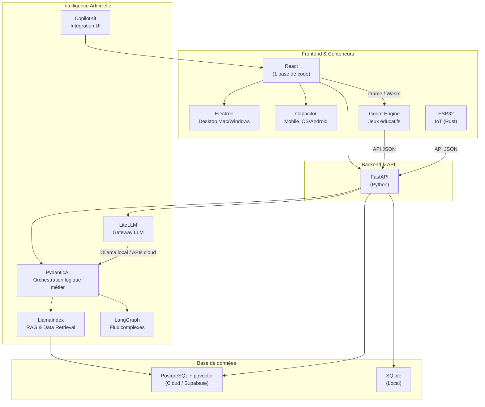
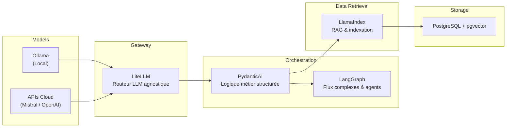
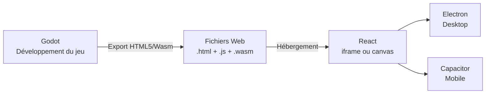

# Stack Technologique — DopaLearn

---

## 1. Vue d'ensemble de l'architecture

---

## 2. Backend

| Techno | Rôle | Justification |
| --- | --- | --- |
| **FastAPI** (Python) | Serveur API principal | Écosystème IA mature en Python, performances élevées (async), connu de l'équipe |

---

## 3. Frontend

| Techno | Rôle | Justification |
| --- | --- | --- |
| **React** | Base de code unique UI | 1 codebase pour desktop + mobile |
| **Electron** | Encapsulateur desktop | Application Mac/Windows native |
| **Capacitor** | Encapsulateur mobile | Déploiement iOS / Play Store |

---

## 4. Jeux

| Techno | Rôle | Justification |
| --- | --- | --- |
| **Godot Engine** | Moteur de jeu éducatif | Open Source, export WebAssembly |
| **GDScript** | Prototypage rapide | Syntaxe simple, itérations rapides |
| **C#** | Code performant | Performances critiques du gameplay |

---

## 5. IoT

| Techno | Rôle | Justification |
| --- | --- | --- |
| **ESP32** | Hardware IoT | Microcontrôleur connecté |
| **Rust** | Langage embarqué | Performances, sécurité mémoire |

---

## 6. Base de données

| Techno | Rôle | Justification |
| --- | --- | --- |
| **PostgreSQL + pgvector** | BDD principale (Cloud / Supabase) | Stockage relationnel + vectoriel pour le RAG |
| **SQLite** | BDD locale | Mode hors-ligne, cache local |

---

## 7. Stack IA

### Détail des rôles IA

| Couche | Techno | Rôle | Quand l'utiliser |
| --- | --- | --- | --- |
| **Gateway** | **LiteLLM** | Routeur LLM agnostique (local Ollama ou cloud) | Simplicité, switch de modèle sans changer le code |
| **Orchestration** | **PydanticAI** | Logique métier, résultats structurés et fiables | Traitement de données, interrogation RAG, sorties typées |
| **Orchestration** | **LangGraph** | Graphe de décision, agents autonomes | Flux complexes, agents qui naviguent, corrigent, itèrent |
| **Retrieval** | **LlamaIndex** | Indexation, embeddings, recherche RAG | Gestion des cours, PDF, base de connaissances |
| **UI** | **CopilotKit** | Intégration IA dans l'interface React | Interaction conversationnelle côté frontend |

### Architecture résumée

- **Models** : Ollama (Local) <-> **Gateway** : LiteLLM
- **Orchestration** : PydanticAI (Logique métier)
- **Data Retrieval** : LlamaIndex (RAG)
- **Database** : PostgreSQL + pgvector (Cloud) / SQLite (Local)

---

## 8. Intégration Godot dans la Web-App

### Flux d'intégration

### Options d'intégration

| Option | Description | Complexité |
| --- | --- | --- |
| **Hub de jeux (recommandé MVP)** | Jeux hébergés séparément, communication via API avec FastAPI | Faible |
| **Lien externe** | Jeux hébergés sur un autre site, simple redirection | Très faible |
| **Intégration directe React** | Export Wasm chargé dans un composant React | Élevée |

### Compatibilité par plateforme

| Plateforme | Support | Notes |
| --- | --- | --- |
| **Electron (Desktop)** | Excellent | Chrome gère très bien WebAssembly + WebGL |
| **Capacitor (Mobile)** | Correct, avec vigilance | Performances dépendantes du téléphone, restrictions sécurité fichiers `.wasm` |

### Points de vigilance

- **Poids** : Export Godot Web = plusieurs dizaines de Mo minimum
- **GPU** : Exporter en **Compatibility Mode (GLES2/WebGL)** pour garantir la compatibilité
- **Contrôles** : Gérer le tactile (Capacitor) et le clavier/souris (Electron) séparément

### Recommandation MVP

1. Développer le jeu Godot **séparément**
2. Exporter au format Web (HTML5)
3. Afficher dans React via une **URL / iframe**
4. Si performances validées -> intégration locale pour le mode **hors-ligne**

### Communication React <-> Godot

Le jeu Godot exporté en Web peut communiquer avec React via JavaScript (ex: envoi de scores, progression, déclenchement de quiz).
