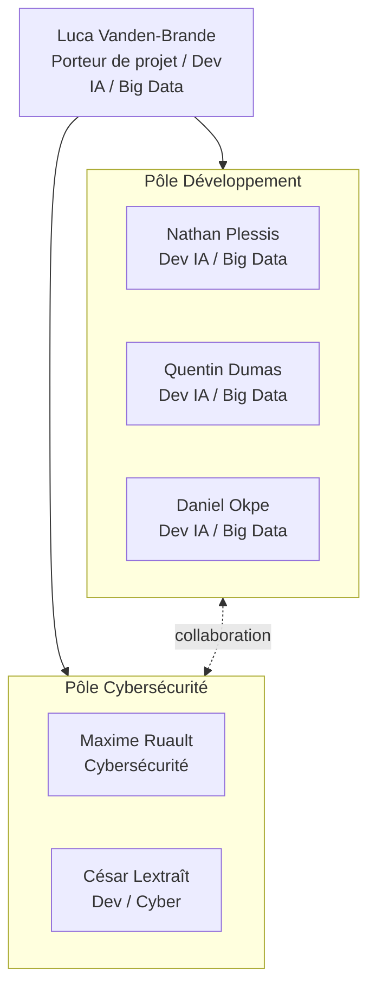

# Schéma OBS (Organizational Breakdown Structure)

## 1. Structure Globale de l'OBS

L'organisation actuelle suit une hiérarchie minimale privilégiant la polyvalence et les relations humaines, tout en définissant des référents clairs pour la prise de décision technique.

### 1.1. Niveaux Organisationnels

- **Niveau 1 - Pilotage / Gouvernance :** Porteur de projet (Luca Vanden-Brande).
- **Niveau 2 - Coordination :** Chef Pôle Développement (Quentin Dumas) et Chef Pôle Cybersécurité (Maxime Ruault).
- **Niveau 3 - Opérationnel :** Pôle Développement (incluant IA / Big Data) et Pôle Cybersécurité.

### 1.2. Organigramme

---

## 2. Décomposition et Affectation des Membres

### 2.1. Liste des membres

- Luca Vanden-Brande
- Nathan Plessis
- Quentin Dumas
- Daniel Okpe
- Maxime Ruault
- César Lextraît

### 2.2. Répartition des rôles basée sur l'équipe

| **Entité OBS** | **Membres Affectés** | **Missions Principales** |
| --- | --- | --- |
| **OBS-01 : Pilotage** | Luca Vanden-Brande | Vision produit, pilotage global, arbitrage final. |
| **OBS-02 : Pôle Dev** | Quentin Dumas (Chef), Luca Vanden-Brande, Nathan Plessis, Daniel Okpe, César Lextraît | IA / Big Data, développement de la logique de jeu, intégration technique. Tests fonctionnels et qualité. |
| **OBS-03 : Pôle Cyber**| Maxime Ruault (Chef), César Lextraît | Audit de code, analyse de risques et "Security by Design". |

---

## 3. Gouvernance et Prise de Décision

- **Mode de décision :** Discussion collaborative privilégiée. Priorité à la majorité des membres du groupe.
- **Arbitrage Pôles :** En cas de désaccord technique au sein d'un pôle n'amenant pas à une solution fixe, le chef de pôle tranche (Quentin Dumas pour le pôle Dev, Maxime Ruault pour le pôle Cyber).
- **Arbitrage Final :** En cas de blocage global, le **Porteur de projet** (Luca Vanden-Brande) prend la décision finale.
- **Délai Cybersécurité :** Un délai maximal de réponse pour les avis de sécurité est instauré pour éviter de bloquer le flux de développement.
- **Mise à jour du document :** Toute modification de l'OBS ou de l'organisation doit être validée à la **majorité** de l'équipe.

---

## 4. Fonctionnement Opérationnel et Outils

La traçabilité et la collaboration sont assurées par ces outils majeurs :

- **Discord :** Canal principal pour la communication instantanée et les échanges quotidiens.
- **Teams :** Réunions de coordination hebdomadaires tous les **lundis** pour le suivi de l'avancement.
- **GitHub :** Gestion de projet via **GitHub Projects** (WBS/Backlog), dépôt de code, actions CI/CD, et documentation validée sur **GitHub Wiki**.
- **Notion :** Centralisation de la documentation (brouillons) et du travail collaboratif.

---

## 5. Scalabilité et Évolutions

- **Seuil de restructuration :** Dès que l'équipe atteint **7 membres**, la structure actuelle doit évoluer vers un modèle plus formel.
- **Polyvalence :** Le droit à l'exploration est encouragé ; les membres peuvent intervenir sur des sujets hors de leur spécialité (ex: devs sur la sécurité ou inversement) pour favoriser l'apprentissage collectif.