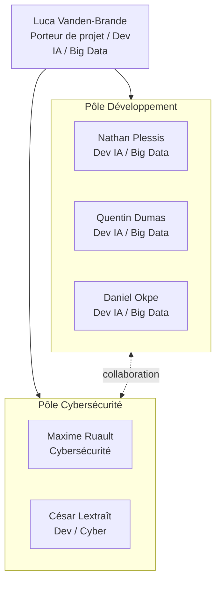
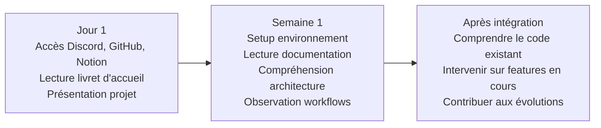
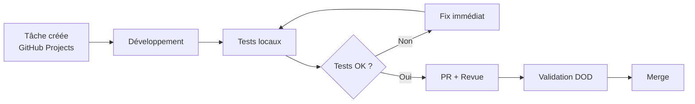

# Livret d’accueil – Projet FlowLearn

---

## 1. Rôle du livret d’accueil

**Finalité**

Dans ce document, nous retrouverons toutes les informations nécessaires sur la gestion du travail de groupe, les différents objectifs du projet à atteindre, la hiérarchie interne, ainsi que les différentes technos utilisées.

**Public cible**

Ce document s’adresse à toute personne entrant dans le groupe du projet / personnes déjà présentes et souhaitant retrouver des informations concernant l’équipe et le projet de manière générale.

**Moment d’utilisation**

Lors de la phase d’intégration, il est fortement conseillé de se référer à ce document afin de ne pas se perdre et de connaître les personnes à qui s’adresser.

---

## 2. Présentation du projet

**Nom :** FlowLearn

**Contexte général**

FlowLearn est un projet visant à réduire la **friction de l’apprentissage** en détournant les mécanismes de dopamine (scroll, jeu, interaction) au profit de la révision. Au lieu d’importer ou de ressaisir ses notes, l’utilisateur construit sa base de connaissances par l’interaction avec l’IA ; la révision passe ensuite par des expériences ludiques où la connaissance devient une mécanique de gameplay.

Web-App SaaS et open source, le projet vise un noyau modulaire extensible par la communauté, avec des perspectives B2C et B2B. Côté équipe, c’est aussi un laboratoire technique (IA, Big Data, cybersécurité, architecture) pour livrer un MVP structuré avant d’évoluer en mode Agile.

**Objectifs synthétiques**

- Apprendre en s’amusant, sans pression inutile
- Explorer des sujets techniques variés, parfois hors spécialité
- Construire un produit fonctionnel et cohérent
- Monter collectivement en compétences

**Périmètre fonctionnel (MVP)**

- Noyau applicatif central
- Construction de connaissances via interaction IA
- Modes ludiques d’apprentissage
- Architecture évolutive

**Contraintes majeures**

- Exigence forte sur la qualité et la sécurité
- MVP structuré avant passage en Agile
- Projet vivant, en évolution continue

---

## 3. Présentation de l’équipe

### Équipe actuelle

| Nom | Rôle | Spécialité | GitHub |
| --- | --- | --- | --- |
| Nathan Plessis | Dev | IA / Big Data | Epi-XeraCube |
| Luca Vanden-Brande | Dev | IA / Big Data | scawward |
| Daniel Okpe | Dev | IA / Big Data | danielOkpe |
| Maxime Ruault | Cybersécurité | Sécurité | SkyHonnor |
| César Lextraît | Dev / Cyber | Sécurité | cez0uille |
| Quentin Dumas | Dev | IA / Big Data | LavaheartGaming |

**Organisation**

Malgré la présence d’une hiérarchie interne qui permet une meilleure gestion d’équipe, celle-ci ne prévaut pas sur les relations humaines. Donc même si, lors de discussions / prises de décision sur des sujets techniques, chaque service possède son chef de pôle, si des discussions n’amènent pas à des solutions fixes, alors Quentin Dumas du côté du pôle dev tranchera, et Maxime Ruault du côté du pôle cyber tranchera.

Pour le reste, ce sera surtout du travail collaboratif pour éviter toute potentielle tension due à un sentiment de “pouvoir”.

---

## 4. Culture de travail

La culture du projet repose sur les principes suivants :

- **Pas de prise de tête inutile :** On est là pour apprendre et “s’amuser d’apprendre”, donc on évite les tensions, ça reste un projet d’école.
- **Droit à l’exploration :** Apprendre des sujets hors spécialité est encouragé. Nous ne sommes pas obligés de nous cantonner à nos spécialités. Comme dit dans le point d’avant, il vaut mieux une ambiance où on avance moins vite mais où on apprend diverses choses qu’on n’aurait pas pensé toucher, plutôt que de nous cantonner à notre rôle et de nous ennuyer avec celui-ci.
- **Responsabilité individuelle :** Due à la “hiérarchie” laxiste que l’on met en place, on attend tous de même un minimum de rigueur et d’autonomie. On n’est pas là pour faire la police, donc chacun prend ses responsabilités.
- **Qualité avant vitesse :** cf droit à l’exploration.
- **Discussion avant conflit :** Afin de mettre en place un projet le plus qualitatif possible, la discussion sur les idées, les désaccords ou tous types de choses personnelles ou professionnelles est privilégiée. On est humain, on a la parole, donc autant l’utiliser.
- **Problèmes traités immédiatement, pas contournés :** On ne laisse pas des problèmes nous bouffer la tête. On a déjà assez à faire à côté pour en plus se rajouter des soucis dans la tête pour un autre projet.

Le projet est un espace pour :

- s’amuser techniquement,
- expérimenter,
- progresser collectivement.

---

## 5. Fonctionnement global du projet

**Méthodologie**

- Phase 1 : MVP en approche prédictive (PBS / WBS)
- Phase 2 : Évolutions en Agile (Backlog, User Stories)

**Décisions**

Les décisions sont prises lors de discussions de groupe. S’il y a des blocages sur les décisions, ce sera le porteur de projet qui prendra la décision finale, donc ici, Luca.

**Priorisation**

On souhaite un produit fini, donc la priorité sera d’avoir un produit fiable et qui fonctionne correctement. C’est cela qu’il faudra prioriser à terme.

---

## 6. Onboarding (intégration)

Même s’il n’existe pas de processus formel rigide, une **timeline de référence** est définie.

### Timeline d’intégration indicative

**Jour 1**

- Accès Discord, GitHub, Notion
- Lecture du livret d’accueil
- Présentation rapide du projet

**Première semaine**

- Setup environnement local
- Lecture de la documentation existante
- Compréhension de l’architecture
- Observation des workflows

**Après intégration**

- Capacité à :
    - comprendre les fonctionnalités existantes,
    - intervenir sur des fonctionnalités en cours,
    - contribuer aux futures évolutions.

**Objectif final**

Être **autonome sur le projet**, ses fonctionnalités actuelles et celles à venir.

---

## 7. Outils et environnements

| Catégorie | Outil | Usage |
| --- | --- | --- |
| **Communication** | Discord | Canal principal, échanges quotidiens |
| **Gestion de projet** | GitHub Projects | Suivi WBS / Backlog |
| **Documentation (brouillon)** | Notion | Travail collaboratif |
| **Documentation (validée)** | GitHub Wiki | Single Source of Truth |
| **Code** | GitHub | Dépôt principal |
| **CI/CD** | GitHub Actions | Tests automatisés |
| **Environnement** | Local | Développement individuel |

---

## 8. Standards et conventions

À ce stade du projet :

- Aucune convention de nommage stricte imposée
- Aucune convention de commits formalisée
- Ces règles pourront évoluer si le projet grandit

**Règle implicite** : lisibilité, clarté, cohérence.

---

## 9. Processus clés

### Création d’une tâche

- Via GitHub Projects (WBS ou Backlog)

### Validation d’un livrable

- Application stricte de la DOD

### Blocage technique

- Discussion immédiate avec l’équipe
- Point technique si nécessaire

### Tests en échec

- Le problème doit être traité avant toute autre avancée
- Échange avec la personne ayant mis en place les tests si besoin

---

## 10. Qualité et exigences

La **Definition of Done (DOD)** est contractuelle.

Aucun travail n’est considéré comme terminé sans :

- Revue de code
- Documentation mise à jour
- Tests validés
- Validation cybersécurité si applicable

---

## 11. Ressources et références

Les documents ci-dessous sont les principales références du projet. Les liens pointent vers les fichiers du dépôt.

**Documents fondateurs (terminés)**

- Genèse et objectifs — vision, UVP, KPIs du projet
- Organisation générale — méthodologie, gouvernance, rituels
- Definition of Done — critères de validation globaux et par phase

**Documents de pilotage (en cours)**

- Planning détaillé — Gantt, dépendances, gates Go/No-Go, KPIs
- Budget prévisionnel — scénarios et contingence
- Plan de communication — stratégie B2C / B2B / RP / investisseurs
- Gestion des risques — registre, matrices, plans de réponse
- OBS — structure organisationnelle et responsabilités
- Stack technique — Backend, Frontend, IA, IoT, BDD
- PBS MVP et PBS global — décomposition produit
- Schéma WBS global — vue d’ensemble du travail à réaliser
- Charte graphique — couleurs, typo, logo, composants UI

**Architecture documentaire**

- Architecture des documents — flux `1-a-faire → 2-en-cours → 3-relecture → 4-terminer`

**Outils externes**

- GitHub — code source, Wiki, Projects, Actions
- Notion FlowLearn — documentation collaborative
- Discord — communication quotidienne

---

## 12. Mise à jour du livret

| Élément | Description |
| --- | --- |
| **Responsable** | Nathan Plessis |
| **Fréquence** | À chaque changement majeur d’organisation ou de méthodologie |
| **Validation** | Équipe + mise à jour GitHub Wiki |