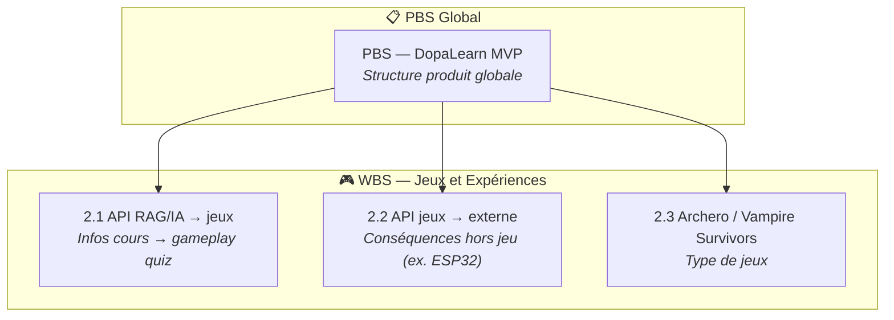

# PBS ↔ WBS — Jeux et Expérience

Schéma de navigation entre le **PBS global** (Product Breakdown Structure) et les **WBS** (Work Breakdown Structure) de la section *Jeux et Expériences*.

---

## Schéma Mermaid

> **Note :** Dans les environnements qui supportent `click` (ex. GitHub, certains viewers), les boîtes sont cliquables. Sinon, utilisez les liens relatifs ci‑dessous.

---

## Liens relatifs (depuis la racine du projet)

| Élément | Fichier | Lien relatif |
|--------|---------|--------------|
| **PBS global** | MVP PBS | [mvp-pbs.md](./1-document/projet/3-relecture/mvp-pbs.md) |
| **2.1** API RAG/IA → jeux | WBS 2.1 | [wbs-2.1-api-rag-ia-jeux.md](./1-document/projet/2-en-cours/wbs/jeux-et-experience/wbs-2.1-api-rag-ia-jeux.md) |
| **2.2** API jeux → externe | WBS 2.2 | [wbs-2.2-api-jeux-externe.md](./1-document/projet/2-en-cours/wbs/jeux-et-experience/wbs-2.2-api-jeux-externe.md) |
| **2.3** Archero / Vampire Survivors | WBS 2.3 | [wbs-2.3-archero-vampire-survivors.md](./1-document/projet/2-en-cours/wbs/jeux-et-experience/wbs-2.3-archero-vampire-survivors.md) |

---

## Correspondance PBS → WBS (section 2)

D’après [mvp-pbs.md](./1-document/projet/3-relecture/mvp-pbs.md) :

| PBS (réf) | Intitulé | WBS associé |
|-----------|----------|-------------|
| **2.1** | api RAG/IA → jeux | [wbs-2.1-api-rag-ia-jeux.md](./1-document/projet/2-en-cours/wbs/jeux-et-experience/wbs-2.1-api-rag-ia-jeux.md) |
| **2.2** | api jeux → externe | [wbs-2.2-api-jeux-externe.md](./1-document/projet/2-en-cours/wbs/jeux-et-experience/wbs-2.2-api-jeux-externe.md) |
| **2.3** | Jeux type Archero / Vampire Survivors | [wbs-2.3-archero-vampire-survivors.md](./1-document/projet/2-en-cours/wbs/jeux-et-experience/wbs-2.3-archero-vampire-survivors.md) |
